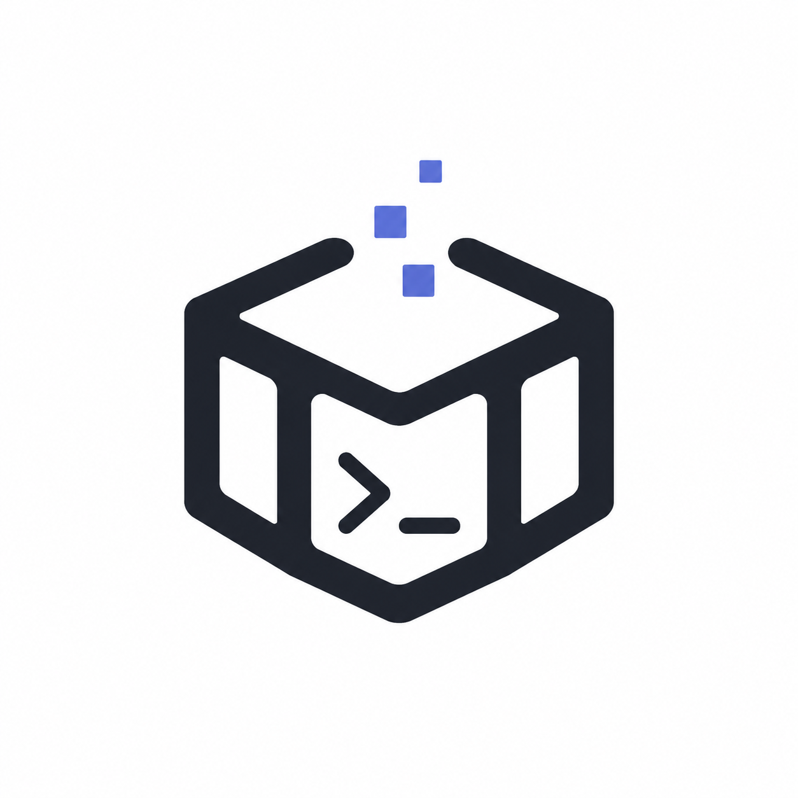

<p align="center">
  
</p>

# agent-box

> **Isolated HOME launcher for coding agents** — run Claude Code, Codex, Hermes,
> and OpenCode as multiple isolated identities (different providers, different
> prompts, different credentials) on the same machine, with **kernel-level
> isolation** via [bubblewrap](https://github.com/containers/bubblewrap) bind
> mounts.

[English](README.md) | [简体中文](README_CN.md)

[](LICENSE)
[](https://www.python.org/)
[](#)

---

## Why

Coding-agent CLIs (Claude Code, Codex, Hermes, OpenCode) read their identity,
model provider, credentials, and per-project memory from a single config
directory (`~/.claude/`, `~/.codex/`, `~/.hermes/`, `~/.config/opencode/`).
Running two agent identities on the same machine means constantly editing config
files and fighting on-disk state — and one agent's credentials leak into the
next session.

`agent-box` gives each identity its own profile directory and launches the agent
inside a `bwrap` mount namespace where the profile is bind-mounted over the real
config directory. The agent sees its own world; the host filesystem is untouched.

```
agent-box cc decision       # a Claude Code identity
agent-box codex builder     # a Codex identity, in parallel
agent-box opencode alt      # an OpenCode identity, in parallel
```

Each identity runs in a separate terminal, with fully isolated config,
credentials, history, and per-project memory. They never touch each other.

---

## Install

### Requirements

- **Python 3.9+** (stdlib only — zero Python runtime dependencies for the CLI)
- **`bubblewrap`** (`bwrap`) — system package, see below
- One or more agent CLIs you want to launch (`claude`, `codex`, `hermes`,
  `opencode`)

### System packages

```bash
# Debian / Ubuntu
sudo apt install bubblewrap

# Fedora / RHEL
sudo dnf install bubblewrap

# Arch
sudo pacman -S bubblewrap

# macOS — bwrap is unavailable; agent-box requires Linux (WSL2 works great)
```

### agent-box itself

From a source checkout:

```bash
git clone https://github.com/mmm-05610/agent-box.git
cd agent-box
pip install -e .
# or, no install needed:
python -m agent_box.cli --help
```

From PyPI (once published):

```bash
pip install agent-box
```

The Windows desktop GUI is an optional extra (requires CustomTkinter):

```bash
pip install -e .[gui]
```

---

## Quick Start

```bash
# 1. Create one profile per agent identity. Templates ship in the package —
#    no init step needed.
agent-box create decision --type cc
agent-box create builder   --type codex
agent-box create dev        --type cc --preset python-dev   # ships a CLAUDE.md + hooks + settings overlay

# 2. Put your real API key / credentials into the profile. Templates are
#    empty-key placeholders — open the config dir and fill them in:
agent-box edit decision        # opens the profile's config dir in $EDITOR
#  → ~/.agent-box/profiles/decision/dot-claude/settings.json
#  → replace the empty env / apiKey placeholders with your real values

# 3. Launch — each command is a fully isolated agent session
agent-box cc decision
agent-box codex builder
agent-box opencode alt
```

Run `agent-box cc decision` in terminal A and `agent-box codex builder` in
terminal B — both are live, both see their own config, neither leaks into the
other.

---

## Command Reference

| Command                                                                                                                              | What it does                                              |
| ------------------------------------------------------------------------------------------------------------------------------------ | --------------------------------------------------------- |
| `agent-box create <name> [--type <t>] [--preset <p>] [--provider <p>] [--display-name <s>] [--description <s>] [--claude-md <file>]` | Create a new profile by copying the agent type's template |
| `agent-box list [--json]`                                                                                                            | List all profiles                                         |
| `agent-box show <name>`                                                                                                              | Show a profile's metadata, paths, and optional fields     |
| `agent-box edit <name>`                                                                                                              | Open a profile's config directory in `$EDITOR`            |
| `agent-box presets [--type <t>] [--json]`                                                                                            | List shipped presets                                      |
| `agent-box launch <name> [extra...]`                                                                                                 | Launch a profile inside a bwrap namespace                 |
| `agent-box cc \| codex \| hermes \| opencode <name> [extra...]`                                                                      | Shortcut: launch a profile of that agent type             |
| `agent-box delete <name> [--force]`                                                                                                  | Delete a profile                                          |
| `agent-box sessions [--json] [--active] [--cleanup] [--exit <id> <code>]`                                                            | List/manage launch session history                        |
| `agent-box --help`                                                                                                                   | Full CLI help                                             |
| `agent-box --version`                                                                                                                | Print version                                             |

`extra` args after the profile name are passed through to the agent binary
(e.g. `agent-box cc decision --resume`).

### `create` options

- `--type / -t` — agent type: `cc` (default), `codex`, `hermes`, `opencode`.
- `--preset` — apply a shipped preset (CC only in v0.4). Copies the preset's
  `CLAUDE.md`, `hooks/hooks.json`, and deep-merges `settings.overlay.json` onto
  the template's `settings.json`. Overrides `--claude-md` if both given.
- `--provider` — provider key (e.g. `anthropic`, `deepseek`). **Record-only in
  v0.4** — stored in `meta.yaml`, no apply logic. (v0.5 will wire it.)
- `--display-name` / `--description` — human metadata, stored in `meta.yaml`.
- `--claude-md <file>` — file whose contents become the profile's `CLAUDE.md`
  (CC only in v0.4). Avoids shell-quoting a multi-line body.

### Shipped presets (CC)

`blank`, `decision-maker`, `python-dev`, `spec-writer` — see
`src/agent_box/presets/cc/`. Inspect with `agent-box presets --type cc`.

---

## How It Works

### The isolation problem

A `HOME` environment override is defeated by `os.userInfo().homedir` inside the
agent — it re-derives the real home and reads the host's real config dir.
**Partial isolation. Broken.**

### The solution: bwrap bind mount

`agent-box` enters a `bubblewrap` mount namespace and bind-mounts the profile's
config directory over the agent's real config directory **at the kernel VFS
layer**. Inside the namespace, the path is rewritten regardless of how the agent
resolves it.

```
┌─────────────────────────────────────────────────────┐
│  host filesystem                                    │
│                                                     │
│  /home/user/.claude/          ← real, untouched     │
│         ▲                                           │
│         │ bind mount (bwrap)                        │
│         │                                           │
│  /home/user/.agent-box/profiles/decision/dot-claude/│
│         (profile's settings.json, CLAUDE.md, ...)   │
└─────────────────────────────────────────────────────┘
          │
          ▼
┌─────────────────────────────────────────────────────┐
│  bwrap namespace                                    │
│                                                     │
│  --bind / /                                         │
│  --bind <profile>/dot-claude   /home/user/.claude   │
│  --bind <profile>/dot-claude.json  /home/user/.claude.json   (CC only)
│  --bind <profile>/dot-opencode-data  ~/.local/share/opencode (OpenCode only)
│  --dev /dev --proc /proc --tmpfs /tmp               │
│  --unshare-ipc --unshare-pid --unshare-uts --share-net│
│  <agent binary>                                     │
│                                                     │
│  ⇒ os.execvpe replaces our PID; the agent inherits  │
│    the tty, signal handlers, Ctrl-C still works.     │
└─────────────────────────────────────────────────────┘
```

Key properties:

- **Kernel-level isolation** — there is no way for the agent to read the host's
  real config dir from inside the namespace.
- **PID/tty preserved** — `os.execvpe` replaces our process with `bwrap`, which
  execs the agent. The terminal session is unchanged; Ctrl-C still goes to the
  agent.
- **Network shared** (`--share-net`) — the agent needs API access.
- **Credentials live in the profile** — API keys sit in the profile's own
  `settings.json` / `auth.json` / `.env`, which the agent reads from _inside_
  the namespace. `agent-box` does not inject or rewrite them; it just makes
  sure the agent sees the profile's copy, not the host's.
- **Template / profile split** — templates ship in the package
  (`src/agent_box/templates/<type>/`) as empty-key placeholders; `create` copies
  a template into a profile. The host's real config dir is never written to.
- **Per-agent-type extras** — CC also bind-mounts `dot-claude.json` →
  `~/.claude.json`; OpenCode also bind-mounts its secondary data dir
  (`dot-opencode-data` → `~/.local/share/opencode`) so `auth.json` is isolated
  too.

### Presets

A preset is a directory (`src/agent_box/presets/<type>/<name>/`) shipping
optional `CLAUDE.md`, `hooks/hooks.json`, and `settings.overlay.json`. On
`create --preset`, the preset's `CLAUDE.md` and hooks are copied in, and the
settings overlay is **deep-merged** onto the template's `settings.json` —
overlay wins on conflicts, but sibling keys are preserved (so a preset's
`permissions.allow` does not clobber the template's `permissions.deny`). The
chosen preset is recorded in `meta.yaml`.

---

## Windows Desktop GUI

The CLI runs in WSL; the optional Windows desktop GUI (`gui-redesign.py` →
`gui/app.py`, built on [CustomTkinter](https://github.com/TomSchimansky/CustomTkinter))
lets you manage profiles from Windows: create, list, inspect, and edit each
profile's raw config files (settings, hooks, auth, CLAUDE.md) across all four
agent types, with a cc-switch / shadcn-Zinc design system and dark/light themes.

It communicates with WSL via `wsl.exe`, so the CLI and bwrap isolation do the
real work — the GUI is a convenience layer over the same profile tree.

Launch with `python gui-redesign.py` or use a desktop shortcut.

---

## Project Structure

```
agent-box/
├── pyproject.toml                  # setuptools + console_script + [gui]/[dev] extras
├── LICENSE                         # MIT
├── README.md  /  README_CN.md
├── .gitignore
│
├── src/agent_box/                  # the package (zero runtime deps)
│   ├── cli.py                      # argparse, subcommand dispatch
│   ├── config.py                   # AGENT_BOX_HOME resolution, path + name validation
│   ├── library.py                  # agent-type registry (templates, presets, binary, dirs)
│   ├── profile.py                  # create / list / show / delete, meta IO, preset apply, _deep_merge
│   ├── edit.py                     # $EDITOR launcher
│   ├── launch.py                   # bwrap argv construction + execvpe
│   ├── sessions.py                 # session tracking (launch history SQLite)
│   ├── templates/<type>/           # shipped agent config templates (empty-key placeholders)
│   └── presets/<type>/<name>/      # shipped presets (CLAUDE.md, hooks.json, settings.overlay.json)
│
├── gui/                            # Windows desktop GUI (CustomTkinter) — [gui] extra
│   ├── app.py  tokens.py  theme.py  data.py  config.py  wsl.py
│   ├── pages/  components/
│
├── tests/                          # regression spine — [dev] extra
└── docs/
    ├── ARCHITECTURE.md  ROADMAP.md  REQUIREMENTS.md
    ├── specs/  troubleshooting/
```

### Runtime layout (on the host, not in repo)

```
~/.agent-box/                       # or $AGENT_BOX_HOME
└── profiles/<name>/
    ├── meta.yaml                   # name, agent_type, (+ display_name/description/provider/preset)
    ├── dot-claude/                 # the config dir bwrap bind-mounts (CC)
    ├── dot-claude.json             # → ~/.claude.json  (CC only)
    └── dot-<type>/                 # dot-codex / dot-hermes / dot-opencode
    └── dot-<type>-data/            # secondary data dir (OpenCode: dot-opencode-data → ~/.local/share/opencode)
```

### Source map

| File          | Responsibility                                                              |
| ------------- | --------------------------------------------------------------------------- |
| `cli.py`      | argparse tree; one `cmd_*` per subcommand                                   |
| `config.py`   | `$AGENT_BOX_HOME` resolution, path helpers, name validation                 |
| `library.py`  | agent-type registry: config dir, binary, data dir, templates, presets       |
| `profile.py`  | `create`, `list`, `show`, `delete`, meta IO, `_apply_preset`, `_deep_merge` |
| `sessions.py` | session tracking: record launch/exit, fetch history, cleanup stale sessions |
| `edit.py`     | open a profile's config dir in `$EDITOR`                                    |
| `launch.py`   | `launch`: build bwrap argv + `os.execvpe`                                   |

---

## Design Principles

- **Zero Python runtime dependencies** (CLI) — stdlib only. `bwrap` and the
  agent CLIs are system dependencies, not Python dependencies.
- **No database** — profiles are a directory tree; the filesystem is the source
  of truth.
- **Don't modify the agent** — `agent-box` is a launcher, not a wrapper. The
  agent is unchanged; we only change what it sees.
- **Don't write to the host's real config dir** — `create` only copies from
  shipped templates. The host's real `~/.claude/` etc. is never written to.
- **Human-editable profiles** — every file in a profile is a plain JSON / TOML /
  YAML / Markdown document. The CLI is a convenience, not a cage.
- **One install, N identities** — the cost of adding a new identity is one
  `agent-box create` command.

---

## Roadmap

**v0.4.0 (current):** 4-agent launch + bwrap isolation, presets pipeline,
Windows GUI with raw-config editing, shipped template corrections, regression
test spine.

**Next:**

- Structured config forms in the GUI (on top of raw editing)
- Team mode — multi-agent tmux orchestration
- Session history management
- Profile import/export

**Explicitly not building:** a web frontend. agent-box is a lightweight WSL
tool; a web stack adds disproportionate complexity for no isolation gain.

---

## Development

```bash
# Editable install with dev + gui extras
pip install -e .[dev,gui]

# Run from a source checkout without installing
python -m agent_box.cli list

# Run the GUI
python gui-redesign.py
```

### Testing

```bash
pip install -e .[dev]
pytest -q
```

The suite is hermetic: tests point `AGENT_BOX_HOME` at a tmp directory and
monkeypatch `os.execvpe` / `shutil.which` / `subprocess.run`, so no real bwrap,
no real `wsl.exe`, and the real `~/.agent-box` is never touched. Covers meta
round-trip + back-compat, profile lifecycle, `_deep_merge` (preset overlay
regression), library registry, launch argv construction, wsl base64 round-trip +
shell-quoting, and preset resolution.

---

## License

MIT — see [LICENSE](LICENSE).
