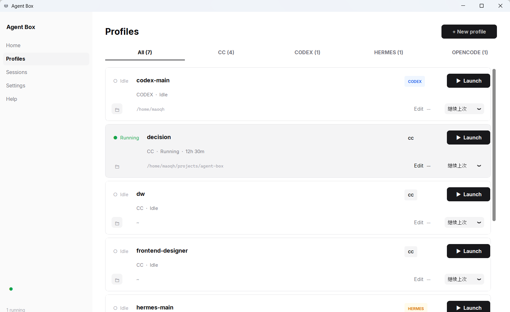

<p align="center">
  
</p>

# agent-box

> **AI Agent 组合管理与运行工具。** 将模型、Agent 框架与配置组织为可复用的
> Profile——相互隔离、可并行运行、不绑定框架。

[English](README.md) | 简体中文

[](LICENSE)
[](https://www.python.org/)
[](https://github.com/mmm-05610/agent-box/releases)

---

## 什么是 Agent

社区讨论 AI 编码 Agent 时，焦点常常集中在单一维度：**模型**（Claude、GPT-4、DeepSeek）
或 **Agent 框架**（Claude Code、Codex、OpenCode）。

实践中，一个 Agent 的实际行为来自三个层次共同作用：

| 层             | 示例                                             |
| -------------- | ------------------------------------------------ |
| **模型**       | Claude、GPT-4、DeepSeek、MiniMax                 |
| **Agent 框架** | Claude Code、Codex、Hermes、OpenCode             |
| **配置**       | CLAUDE.md、权限、Hooks、MCP 服务、工具、对话历史 |

不同任务需要不同组合。**架构 Agent** 可能用 Claude × Claude Code × 受限权限；
**调研 Agent** 可能用不同模型、不同框架、完全不同的配置栈。编码、审查、调试——
每种场景都适合不同的组合。

**agent-box 不提供上述任何一层能力。** 它不提供模型、不提供 Agent 框架、也不提供
提示词库。它提供的是：帮助你把创建的组合组织起来、隔离开来、管理起来、复用起来。

---

## 为什么需要 agent-box

多个 Agent 组合并存时，管理很快就会失控。每个组合需要独立的：

- **系统提示词**（CLAUDE.md 或等价物）
- **权限**（只读 vs 完整访问、工具白名单）
- **Hooks**（提交前校验、响应后动作）
- **MCP 服务**（不同角色需要不同工具）
- **对话历史**（上下文不应在任务间泄漏）

这些配置很容易互相干扰——审查 Agent 误用了编辑权限、调研 Agent 冗长的 hooks
污染了编码会话、对话上下文从一个任务泄漏到另一个。

agent-box 将每个组合封装为**隔离的 Profile**。每个 Profile 是磁盘上的一个目录——
纯 JSON、YAML、Markdown 文件。启动 Profile，Agent 运行在私有命名空间中，
只能看到该 Profile 的配置，无法感知或影响外部任何东西。

- **可复用** — 创建一次 Profile，随时启动该角色
- **可隔离** — 内核级 bind-mount 确保配置互不干扰
- **可并行** — 同一台机器同时运行多个 Profile

```bash
agent-box create decision --type cc --preset decision-maker
agent-box create research --type cc --preset spec-writer
agent-box create reviewer  --type cc --preset blank

agent-box cc decision    # 架构与设计决策
agent-box cc research    # 深度调研
agent-box cc reviewer    # 代码审查
```

三种组合，三套配置栈，三段独立历史。同一台机器，零手动切换。

---

## 安装

### Windows（GUI 一键安装）

从 [GitHub Releases](https://github.com/mmm-05610/agent-box/releases) 下载安装包，
双击运行即可。自动创建桌面快捷方式、开始菜单和卸载入口。
**需要 WSL2**（推荐 Ubuntu）。

GUI 覆盖全部操作：管理 profile、编辑配置、启动 Agent、环境检查——不需要打开终端。

### Linux / WSL（命令行）

```bash
# 1. 系统依赖
sudo apt install bubblewrap

# 2. 安装 agent-box
pip install agent-box-cli

# 3. 安装至少一个 Agent
npm install -g @anthropic-ai/claude-code   # Claude Code
# 和/或: npm install -g @openai/codex       # Codex
# 和/或: pip install hermes-agent            # Hermes
# 和/或: npm i -g @opencode-ai/opencode      # OpenCode
```

> **macOS 用户：** bwrap 仅支持 Linux。请在 Linux 虚拟机或 WSL2 中使用 agent-box。
> 详见 [docs/troubleshooting/desktop-launch.md](docs/troubleshooting/desktop-launch.md)。

---

## 快速上手

<p align="center">
  
</p>

### GUI（Windows）

1. 从 [最新 Release](https://github.com/mmm-05610/agent-box/releases) 下载安装
2. 点击 profile → **启动** — 终端自动打开，Agent 在隔离环境中运行
3. 使用标签页直接编辑 settings、hooks、auth、CLAUDE.md

### 命令行（Linux / WSL）

```bash
# 创建一个 profile
agent-box create dev --type cc --preset python-dev

# 填入 API Key（在编辑器中打开 profile 配置目录）
agent-box edit dev
#  → 编辑 settings.json，替换占位 API Key

# 启动
agent-box cc dev
```

搞定。Agent 在 bwrap 命名空间中运行，`~/.claude/` 就是你的 profile 配置。
Ctrl-C、终端颜色、信号处理全部正常工作。

---

## 特性

|                         |                                                                                                           |
| ----------------------- | --------------------------------------------------------------------------------------------------------- |
| 🔒 **内核级隔离**       | bwrap bind-mount 在 VFS 层替换 Agent 的配置目录。不是 `$HOME` 环境变量——Agent 无法读取宿主机真实配置。    |
| 🎛 **多 Agent 支持**    | Claude Code、Codex、Hermes、OpenCode——统一入口，统一 profile 管理。                                       |
| 📦 **预设模板**         | `python-dev`、`decision-maker`、`spec-writer`——一条命令创建带 CLAUDE.md、hooks、settings 的完整 profile。 |
| 📜 **会话追踪**         | `agent-box sessions` 记录每次启动。知道什么时间跑了什么、退出状态如何。                                   |
| 🪟 **Windows 桌面 GUI** | 管理 profile、编辑配置、查看会话——全在桌面应用中完成。深色/浅色主题。                                     |
| ⚡ **零 Python 依赖**   | CLI：纯标准库。`bwrap` 和 Agent CLI 是系统依赖，不是 Python 依赖。                                        |
| 📂 **文件系统即数据库** | 每个 profile 就是磁盘上的 JSON/YAML/Markdown 文件。用任何编辑器都能改。                                   |

---

## 不绑定框架（Framework-Agnostic）

agent-box 并不试图将不同 Agent 框架统一到一个共同接口后面。
Claude Code、Codex、Hermes、OpenCode 各有自己的 CLI 惯例、配置布局和长处。
这种多样性是有意保留的。

不同场景适合不同框架。一次快速重构可能 Codex 最顺手；深度架构讨论可能受益于
Claude Code 的权限模型；调研任务可能适合 OpenCode 的工作流。agent-box 支持多种
框架，不是为了抹平它们的差异，而是让你能为每个 Profile 选择合适的框架——
并且在不同框架间切换时不需要从零开始重新配置。

---

## 支持的 Agent

| Agent       | CLI 命令                    | 配置目录        |
| ----------- | --------------------------- | --------------- |
| Claude Code | `agent-box cc <name>`       | `dot-claude/`   |
| Codex       | `agent-box codex <name>`    | `dot-codex/`    |
| Hermes      | `agent-box hermes <name>`   | `dot-hermes/`   |
| OpenCode    | `agent-box opencode <name>` | `dot-opencode/` |

---

## 工作原理

```
宿主机（真实文件系统）          bwrap 命名空间（Agent 看到的）
┌─────────────────────┐         ┌─────────────────────────────┐
│ ~/.claude/          │         │ ~/.claude/  ─────────────── │
│  （不受影响）        │◄ ─ ─ ─ ┤   bind-mount 自 profile     │
│                     │         │                              │
│ ~/.agent-box/       │         │ • settings.json（你的配置）  │
│  profiles/dev/      │         │ • CLAUDE.md  （你的提示词）  │
│   dot-claude/ ──────┘         │ • hooks/     （你的钩子）    │
│   dot-claude.json ─────────── │ • （你的凭证）               │
│                               └─────────────────────────────┘
```

- `os.execvpe` — Agent 在同一终端中替换当前进程
- `--share-net` — API 访问正常工作
- `--tmpfs /tmp` — 每次会话独立的临时目录
- PID/IPC/UTS namespace — 干净的进程隔离

→ 详见：[docs/ARCHITECTURE.md](docs/ARCHITECTURE.md)

---

## CLI 常用命令

| 命令                                                               | 说明                             |
| ------------------------------------------------------------------ | -------------------------------- |
| `agent-box create <name> --type cc \| codex \| hermes \| opencode` | 创建新 profile                   |
| `agent-box list`                                                   | 列出所有 profile                 |
| `agent-box edit <name>`                                            | 在 `$EDITOR` 中打开 profile 配置 |
| `agent-box cc \| codex \| hermes \| opencode <name>`               | 启动 profile                     |
| `agent-box presets`                                                | 列出可用预设                     |
| `agent-box sessions`                                               | 查看启动历史                     |
| `agent-box --version`                                              | 输出版本号                       |

`agent-box --help` 查看完整命令参考。

---

## 预设模板

内置预设一键创建带定制 CLAUDE.md 的 profile：

| 预设             | 适用场景                        |
| ---------------- | ------------------------------- |
| `blank`          | 空白模板——默认配置              |
| `decision-maker` | 架构与设计决策                  |
| `python-dev`     | Python 开发，带测试和 lint 习惯 |
| `spec-writer`    | 规范驱动开发                    |

```bash
agent-box create planner --type cc --preset decision-maker
agent-box presets --type cc          # 列出所有 CC 预设
```

---

## 开发

```bash
git clone https://github.com/mmm-05610/agent-box.git
cd agent-box
pip install -e .[dev,gui]
pytest -q                           # 53 个测试，完全隔离
python gui-redesign.py              # 从源码启动 GUI
```

→ [docs/ARCHITECTURE.md](docs/ARCHITECTURE.md)
→ [docs/ROADMAP.md](docs/ROADMAP.md)

---

## License

MIT — 详见 [LICENSE](LICENSE)。
