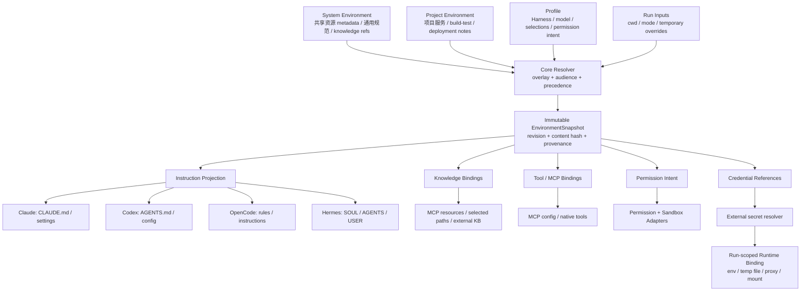
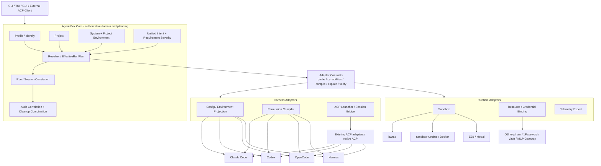

# Adapter-First Architecture for Agent-Box
>
> Historical record — describes an earlier architecture or validation state and is not current implementation guidance.
>
> Historical record — describes an earlier architecture or decision input and is not current implementation guidance.

> 文档导航：[总目录](../README.md)

> 状态：技术与产品架构研究结论
> 日期：2026-08-20
> 范围：Claude Code、Codex、OpenCode、Hermes，以及 ACP、MCP、本地/远程 Sandbox 生态
> 目的：定义 Agent-Box Core 与 Adapter 的稳定边界；不是实现规范，也不是一次性重构计划

## Executive Summary

结论是 **Modify / Go with a narrow Adapter-First boundary**，而不是把 Agent-Box 扩张为“Universal Agent OS”。

Adapter-first 对 Agent-Box 有真实工程价值，但只有满足以下条件时才有独立产品价值：

1. Agent-Box 拥有跨 harness 持久存在的领域状态，而不只是翻译配置文件；
2. Adapter 不只做格式转换，还负责版本探测、能力协商、编译、验证、解释和兼容性诊断；
3. 统一抽象只覆盖可验证的 80% 共同语义，无法可靠映射的能力保留为 backend-specific；
4. 所有安全约束默认 fail closed，不能把“配置已经写入”误报为“权限已经执行”；
5. ACP、MCP、sandbox、secret manager、workflow runtime 等成熟协议或基础设施优先复用，不在 Agent-Box 内重写。

本文推荐将 Agent-Box 定义为：

> **面向异构 coding-agent runtime 的、以 Profile 为中心的本地控制层。它拥有 Profile、Project、Environment 和 Run 的持久意图与关联关系，将它们的交集编译为一次运行的、可解释的 Effective Run Plan；Adapter 将该计划投影到 harness 原生机制和外部 runtime backend。**

可以用下面这个不变量概括：

```text
Run = Profile × Project × EnvironmentSnapshot × RuntimeRequirements
```

Agent-Box Core 应该拥有：

- Profile identity，而不是某个 harness 的配置格式；
- Project identity 与 project root；
- System Environment、Project Environment 及其覆盖关系；
- Run identity、ACP/native session correlation 与生命周期状态；
- 用户声明的统一 intent、要求级别和编译结果；
- capability negotiation 结果、解释信息和 audit correlation；
- 对进程、投影、绑定、清理的协调。

Agent-Box Core 不应该拥有：

- agent loop 或通用 tool execution engine；
- ACP/MCP wire protocol 的重新实现；
- 通用 workflow engine；
- secret store、加密、轮换或 cloud IAM；
- sandbox 内核、容器平台或远程执行平台；
- 通用 memory ontology；
- 一个试图覆盖所有 backend 的 IAM/policy language。

对三个最重要问题，本文的直接回答是：

1. **Agent-Box Core 是什么？** 它不是 config translator，而是多 harness 的 Profile/Environment/Run control plane。Core 保存用户意图和跨 harness 状态，生成可解释的运行计划。
2. **哪些能力值得 Adapter 化？** 当前最值得的是窄范围 Permission Adapter；现有 Config/MCP 投影应继续渐进式正规化；ACP 应包装现有 adapter；Sandbox 只在有第二个 backend 时抽象；workflow、secret manager、tool execution 不做统一实现。
3. **Shared Environment 属于哪一层？** Shared Environment 是 Core domain state；“把它写成 CLAUDE.md、AGENTS.md、MCP resource、runtime env 或文件挂载”才是 Adapter/Projection。Environment 与 Permission 必须分离：前者回答 Agent 知道什么，后者回答运行机制允许什么。

如果只有 2–3 周，建议只完整验证 **Permission Adapter**：定义极小的 Permission Intent，针对当前安装版本的 Claude Code、Codex、OpenCode 做 capability report、compile、explain 和 fail-closed launch gate，再用真实负向测试证明“不能写、不能调用、不能联网”不是纸面声明。共享环境只完成最小领域模型和一条静态投影演示，不扩张为资源平台。

## Motivation

Claude Code、Codex、OpenCode、Hermes 都在快速增加自己的配置、权限、sandbox、MCP、session 和 ACP 能力。如果 Agent-Box 在自己的 Core 中重写这些机制，会产生四类问题：

- 安全语义重复实现，但 enforcement point 实际仍在 harness 或 OS backend；
- 上游格式和行为改变后，Core 被迫持续追随所有产品细节；
- 用户看到一个“统一权限”开关，却无法知道 backend 是否真的执行；
- Agent-Box 的产品价值退化为多个配置文件的 UI wrapper。

反过来，“所有东西都做 Adapter”同样危险。它容易产生一个无法完整映射的 Universal Agent Interface，最终只有最低共同分母和大量 escape hatch。Adapter-first 应当是一种边界纪律，而不是 Adapter 数量竞赛。

一个抽象只有同时满足以下条件时才值得 Adapter 化：

1. 至少存在两个实际 backend；
2. 用户意图在 backend 之间相同，而机制不同；
3. 共同语义可以稳定描述；
4. 结果可以被探测、验证或解释；
5. 统一后能减少重复配置、降低切换成本或提高安全可见性；
6. Adapter 的长期维护成本低于让用户直接使用原生配置的成本。

如果只能做到“把字段 A 改名成字段 B”，且没有版本检测、能力声明、验证和解释，那么它只是 formatter，不构成 Agent-Box 的独立价值。

## Research Scope and Method

本报告交叉检查了三类证据：

- Agent-Box 当前代码、registry、launch plan、project projection、资源 apply 逻辑和测试；
- 2026-08-20 可获取的 Claude Code、Codex、OpenCode、Hermes 官方文档和实际 CLI；
- ACP、MCP、Bubblewrap、Anthropic sandbox-runtime、Docker Sandboxes、E2B、Modal 等官方协议、代码库和文档。

本地环境中的实际版本快照为：Claude Code 2.1.234、Codex CLI 0.147.0、OpenCode 1.18.16、Hermes 0.19.0、Bubblewrap 0.9.0。版本号仅作为本次兼容性判断的证据，不应硬编码为永久能力声明。

一个重要发现是：Agent-Box 的 registry 仍描述 OpenCode V1 风格的 `permission`/`bash`/`task`，而 OpenCode V2 官方文档已经使用有序的 `permissions` 规则和 `shell`/`subagent` action；Codex 也已经出现新的 beta permission profiles。这个漂移说明 Adapter 必须是版本化、可探测的兼容边界，不能只是静态字段映射。

### 可复用项目与标准清单

“活跃程度”是本次调研时点的判断，不是长期承诺；依赖前仍应锁版本并检查 release/security notice。

| Project / Standard | Official source | Activity / maturity | License / terms | Core abstraction | 可复用什么 | 与 Agent-Box 重合 | 依赖建议 |
|---|---|---|---|---|---|---|---|
| Agent Client Protocol | [Docs](https://agentclientprotocol.com/) / [GitHub](https://github.com/agentclientprotocol/agent-client-protocol) | 活跃；stable wire protocol v1；有多语言 SDK、registry 和持续 release | Apache-2.0 | Client↔Agent JSON-RPC、session、events、permission request、terminal、MCP | 整个 wire protocol、schema、SDK、capability negotiation | 低；Agent-Box 位于 transport 之上 | **直接复用标准/SDK，不实现 protocol** |
| codex-acp | [GitHub](https://github.com/agentclientprotocol/codex-acp) | 活跃；随 Codex App Server 演进，已有完整 event/approval/sandbox 映射 | Apache-2.0 | ACP server ↔ Codex App Server translation | Codex ACP endpoint、session/event/tool/approval translation | 中；只缺 Profile/Project/runtime binding | **作为外部进程包装并锁版本，不 fork** |
| claude-agent-acp | [GitHub](https://github.com/agentclientprotocol/claude-agent-acp) | 活跃；有持续 changelog/release | Adapter 为 Apache-2.0；Claude Agent SDK 另受 Anthropic terms 约束 | ACP server ↔ Claude Agent SDK translation | Claude ACP endpoint、tool/permission/edit/terminal event translation | 中；只缺 Profile/Project/runtime binding | **包装现有 adapter；分开处理 SDK 分发条款** |
| OpenCode ACP | [ACP registry](https://github.com/agentclientprotocol/registry/blob/main/opencode/agent.json) / native `opencode acp` | 原生 CLI 已提供；随 OpenCode 版本变化 | 依上游 OpenCode distribution/license | Native ACP endpoint | 直接启动 native ACP | 低 | **探测并调用 native command** |
| Hermes ACP | [Official docs](https://github.com/NousResearch/hermes-agent/blob/main/website/docs/user-guide/features/acp.md) | 原生 CLI 已提供；项目活跃 | MIT | Native ACP server 复用 Hermes identity/config/memory/tools | 直接启动 native ACP | 低 | **探测并调用 native command** |
| MCP | [Specification](https://modelcontextprotocol.io/specification/2025-11-25/server/tools) | 广泛采用的开放协议；版本化 specification | Specification/SDK license 依各官方仓库；server 各自许可 | Tool/resource/prompt discovery 与 invocation | 工具和资源接入协议、现有 server/gateway | 中；Agent-Box 仍需做 selection/config projection | **复用协议与 server，只做薄 binding** |
| Bubblewrap | [GitHub](https://github.com/containers/bubblewrap) | 成熟、广泛由 Flatpak 等使用；仍活跃 | GNU Library GPL v2 | 低层 user/mount/PID/network namespace 构造 | Linux 本地 mount/process isolation primitive | 中高；当前 launch 已直接调用 | **继续使用，但把 policy 责任留给 Agent-Box；不称其为完整 sandbox** |
| Anthropic sandbox-runtime | [GitHub](https://github.com/anthropic-experimental/sandbox-runtime) | 活跃 beta research preview，尚非稳定基础设施 | Apache-2.0 | OS filesystem policy + proxy network policy wrapper | 未来本地 sandbox backend、配置和测试思路 | 中；可替代部分自写 bwrap policy | **评估/包装，不作为当前硬依赖** |
| Docker Sandboxes | [Official docs](https://docs.docker.com/ai/sandboxes/get-started/) | 产品化能力，平台支持和行为持续演进 | Docker 产品/服务条款；不要假设与 Docker Engine 相同分发边界 | Per-agent microVM、filesystem/Docker/network lifecycle | 强隔离 sandbox backend | 中；可替代 sandbox implementation | **未来通过 CLI/API 包装，不嵌入实现** |
| E2B / Modal Sandboxes | [E2B](https://e2b.dev/docs) / [Modal](https://modal.com/docs/guide/sandbox-v2) | 活跃托管服务 | 服务条款与 SDK/开源组件许可分别核验 | Remote VM/sandbox lifecycle、filesystem、exec、secrets | 远程不可信代码执行和 ephemeral lifecycle | 中；替代 remote runtime/scheduler | **仅在真实远程需求出现后包装** |

这里最成熟、最应该立即复用的是 ACP/MCP 协议与现有 ACP adapters。Sandbox 生态已经有成熟 primitive 和产品，但不存在一个可以直接成为 Agent-Box 通用 sandbox contract 的行业标准；Agent-Box 只能定义很小的 requirement model，并让 backend 明确报告 fidelity。

## Current Agent-Box Architecture

### 当前结构

Agent-Box 已经不是一个完全无边界的 launcher。当前实现存在几类清晰的 adapter-like 结构：

- `core/agent_types.json` 声明 harness identity、binary、config/data dir、resources、project surfaces 和 sandbox 信息；
- provider apply 通过 `json_merge`、`multi_file`、`yaml_custom_providers`、`jsonc_provider` 等 strategy 将统一来源投影为原生配置；
- MCP apply 将统一 server entry 转换为 passthrough、default 或 structured 形式；
- `project_space.py` 根据声明式 surface 发现项目层级，生成确定性的 backing 和 mount plan；
- `launch.py` 先构造 `LaunchPlan`，再启动进程并记录 session；
- Profile 通过隔离配置目录统一 Claude、Codex、OpenCode 和 Hermes 的身份边界。

因此，Adapter-first 不是推翻当前架构，而是给已经存在的模式补上明确 contract。

### 已实现得合理的部分

1. **声明式 harness registry**：CLI/GUI 不硬编码 agent 名称和原生目录，是合理的 descriptor layer。
2. **Strategy dispatch**：provider 和 MCP 的转换路径已经把大部分 harness-specific 文件格式挡在业务流程之外。
3. **Project surface projection**：Core 处理 Project/Profile 隔离，surface metadata 处理原生入口差异，边界方向正确。
4. **确定性 launch/mount plan**：为未来 `compile`、`explain` 和 contract tests 提供了良好基础。
5. **测试风格**：已有 provider/MCP/project/mount/session 的行为测试，适合扩展为 Adapter contract tests。

### 当前泄漏点

1. `agent_types.json` 同时承载 identity、UI metadata、runtime、resource taxonomy、project surface 和 sandbox 细节，正在从 descriptor 膨胀为混合 schema。
2. registry validator 固定知道 provider、MCP、hooks、prompt、skills、permissions 等资源类型；新增能力会让 Core validator 持续认识每个 adapter 的内部格式。
3. `resources/*/apply.py` 同时做 use case、来源读取和原生配置写入，domain operation 与 projection mechanism 尚未完全分离。
4. `launch.py` 直接拼 Bubblewrap 参数。Core 知道具体 backend mechanism，而当前配置又使用 `--bind / /` 和 `--share-net`，主要解决配置隔离，不等于资源安全 sandbox。
5. 当前 `adapters/` 表示 ACS/model 等外部数据来源，不表示 harness adapter；未来引入 harness adapter 时会发生命名语义冲突。
6. registry 缺少 harness version、dialect version、tested range、capability report 和 degraded/unsupported 状态。
7. session 只记录 profile、agent type、cwd、PID 和退出状态，尚未保存 Project、EnvironmentSnapshot、effective plan、ACP/native session correlation。

### 渐进式调整，不做大重构

推荐的最小迁移顺序：

1. 在现有 registry 和 strategy 之上增加一个 `HarnessAdapter` facade；registry 继续作为其 manifest 实现，不立即移动文件。
2. 增加 `AdapterDescriptor`、detected harness version 和 `CapabilityReport`，先服务 Permission MVP。
3. 将新 permission compiler 做成版本化小模块，例如 OpenCode V1/V2、Codex legacy/new permission profile；不要先重写 provider/MCP。
4. 当真正加入第二个 sandbox backend 时，再把 Bubblewrap argv 生成从 `launch.py` 抽到 `SandboxAdapter`；Core 继续组合 `LaunchPlan`。
5. 未来再逐步把目录收敛为如下概念结构，而不是一次性移动：

```text
core/domain/             Profile, Project, Environment, Run
core/planning/           intent resolution, EffectiveRunPlan
adapters/harness/<id>/   manifest, config, permission, environment, ACP launcher
adapters/sandbox/        bwrap, sandbox-runtime, Docker, E2B
adapters/external/       ACS, secret providers, telemetry exporters
```

## What Adapter-First Means

Adapter-first 的基本原则是：

> **Core expresses intent; Adapter expresses mechanism.**

例如 Core 不应写“生成 Claude Code `permissions.deny`”；它应写“workspace 必须只读”。Claude adapter 可以用 tool permissions 加 native sandbox，Codex adapter 可以用 read-only sandbox 或 permission profile，OpenCode adapter 如果不能阻止 shell 绕过，就必须报告 partial，并要求外部 sandbox 补足。

一个合格 Adapter 至少承担：

- 探测 backend 版本和运行环境；
- 声明 exact / partial / unsupported 能力；
- 将 Core intent 编译为原生配置、启动参数或外部 binding；
- 产生可读解释和 provenance；
- 报告无法满足的要求，不 silent fallback；
- 提供可自动测试的 verification evidence；
- 隔离上游版本差异。

Adapter 不应承担：

- 决定 Profile、Project 或 Run 的业务身份；
- 保存跨 harness 的权威状态；
- 私自放宽 Core 的 required security requirement；
- 发明上游已经存在的协议、sandbox 或 secret lifecycle；
- 将 native session 冒充为 Agent-Box Run；
- 把用户没声明的 backend-specific 行为提升为跨平台语义。

## Adapter Suitability Matrix

| Capability | Adapter Suitable? | Core / Adapter / External | Reason | Example Backends |
|---|---|---|---|---|
| Harness config | 是，已部分存在 | Core intent + Harness Adapter | 相同 Profile 意图，不同文件和字段；必须版本化，避免 formatter-only | Claude settings, Codex TOML, OpenCode JSONC, Hermes YAML/.env |
| Permission | 是，但只做小语义 | Core PermissionIntent + Harness/Sandbox/MCP Adapter | 用户意图可共享，enforcement 分布于多个机制；必须组合覆盖并验证 | Claude permissions/sandbox, Codex permissions/sandbox, OpenCode rules, Hermes approvals |
| MCP binding | 是，但协议本身外部复用 | Core selection + thin config Adapter + MCP standard | server/tool 选择可统一；发现和调用已有标准，不重写协议 | Claude MCP, Codex MCP, OpenCode MCP, Hermes MCP |
| ACP | 只适合包装 | Core run/session correlation + ACP launcher Adapter + external ACP | wire protocol 和成熟 adapter 已存在；Agent-Box 只负责 Profile 投影、进程与关联 | codex-acp, claude-agent-acp, native OpenCode/Hermes ACP |
| Sandbox | 是，要求模型应很小 | Core RuntimeRequirement + Sandbox Adapter | workspace/home/network/env/lifecycle 有共同意图；隔离强度和高级功能不可统一 | bwrap, sandbox-runtime, Docker Sandboxes, E2B, Modal |
| Session | 部分 | Core Run identity + Harness/ACP session bridge | Agent-Box 必须拥有 correlation；对话持久化和 resume 仍由 harness/ACP 所有 | Claude/Codex native sessions, ACP session IDs |
| Tool execution | 通常否 | External harness/MCP | agent loop、approval UX 和 tool result 是 harness/协议职责；统一会变成新 agent framework | Native tools, MCP tools |
| Memory/context | 仅 projection 可适配 | Core environment refs + Harness projection；native memory external | 指令读取入口可投影，但 memory 写入、压缩、召回语义差异太大 | CLAUDE.md, AGENTS.md, Hermes MEMORY, OpenCode instructions |
| Resource injection | 是，按 binding type | Core BindingPlan + Adapter/External provider | Core 选择什么资源；adapter 决定 env/file/mount/MCP/proxy；secret 只保存 ref | env, temp file, mount, MCP, broker |
| Logging/tracing | 部分 | Core correlation + Adapter/exporter | Run ID 和 plan hash 属于 Core；native event translation 和 OTLP export 可适配 | ACP updates, process logs, OpenTelemetry |
| Workflow | 否 | External | 顺序、分支、重试不是 Profile runtime 的核心，不应重写 Temporal/LangGraph 等 | Temporal, LangGraph, external ACP client |
| Secrets | provider adapter 可有，store 不做 | External secret manager + thin resolver | 存储、加密、轮换和 IAM 不应自研；Core 只保存 CredentialRef | OS keychain, 1Password, Vault, cloud IAM |
| Model/provider routing | 部分 | Harness config Adapter；高级 routing external | 静态 provider/model 选择适合 Profile；动态路由、fallback、计费策略不稳定 | Native provider config, model gateway |
| Filesystem mapping | 是，属于 sandbox/runtime | Core requirement + Sandbox Adapter | 路径映射目标稳定，mount 机制不同；需防路径逃逸 | bwrap binds, Docker mounts, E2B upload/sync |
| Network policy | 有条件 | Core requirement + Sandbox/Harness Adapter | none/all/domain allowlist 可表达，但不同 backend enforcement 差异大 | Claude proxy, Codex network proxy, Docker policy, bwrap net namespace |
| Runtime lifecycle | 部分 | Core coordinator + Backend Adapter | Core 拥有 Run 状态和 cleanup 责任；进程/VM/container 操作由 backend | Popen, Docker sandbox, E2B sandbox |
| Skills/hooks/plugins | 部分 | Core selection + Harness config/project Adapter | 安装/启用可投影；执行语义不统一，不能假设等价 | Claude skills/hooks, Codex skills, OpenCode plugin |
| Project shared environment | 投影可适配，概念本身不可 | Core Environment + projection Adapter | 这是跨 harness 的用户状态；原生说明文件/MCP/路径只是承载机制 | CLAUDE.md, AGENTS.md, MCP resource |
| Audit correlation | 否 | Core | 跨 adapter 的统一 Run、计划、授权与 cleanup 关联必须由 Agent-Box 所有 | Agent-Box DB/event log |

## Permission Adapter

### 先区分“提示”“工具规则”和“安全边界”

Permission 是最适合验证 Adapter-first 的能力，也是最容易产生虚假安全感的能力。以下三者不能混为一谈：

1. Prompt/instruction，例如“不要改生产数据库”；
2. harness tool rule，例如禁止 `Edit` 或要求批准某条 Bash 命令；
3. OS/runtime enforcement，例如文件系统只读、无网络 namespace、proxy domain policy。

工具规则通常只覆盖该 harness 的已知 tool。若仍允许 shell，Agent 可能通过 `sed` 写文件或 `curl` 访问网络。ACP 的 permission request 也是 host 与 agent 的交互协议，不自动构成安全边界。一个统一权限只有在 Adapter 能明确指出 enforcement point 和 bypass surface 时，才可称为“执行”。

### Claude Code 当前权限模型

Claude Code 使用 `allow`、`ask`、`deny` 工具规则与 permission mode。匹配优先级为 deny、ask、allow；规则可以覆盖 Read/Edit/Bash/Web/MCP 等 tool，并支持路径或命令级 matcher。官方文档明确区分 permission system 与 sandbox：native sandbox 使用 OS 文件系统限制和网络 proxy 约束 Bash 及其子进程，内建文件工具仍由权限规则控制。它还支持 domain policy、sandbox unavailable 时失败以及显式 escape hatch。[Claude Code Permissions](https://code.claude.com/docs/en/permissions)；[Claude Code Sandboxing](https://code.claude.com/docs/en/sandboxing)

结论：Claude 可以较强地实现 workspace、tool、MCP 与部分网络 intent，但通常需要 permission rules 和 sandbox 的组合，不能只写 `deny Edit` 就宣称 project read-only。

### Codex 当前权限模型

Codex 的稳定基础包括 `approval_policy`、`sandbox_mode`（如 read-only、workspace-write、danger-full-access）、可写 root、exec policy/rules、MCP server/tool enable/disable 等。当前官方文档还提供 beta permission profiles，将文件读写/拒绝规则和网络 domain 规则组合为命名 profile；新模型与旧 `sandbox_mode` 配置并非简单叠加，且 domain policy 需要 network proxy feature 才能执行。这些差异说明 adapter 必须识别 Codex 版本和 dialect。[Codex Permissions](https://learn.chatgpt.com/docs/permissions)；[Codex Config Reference](https://learn.chatgpt.com/docs/config-file/config-reference)

结论：Codex 对 workspace read-only 与命令执行 sandbox 支持较强；网络、web search、connectors、MCP 和 browser 等 surface 需要分别处理，不能用一个 `network.access` 布尔值声称覆盖所有出站通道。

### OpenCode 当前权限模型

OpenCode V2 使用有序的 `permissions` 规则数组，每条规则含 action、resource 和 effect；后匹配规则覆盖前规则，并支持 allow/ask/deny。action 包括 read、edit、shell、webfetch、MCP tool name 等。当前 Agent-Box registry 中的 V1 `permission`、`bash`、`task` 表达与 V2 `permissions`、`shell`、`subagent` 已不一致。[OpenCode V2 Permissions](https://opencode.ai/v2/docs/permissions)

结论：OpenCode 可以较好地映射 tool-level permission，但这些规则本身不是整个进程的 OS sandbox。只限制 read/edit 而允许通用 shell，不能可靠保证项目只读；只限制 webfetch 也不能阻止 shell 中的 `curl`。

### Hermes 当前权限模型

Hermes 支持 toolsets/disabled toolsets、危险命令审批与 local/docker/ssh/singularity/modal/daytona 等 terminal backend。其安全文档明确说明：terminal backend 只约束终端及相关文件路径，并不自动约束 Agent 进程中的 Python、MCP、plugins 或 hooks；处理不可信输入时需要 whole-process isolation wrapper。[Hermes Tools](https://github.com/NousResearch/hermes-agent/blob/main/website/docs/user-guide/features/tools.md)；[Hermes Security Model](https://github.com/NousResearch/hermes-agent/security)

结论：Hermes 的工具可用性和 terminal backend 可被 Adapter 使用，但不能把它们误报为完整的 process permission enforcement。

### 最小语义的实际可映射程度

| Unified intent | Claude Code | Codex | OpenCode | Hermes | 判断 |
|---|---|---|---|---|---|
| `filesystem.read` | tool rule 可控；sandbox 可约束 Bash | read roots/deny rules/sandbox 可控 | read action 可控，但 shell 可绕过 | terminal/file surface 部分可控 | 必须声明 scope，单一布尔值太粗 |
| `filesystem.write` | Edit/Write + sandbox 组合较强 | workspace-write/read-only/permission profile 较强 | edit action 可控，shell 绕过风险 | terminal backend 部分可控 | Claude/Codex 可 exact；其余常为 partial |
| `shell.execute` | Bash tool gate 可控 | approval/exec policy/sandbox 组合，不是完全相同语义 | shell action 可控 | toolset/approval 可控 | 可映射 tool availability，批准语义不完全统一 |
| `network.access` | Bash sandbox proxy + Web tools/MCP 分面 | command proxy + web/connectors/MCP 分面 | webfetch rule 不约束 shell 网络 | whole process 缺少统一约束 | 必须拆分 surface；需要 sandbox 补足 |
| `mcp.server.use` | 原生支持 | 原生支持 | 原生支持 | 原生支持 | 可较稳定统一 |
| `mcp.tool.allow` | tool matcher | enabled/disabled tools | MCP tool action rule | server/toolset filtering，精度视版本 | 前三者较强，Hermes 需 probe |
| `project.read_only` | composite：file tools + Bash sandbox | read-only sandbox/profile 最接近精确 | 仅 tool rule 不够 | terminal-only 不够 | 这是 composite requirement，不应映射为单字段 |

### Capability model、policy model，还是简单 schema？

短期应采用 **小型 Permission Intent schema + requirement semantics**，而不是 IAM capability token system，也不是 OPA/Cedar 风格通用 policy language。

原因是本地单用户 runtime 的关键问题不是“谁能给谁授权”，而是：

- 用户希望本次 Run 满足什么约束；
- 哪个 backend 在哪个 enforcement scope 可以满足；
- 多个 adapter 的组合是否覆盖所有 bypass surface；
- 如果不能满足，是否拒绝启动。

建议将名称从含混的 `capability` 改为 `PermissionIntent` 或 `RuntimeConstraint`。`CapabilityReport` 专门表示 backend 能力，避免把“用户被授予的能力”与“backend 支持的能力”混淆。

最小 intent 不宜直接使用题目中的七个扁平布尔值，而应稍作拆分：

```yaml
permission_intent:
  workspace:
    access: read_only        # none | read_only | read_write
    requirement: required
  shell:
    access: ask              # deny | ask | allow
    requirement: required
  command_network:
    access: restricted       # none | restricted | unrestricted
    allow_domains: [api.github.com]
    requirement: required
  mcp:
    servers: [github]
    tools:
      github: [get_file_contents, search_code]
    requirement: required
```

这里刻意写 `command_network`，避免暗示它自动覆盖 browser、web search、MCP server 和插件的网络。

### 最小 Permission Adapter interface

```text
PermissionAdapter
  describe() -> AdapterDescriptor
  probe(binary, version, host_context) -> CapabilityReport
  compile(permission_intent, run_context) -> CompileResult
  explain(compile_result) -> Diagnostics

CapabilityReport
  capability_id
  support: exact | partial | unsupported
  enforcement_scope
  bypass_surfaces
  tested_version_range
  reason

CompileResult
  native_config_patches
  launch_arguments
  delegated_runtime_requirements
  effective_coverage
  warnings
  errors
  evidence_expectations
```

这里的关键不是接口名字，而是 `effective_coverage`。一个 harness permission adapter 可以把剩余要求委托给 sandbox adapter；Core 必须对组合后的覆盖做 closure check。例如：OpenCode adapter 只覆盖 tool-level edit deny，sandbox adapter 覆盖 workspace mount read-only，二者组合后才能把 `workspace.read_only` 标记为 exact。

### 无法映射时怎么办？

- `required + unsupported`：拒绝 compile 或拒绝 launch；
- `required + partial`：除非另一个 adapter 补齐 coverage，否则拒绝 launch；
- `advisory + partial/unsupported`：允许显式降级，但显示 warning 并写入 Run plan/audit；
- backend 版本未知且安全语义未被测试：不得沿用旧版本的 exact 声明；应 probe，无法 probe 则降为 partial/unsupported；
- backend-specific override 与 required intent 冲突：默认拒绝，而不是让 override 静默获胜。

因此，安全能力默认 **fail closed**。非安全体验能力，例如某种 prompt metadata 或 UI session title，可以 graceful degradation。

### 避免虚假 enforcement

每个 compile 结果都应可回答：

1. 哪个机制执行该约束？
2. 约束覆盖哪类操作？
3. 哪些旁路仍存在？
4. 哪个版本验证过？
5. 启动前和运行后如何验证？

建议提供三个调试命令：

```text
agent-box permission capabilities <profile>
agent-box permission compile <profile> --cwd <project> --json
agent-box permission explain <profile> --cwd <project>
```

`capabilities` 输出 backend probe；`compile` 输出确定性的 native plan 而不执行；`explain` 用人类可读方式显示 intent → mechanism → enforcement scope → gap。这些命令比新增一个复杂 Web 权限编辑器更能体现 Agent-Box 的价值。

## ACP Adapter

### ACP 本身解决什么

[Agent Client Protocol](https://agentclientprotocol.com/) 是 editor/client 与 coding agent 间的 JSON-RPC 协议。稳定协议支持初始化和 protocol version/capability negotiation、session new/load、prompt、streaming updates、tool call、permission request、terminal 以及 MCP integration。它解决的是“客户端如何调用 coding agent 并接收结构化事件”，不是资源授权、OS isolation、credential delivery 或 workflow orchestration。[ACP repository](https://github.com/agentclientprotocol/agent-client-protocol) 使用 Apache-2.0 license，项目持续活跃。

现有复用路径已经相当明确：

- [codex-acp](https://github.com/agentclientprotocol/codex-acp) 启动 Codex App Server，并将 ACP session、approval、sandbox、event 和 client MCP 映射到 Codex；Apache-2.0；
- [claude-agent-acp](https://github.com/agentclientprotocol/claude-agent-acp) 基于 Claude Agent SDK 映射 tool call、permission、edit、terminal、client MCP 和 subagent transcript；Apache-2.0；
- OpenCode 已出现在 [ACP Registry](https://github.com/agentclientprotocol/registry/blob/main/opencode/agent.json)，本地 CLI 也原生提供 `opencode acp`；
- Hermes 原生提供 `hermes acp`，复用其配置、身份、memory 与 tools。[Hermes ACP](https://github.com/NousResearch/hermes-agent/blob/main/website/docs/user-guide/features/acp.md)

### Agent-Box 不应该实现什么

Agent-Box 不应：

- 自己实现 ACP JSON-RPC codec、schema 或 protocol negotiation；
- fork codex-acp/claude-agent-acp 只为注入 Profile；
- 把 ACP permission request 当作安全 enforcement；host 可以自动批准，协议本身不限制 host；
- 发明新的通用 agent communication protocol；
- 将 ACP 扩张为 workflow engine。

### Agent-Box ACP Adapter 仍需要做什么

Agent-Box 的 ACP Adapter 更准确地说是 **ACP launcher/binding adapter**：

- 选择现有 native ACP command 或外部 adapter binary；
- 把 Profile 的 isolated config、Project cwd、EnvironmentSnapshot 与 EffectiveRunPlan 投影到该进程；
- 探测 adapter/ACP protocol/harness version；
- 将 Agent-Box Run ID 映射到 ACP session ID 和 native session ID；
- 管理进程启动、存活、超时、退出、cleanup 与 audit correlation；
- 暴露已有 adapter 不支持的能力缺口，但不修改 wire protocol。

Session lifecycle 应分层拥有：

| Lifecycle concern | Owner |
|---|---|
| ACP `session/new`, `load`, `resume` 语义 | ACP client/protocol 与现有 ACP adapter |
| Conversation history/native session data | Harness/现有 adapter |
| Profile/Project/Environment 绑定 | Agent-Box Core |
| ACP session ↔ native session translation | 现有 ACP adapter |
| Agent-Box Run ↔ ACP/native session correlation | Agent-Box Core |
| Process/container/VM lifecycle 和 cleanup | Agent-Box Core + runtime adapter |

ACP 下的 Profile 不是 ACP agent 本身。Profile 是 Agent-Box 的持久 identity/config/environment selection；ACP endpoint 是调用这个 Profile 的一种 transport projection。这样 CLI launch、GUI launch 和 ACP launch 才能复用同一个 EffectiveRunPlan。

## Sandbox Adapter

### 可以统一的最小目标约束

Core 应描述目标约束，而不是暴露 Bubblewrap 参数：

```yaml
runtime_requirements:
  workspace: read_write
  host_home: hidden
  extra_paths:
    - path: /opt/shared-sdk
      access: read_only
  network:
    mode: restricted
    allow_domains: [api.github.com]
  environment:
    inherit: clean
    allow: [TERM, LANG]
  lifecycle: ephemeral
```

以下语义在 bwrap、sandbox-runtime、Docker、E2B/Modal 等 backend 间有相对稳定的交集：

- workspace：none/read-only/read-write；
- host home：hidden/selected paths；
- extra path mounts 或同步；
- environment：clean/allowlist/explicit values；
- network：none/unrestricted/domain allowlist，但必须声明 enforcement fidelity；
- lifecycle：ephemeral/persistent；
- timeout，以及可选 CPU/memory limit。

以下语义不应强行统一：

- namespace、container、microVM、remote VM 的信任模型；
- image/build/devcontainer 的构建语义；
- nested Docker、GPU、kernel/syscall policy；
- snapshot/checkpoint/persistence 的一致性；
- TLS/L7 proxy、Unix socket、VPN 和 service mesh；
- remote file sync、region、cost、latency；
- backend 特有的 desktop/browser/credential proxy。

### 可复用 backend

- [Bubblewrap](https://github.com/containers/bubblewrap) 是低层 Linux namespace/mount 构造工具，不是完整 policy model。当前 Agent-Box 已使用它，但 `--bind / /` 与 `--share-net` 主要提供配置目录隔离，不能宣称 host home hidden 或 network restricted。
- [Anthropic sandbox-runtime](https://github.com/anthropic-experimental/sandbox-runtime) 是 beta 的跨进程 sandbox runtime，组合 OS 文件约束和 proxy 网络策略，适合未来作为本地 backend 评估，不宜当成稳定标准。
- [Docker Sandboxes](https://docs.docker.com/ai/sandboxes/get-started/) 提供 per-agent microVM、独立文件系统、Docker daemon 和网络策略，隔离强但运行/平台成本高于 bwrap。
- [E2B](https://e2b.dev/docs) 提供远程隔离 VM、template 和 lifecycle API，适合不可信代码或远程执行，但引入云依赖、上传、成本和数据边界。
- [Modal Sandboxes](https://modal.com/docs/guide/sandbox-v2) 提供远程 sandbox、secret/env、文件系统和 exec API；同样不应伪装为与本地 bwrap 完全等价。
- devcontainer 适合可复现开发环境与 mount/config，不应默认视为强安全边界。

### Capability negotiation 和降级

Sandbox Adapter 必须报告：隔离类型、workspace/home/network/env/lifecycle 的 exact/partial/unsupported、host 前提和已验证版本。

- 任何安全要求无法满足时拒绝启动；
- 不得把请求的 remote microVM 静默降级为本地 namespace；
- 不得把 domain allowlist 静默降级为 unrestricted network；
- 非安全功能如 snapshot label、session title 可降级；
- `allow_degraded` 只能是显式、一次运行可见、写 audit 的 unsafe option，不能成为全局默认。

### 是否现在就做 Sandbox Adapter？

现在不应完整实现。当前只有 bwrap 一个真实集成 backend，而 bwrap 调用与 launch 紧密相关。过早抽象容易从 Bubblewrap 参数反向发明 schema。先保留 `RuntimeRequirement` 数据形状，在需要第二个 backend 时提取接口，并用真实负向隔离测试定义 contract。

## Config Adapter

Config Adapter 是 Agent-Box 最早出现、也最成熟的隐式 adapter：Profile 表达统一选择，registry/strategy 负责将 provider、MCP、prompt、skills 等写入各 harness 原生位置。

它当前的价值不仅是字段翻译，还包括：

- Profile config directory 隔离；
- 多文件和多格式写入；
- Project surface 发现与分层投影；
- 资源 selection 的复用；
- launch 时透明挂载到原生路径。

但未来要避免把所有 config 都塞入一个万能 `HarnessConfigAdapter`。推荐拆成窄 capability contracts：

- `ProviderProjection`
- `McpProjection`
- `InstructionProjection`
- `SkillProjection`
- `PermissionProjection`
- `ProjectSurfaceDescriptor`

这些 capability 可以由同一个 harness package 提供，但不共享一个巨大的输入 schema。

当前结构不需要为了“模式纯洁”大改。先给现有 strategy 加 descriptor、version range、capability report 和 compile/explain 入口；等一类能力真实需要独立演进时再拆文件。

## Shared Environment / Resource Context

### Shared Environment 和 Permission 是两回事

这个区分成立，而且必须成为模型硬边界：

- **Environment**：Agent 被告知什么、当前环境中有什么、资源用途和使用规范是什么；
- **Permission**：本次 Run 的 enforcement mechanism 实际允许什么；
- **Binding**：允许访问之后，通过哪种 runtime mechanism 交付；
- **Credential**：执行访问所需的敏感材料，只保存 external reference；
- **Audit**：本次 Run 解析和交付了什么，以及哪些动作可被观察到。

“服务器存在且用途是 staging”不等于 Agent 有 SSH 权限；“Profile 获得 staging deploy grant”也不等于应该把 SSH private key 写入 prompt。

### 为什么仅靠 CLAUDE.md/AGENTS.md 不够

原生说明文件能解决一部分 context projection，但它们不是共享环境的权威模型：

- Claude Code 支持 managed/user/project/local `CLAUDE.md` 与 auto memory，并明确说明 CLAUDE.md 是 context，不是 enforced configuration。[Claude Code Memory](https://code.claude.com/docs/en/memory)
- Codex 从全局 `~/.codex/AGENTS(.override).md` 和 project root 到 cwd 的 `AGENTS.md` 链加载指令，有层级和大小限制。[Codex AGENTS.md](https://learn.chatgpt.com/docs/agent-configuration/agents-md)
- OpenCode 支持 project/global rules 和 config instructions，但入口和优先级不同。[OpenCode Rules](https://opencode.ai/docs/rules/)
- Hermes 将 SOUL、USER、MEMORY、AGENTS/.hermes 用于不同角色，加载和持久化语义不等价。[Hermes File Roles](https://github.com/NousResearch/hermes-agent/blob/main/website/docs/user-guide/which-file-does-what.md)

如果只把同一段文本复制到这些文件，Agent-Box 无法区分知识、资源 metadata、凭据引用或权限，也无法知道 prompt 是否超限、某 harness 是否根本没有加载该层。

### 判定：Environment 是 Core，Projection 是 Adapter

“用户长期拥有两台服务器、共享知识库和通用规范；项目选择其中一台 staging server，并增加项目数据库”这一事实独立于 Claude 或 Codex，因而属于 Core domain state。把它变成 CLAUDE.md、AGENTS.md、MCP resource、mount、env 或 system prompt 的行为属于 Adapter。

这不是要求 Core 建一个 Universal Resource Ontology。短期模型必须保持小而类型明确：

```text
EnvironmentEntry
  id
  scope: system | project
  kind: resource_metadata | usage_instruction | knowledge_ref | tool_ref
  content_or_ref
  audience/profile_selector
  sensitivity
  precedence
  revision

CredentialRef               # 单独，指向外部 secret provider
PermissionIntent            # 单独，描述要求
RuntimeBinding              # 运行时计算，不是知识文本
EnvironmentSnapshot         # 每个 Run 的不可变解析结果和 hash
```

建议不要在第一版定义 database/server/API 的完整子类型树。`resource_metadata` 可以先是有 schema version 的描述项；当某类资源出现真实 runtime binding 需求时，再增加窄 binding plugin。

### Projection Flow



### 最小清晰模型

| Concept | 回答的问题 | 是否可进入 prompt | Owner |
|---|---|---|---|
| Resource metadata | 有什么、用途是什么、非敏感 endpoint 是什么 | 可按 audience 投影 | Core Environment |
| Usage instruction | 应如何使用、注意事项是什么 | 可投影，但不是 enforcement | Core Environment |
| Knowledge | Agent 可查阅哪些文档/知识库 | 通常投影 ref/摘要，不必全文 | Core ref + external store |
| Credential reference | 真正 credential 在哪里 | 不进入 prompt | Core ref + external secret provider |
| Permission intent | 本次 Run 必须允许/禁止什么 | 可显示解释，不能靠 prompt 执行 | Core + enforcement adapters |
| Runtime binding | 具体怎样交付 env/file/mount/MCP/proxy | 不必进入 model context | Run plan + adapter |

共享知识库本体不应由 Agent-Box 重写。Core 保存 reference 和选择关系，projection adapter 可映射为 MCP resource、只读路径或简短 instruction。

## What Must Not Be Adapterized

不是所有差异都应被 Adapter 包起来。以下概念必须留在 Core 或外部系统：

- **Profile**：Agent-Box 的身份和配置选择，不是 harness adapter；adapter 只投影 Profile。
- **Project**：Agent-Box 的工作范围、root 和 environment selection，不是 adapter。
- **Environment**：跨 harness 的共享状态，不是 adapter；承载方式才是 adapter。
- **Run identity**：跨 CLI/GUI/ACP/native session 的稳定 correlation，不应交给任一 harness。
- **Audit correlation**：必须能跨 permission、sandbox、ACP、secret binding 关联同一个 Run。
- **Overlay/precedence**：System、Project、Profile、Run override 的解析属于 Core。
- **EffectiveRunPlan**：Adapter 输入和实际启动证据的统一载体属于 Core。
- **Workflow**：不是 Core，也不是 Adapter；交给外部 orchestration。
- **Agent loop/tool execution**：保留在 harness/MCP。
- **Secret storage/rotation**：保留在 OS keychain、1Password、Vault 或 cloud identity。
- **Native memory write semantics**：不尝试统一。Core 可以投影起始 context 或引用，但不接管各 harness 的压缩、召回和持久化算法。

Project-level shared environment 不能被简单归为 `EnvironmentAdapter`，否则换一个 harness 就会失去权威来源和版本历史。正确关系是：Environment 是 domain；Environment Projection 是 adapter capability。

## Candidate Definitions of Agent-Box Core

### Candidate A：Multi-harness Profile Manager

Core entities：Profile、HarnessDescriptor、ConfigAsset。
Core state：Profile metadata、isolated config/data dirs、资源选择。
Adapter：原生配置和 project surface 投影。

优点：最贴近当前事实、边界小、实现风险低。多 harness 用户能复用配置并隔离身份。
缺点：单 Claude Code 用户价值很低；容易被描述为 config launcher；上游 harness 加强 profile 管理后可吞掉部分价值。
产品叙事：清楚但不强。
Scope explosion：低。

### Candidate B：Agent Environment Projection Layer

Core entities：SystemEnvironment、ProjectEnvironment、Profile、EnvironmentSnapshot、Projection。
Core state：共享 metadata/instruction/knowledge/tool refs 及选择、覆盖、版本。
Adapter：CLAUDE.md/AGENTS.md/MCP/config/runtime bindings。

优点：直接解决重复告诉多个 Agent “机器有什么、项目怎么工作”的真实问题；跨 harness 性强，不容易被单个上游吞掉。
缺点：容易演化成无限 Resource Ontology 或 prompt 拼装器；需要真实用户验证哪些环境项会被复用。
产品叙事：强，但必须证明重复配置痛点。
Scope explosion：中高。

### Candidate C：Local Agent Runtime Manager

Core entities：Profile、Project、Run、RuntimePlan、SessionBinding。
Core state：launch、sandbox、process、cleanup、运行记录。
Adapter：harness launcher、sandbox backend、resource binding。

优点：自动化和安全边界清晰，可以支撑 CLI/GUI/ACP。
缺点：容易与 Docker Sandboxes、E2B、IDE runtime 或 harness native sandbox 竞争；跨平台和 remote lifecycle 会显著扩大范围。
产品叙事：中强。
Scope explosion：高。

### Candidate D：Multi-harness Agent Control Plane

Core entities：Profile、Project、Environment、Endpoint、Run、Session、CapabilityPlan。
Core state：统一意图、endpoint、运行关联、审计。
Adapter：Config、Permission、ACP、Sandbox、Environment projection。

优点：可统一 interactive/ACP launch，并与外部 workflow 解耦；架构故事完整。
缺点：“control plane”容易诱导做 IAM、workflow、fleet、multi-user、remote scheduling；当前产品规模可能撑不起名称。
产品叙事：强但危险。
Scope explosion：很高。

### 候选对比

| Candidate | 当前事实匹配 | 单 harness 价值 | 多 harness 价值 | 被上游吞掉风险 | 独立叙事 | Scope 风险 |
|---|---:|---:|---:|---:|---:|---:|
| A Profile Manager | 高 | 低 | 中高 | 中高 | 中 | 低 |
| B Environment Projection | 中 | 中 | 高 | 低中 | 高 | 中高 |
| C Runtime Manager | 中高 | 中 | 高 | 中 | 中高 | 高 |
| D Control Plane | 中 | 低中 | 很高 | 低中 | 高 | 很高 |

### 推荐定义

推荐将 A 作为当前产品事实，以 B 为明确扩展方向，并只吸收 C/D 中与单机 Run 规划有关的部分：

> **Agent-Box 是一个 profile-oriented local control plane for heterogeneous coding-agent runtimes。它拥有 Profile、Project、Environment、Run 的稳定状态，将其编译为可解释的 run-scoped plan；它不拥有 agent loop、workflow、protocol、secret store 或 sandbox implementation。**

这一定义比“Profile Manager”更能容纳共享环境和 ACP，又比“Agent Control Plane”严格得多。单 Claude 用户仍可能只需要原生能力；Agent-Box 的主要用户应明确定位为同时使用多个 harness、多个 identity 或多个 project environment 的开发者。

## Recommended Core + Adapter Boundary



Core 与 Adapter 的边界以 `EffectiveRunPlan` 为中心。Core 解析所有权威状态，Adapter 不直接查询 UI 状态或偷偷修改 Profile；Adapter 返回 artifacts/arguments/bindings 和解释，Core 再决定能否启动。

建议 Run plan 至少记录：

- run_id、profile_id、project_id；
- harness id 和 detected version；
- EnvironmentSnapshot hash 和 provenance；
- requested intents 与 requirement severity；
- adapter capability reports 和 compile result；
- native config artifact hashes、launch/mount/binding plan；
- degraded/unsafe override；
- ACP/native session correlation；
- lifecycle/cleanup 状态。

这使 Agent-Box 的价值从“写了几个配置文件”提升为“能解释本次 Agent 具体以什么环境和权限运行”。

## Adapter Contract Principles

### 1. Core expresses intent, Adapter expresses mechanism

Core 写 `workspace = read_only`；Adapter 选择 Claude permission+sandbox、Codex read-only、OpenCode rule+external sandbox。不要让 Core 直接包含 `permissions.deny`、`sandbox_mode` 或 Bubblewrap argv。

### 2. 能力必须显式协商

每个 capability 至少返回：

```text
support = exact | partial | unsupported
enforcement_scope
bypass_surfaces
tested_versions
reason
```

`supported: true/false` 太粗。partial 是现实中的常态，但不能被当作 true。

### 3. 安全要求 fail closed

安全要求包括 filesystem、network、secret exposure、MCP/tool deny、host path visibility。无法执行时默认拒绝。Prompt、显示标题、某类 logging enrichment 等非安全功能才允许 graceful degradation。

### 4. Adapter 是 anti-corruption boundary

Adapter 应吸收上游命名、格式、版本与行为变化，并对 Core 暴露稳定事实。OpenCode V1→V2、Codex legacy sandbox→permission profiles 正是该边界存在的理由。

### 5. 小接口、组合 coverage

不要做一个接收 UniversalProfile 的万能 adapter。Permission、Environment、ACP、Sandbox 等 contract 独立；Core 负责组合它们的 coverage。

### 6. 确定性 compile，显式 side effect

`compile` 应尽量纯函数化，生成 config patches、mounts、args 和 diagnostics。实际写文件、启动进程、取 secret 是后续显式阶段，以支持 preview、test 和 audit。

### 7. Provenance first

每个 effective value 都应能追溯到 System、Project、Profile、Run override 或 native override。没有 provenance 的 overlay 很难调试，也会让共享环境失控。

## Capability Negotiation

Negotiation 应发生在 launch 前，而不是出现错误后猜测。建议流程：

```text
detect binary/version/host
        ↓
collect Harness + Sandbox + MCP capability reports
        ↓
resolve Core intents and severity
        ↓
compile each adapter plan
        ↓
combine enforcement coverage
        ↓
exact closure? ── no ──> fail or explicit advisory degradation
        │
       yes
        ↓
materialize → launch → verify → audit
```

版本至少有四条轴：

- Adapter contract version；
- Core intent schema version；
- detected harness/backend version；
- adapter tested compatibility range/capability revision。

对于超出 tested range 的新 harness：非安全 projection 可以 warning 后尝试；安全能力不能继续声称 exact，除非 live probe 和负向测试能提供新证据。

## Fail-Closed / Degradation Strategy

| Situation | Default behavior | Rationale |
|---|---|---|
| Required permission unsupported | 拒绝启动 | 防止虚假安全声明 |
| Required permission partial | 尝试由其他 adapter 补足；仍有 gap 则拒绝 | enforcement 可能分布在 harness/sandbox/MCP |
| Unknown backend version | 安全能力降为 partial/unsupported | 不能假设旧语义仍成立 |
| Non-security metadata projection missing | warning 后继续 | 不影响访问边界 |
| Domain allowlist 只能变成 unrestricted | 拒绝启动 | 这是权限扩大，不是 graceful degradation |
| Remote sandbox 不可用 | 拒绝或由用户显式选择本地方案 | trust boundary 已改变 |
| Native override 放宽 required constraint | 默认拒绝 | 统一 intent 必须保持权威 |
| Audit exporter 不可用 | 本地记录后继续，若用户要求强审计则拒绝 | severity 应可声明 |

`fail closed` 不能只看某一个 adapter。若 harness adapter partial，而 bwrap 能完整补足，组合可以通过。Core 需要的是 coverage graph，而不是所有 backend 都返回 exact。

## Backend-Specific Escape Hatches

应允许 escape hatch，否则用户会因最低共同分母离开 Agent-Box。但它必须是显式、namespaced、可审计的：

```yaml
native_overrides:
  codex:
    min_version: ">=0.138"
    config_patch:
      feature_x: true
```

约束：

1. portable intent 先编译，native override 后应用；
2. override 与 required security intent 冲突时默认拒绝；
3. 真要放宽必须使用显式 `unsafe_override`，在 explain 和 audit 中高亮；
4. 有 override 的 Profile 标记为 non-portable；
5. override 必须带 backend 和可选 version guard；
6. 同一能力在两个以上 backend 反复出现且语义稳定后，才考虑提升为 portable intent；
7. Core 不解析未知 native 字段的业务含义，但 Adapter 应做格式/版本验证。

## Testing Strategy

Adapter 的价值要靠 contract tests 而不是接口图证明。

### Compile tests

- 同一 intent 对每个 dialect 生成确定性 artifact；
- golden tests 覆盖 Claude、Codex legacy/new、OpenCode V1/V2、Hermes；
- overlay、precedence、native override conflict 与 diagnostics 可重复；
- compile 不发生 secret 读取或进程启动。

### Capability compatibility tests

- 版本矩阵：最低、当前、未知新版本、不可识别版本；
- exact/partial/unsupported 与 enforcement scope；
- 缺失 binary、sandbox unavailable、proxy unavailable；
- registry 声明与 live CLI probe 一致。

### Launch smoke tests

- 使用真实 binary 的最小启动；
- Profile config/project surface 正确投影；
- Run ID、PID、ACP/native session correlation 被记录；
- cleanup 清除临时文件、mount/container/process。

### Negative permission tests

这是安全 adapter 的核心：

- read-only workspace 不能通过内建 file tool 写；
- 不能通过 shell 重定向、`sed` 或脚本绕过写限制；
- denied path 不能被 shell 或插件读取；
- denied MCP tool 不可发现或不可调用；
- command network none/domain allowlist 不能被 `curl`/subprocess 绕过；
- ACP host 自动批准不能突破 OS/runtime ceiling；
- unsupported required intent 必须在 launch 前失败。

### Upgrade canary

每次上游 harness 升级时，在 CI 或受控本地环境运行 capability probe、compile snapshot、launch smoke 和负向测试。不能只检查配置文件是否能解析。

## Avoiding Over-Abstraction

### Adapter 什么时候值得做

- 两个以上 backend 存在稳定相同的用户 intent；
- 用户希望 Profile/Project 在 harness 间切换；
- Adapter 可以产生比原生配置更好的解释、检测或验证；
- 统一层能避免重复配置或降低安全误配；
- 上游差异可以被窄 contract 隔离。

### 什么时候直接暴露原生能力

- 只有一个 backend 支持；
- 语义和 lifecycle 高度专有；
- 统一后会丢失用户真正需要的控制；
- 无法验证映射是否生效；
- escape hatch 数量接近 common schema 数量；
- 用户主要通过原生文档理解和调试该能力。

### 判断抽象太薄或太泛的信号

- Adapter 只有 rename/serialize，没有 probe/explain/verify；
- 所有 backend 都被标记 partial；
- common schema 每次新增字段都只有一个 backend 使用；
- 用户频繁依赖 raw native override；
- Core 开始包含大量 harness 名称和版本条件；
- 一个“network.access”布尔值试图覆盖 shell、MCP、browser、web search 和 plugin；
- 一个“memory”接口试图统一不同 harness 的召回和持久化算法。

推荐采用三层 80/20 模型：

1. portable core intents：少、稳定、可验证；
2. namespaced adapter extensions：有类型、有版本、可 explain；
3. raw native overrides：最后逃生口，明确 non-portable。

## Risks and Failure Modes

### 1. 退化为 config translator

如果 Adapter 不做 capability negotiation、版本检测和 enforcement verification，Agent-Box 的独立价值很低。解决方法是把 compile/explain/negative tests 作为 Permission MVP 的 Definition of Done。

### 2. Lowest-common-denominator problem

过度追求统一会牺牲 Claude/Codex 的高级能力。解决方法是保持 portable schema 小，并允许 namespaced extensions。

### 3. 上游高速变化导致维护成本失控

OpenCode V1/V2 与 Codex permission profiles 已证明风险真实存在。解决方法是 versioned dialect、tested range、upgrade canary；不要宣称支持未测试版本的安全语义。

### 4. 用户并不切换 harness

单 Claude Code 用户已有完整 permission、sandbox、MCP 和 instruction 机制，Agent-Box 增量价值有限。必须通过用户验证“多 harness、多 Profile、多 project environment”是否为高频行为，而不是把架构完整性当需求。

### 5. Shared Environment 变成垃圾抽屉

如果所有 prompt、secret、server、知识和 policy 都塞进 Environment，模型会失去边界。解决方法是 typed entry、CredentialRef/PermissionIntent 分离、snapshot/provenance 和最小 taxonomy。

### 6. 虚假权限安全

最严重的风险不是功能失败，而是 UI 显示 read-only，shell 实际仍能写。解决方法是组合 coverage、fail closed 和跨 surface 负向测试。

### 7. Adapter 维护面过宽

同时做 Config、Permission、ACP、Sandbox、Memory、Workflow 会超过短期承受能力。先选 Permission 一个完整切口；其余按 reuse/wrap/later 处理。

### 8. Core 与 workflow/IAM 边界失守

Run/session correlation 很容易继续扩展为 DAG、retry、scheduler、multi-user policy。应明确 workflow external、单用户本地为当前边界。

### 9. Native override 架空统一层

如果 override 可以静默放宽权限或不显示 portability，统一 intent 将失去权威。必须做 conflict detection、explain 和 audit。

## Product Value Analysis

### 用户真正获得什么

Adapter-first 的用户价值不在“少写几行 TOML”，而在：

- 同一 Profile/Project intent 可以在多个 harness 间复用；
- 切换 harness 前可以看到哪些能力会 exact、partial 或 unsupported；
- 相同共享环境不必重复维护在多份 CLAUDE.md/AGENTS.md/config；
- 每次 Run 可解释其环境、权限、sandbox 与 session 关联；
- native backend 升级造成的兼容性变化可以被集中检测；
- 外部 workflow 可以调用 Profile，而不需要知道每个 harness 的启动和配置细节。

但这些价值只对多 harness、多 Profile 或频繁跨项目用户显著。对单 harness、单项目、低安全要求用户，`.env + 原生 config + 原生 permission` 往往已经足够。

### 三种价值必须分开看

| Dimension | Score | 判断 |
|---|---:|---|
| Useful engineering value | High | 明确减少 harness-specific logic 泄漏，并使版本与安全能力可测试 |
| Independent product value | Medium，条件式 | 取决于真实用户是否复用 Profile/Environment 并切换 harness；仅 config 翻译则 Low |
| Resume/demo value | High | capability negotiation、compile/explain、fail-closed 与真实负向测试能展示架构和安全深度 |

### 最强反方论证

1. 各 harness 已经有 permission、sandbox、MCP 和 instruction，Agent-Box 只是第二套配置入口。
2. ACP/MCP 正在标准化调用和工具接入，Agent-Box 的统一层可能被标准吞掉。
3. 绝大多数用户不会在同一项目频繁切换四种 coding agent。
4. Adapter 长期成本与 harness 数量和上游发布频率相乘。
5. 所谓统一权限最终仍要依赖 native escape hatch，用户不如直接读原生文档。
6. 本地单用户场景没有 enterprise IAM 的授权复杂度。

这些反方论证足以否决“完整 Universal Adapter Platform”，但不足以否决一个窄的 Profile/Environment/Run control plane。

### 最强正方论证

1. Profile、Project 和共享 Environment 的生命周期天然跨越单个 harness；上游产品无法替用户统一另一个竞争 harness。
2. 相同用户 intent 在不同 backend 上的执行强度不同；集中 capability negotiation 和 explain 是原生 config 不提供的跨 harness价值。
3. Agent-Box 已经拥有 Profile 隔离、声明式 registry、project projection 和 launch/session 基础，验证 Adapter contract 的增量成本可控。
4. ACP 使外部调用趋于标准化，反而凸显 Profile/environment/runtime binding 在 transport 之上的价值。
5. 安全相关 Adapter 的真正价值是避免虚假 enforcement，不是发明 IAM。

## Recommended Evolution Path

### Phase 0：保持当前能力稳定

- 不移动现有目录；
- 给当前 registry/strategy 补文档化 descriptor；
- 固化 Profile、Project、Run 的术语；
- 明确当前 bwrap 是 config isolation，不宣传为完整 sandbox policy。

### Phase 1：Permission Adapter vertical slice（2–3 周）

- 极小 PermissionIntent；
- version/capability probe；
- compile/capabilities/explain；
- Claude + Codex 真实执行，OpenCode 用来验证 partial/fail-closed；
- 真实负向测试；
- Run plan 记录 compilation evidence。

### Phase 2：最小 Environment Core 验证

- 只支持 system/project 两层、四种非敏感 entry kind；
- 生成 EnvironmentSnapshot 与 provenance；
- 选择一条 instruction projection 和一条 MCP/knowledge ref projection；
- 不做资源 Web 管理平台，不存 secret，不设计完整 ontology。

### Phase 3：ACP wrapper

- 复用 codex-acp、claude-agent-acp 和 OpenCode/Hermes native ACP；
- Agent-Box 只做 Profile-bound endpoint、process lifecycle 和 Run/session correlation；
- 不 fork protocol adapter，除非上游明确拒绝必要扩展且无法通过 wrapper 解决。

### Phase 4：第二个 sandbox backend 出现后再抽象

- 从真实 bwrap + sandbox-runtime 或 Docker/E2B 的共同需求提取 contract；
- 先支持 workspace/home/env/lifecycle；
- network domain policy 只有在两个 backend 都通过负向测试后才进入 portable core。

### 长期结构判断

题目提出的长期结构总体合理：

```text
Agent-Box Core
  Profile / Identity
  Project
  Environment
  Run / Session
  unified intent/state
        ↓
Adapter Layer
  Claude / Codex / OpenCode / Hermes
```

但具体 capability 不应全部同时成为一等 Adapter：

- 现在值得：现有 Config/MCP projection 的正规化、Permission Adapter；
- 下一步可做：Environment Projection、ACP launcher wrapper；
- 有第二个 backend 再做：Sandbox Adapter、telemetry exporters、secret provider resolver；
- 绝对不要做：Universal Workflow、Universal Tool Execution、Universal Memory、ACP/MCP protocol 重写、内置 secret manager。

Core 在 Profile/Project/Run 方面已经足够稳定；Environment 的最小分层稳定，但资源 taxonomy 尚未稳定。应先保存 typed refs 和 provenance，避免提前建模所有资源类型。

## 2–3 Week Recommendation

### 选择：Permission Adapter

它是最好的第一个完整验证，因为：

- 当前代码已有 permission metadata，但没有统一 capability contract 和 enforcement explanation；
- Claude、Codex、OpenCode 的相同用户意图确实存在，同时机制明显不同；
- OpenCode V2 和 Codex 新 permission profiles 提供真实版本漂移样本；
- 能与 Profile 和 launch 直接结合，但不要求引入 workflow、secret store 或远程 sandbox；
- 能验证 Adapter 是否不只是 formatter；
- 负向测试和 `explain` 对简历/面试展示很有技术含量。

对当前代码侵入程度为 **中等偏低**：可以在 registry 之上增加 facade/compiler，不需要先迁移 provider/MCP 或重写 launch。唯一需要谨慎触碰的是 launch gate 和 Run plan 记录。

### 最小 Definition of Done

1. 定义仅包含 workspace access、shell policy、command network、MCP server/tool allowlist 的 `PermissionIntent`，每项有 required/advisory。
2. 对 Claude Code、Codex、OpenCode 当前安装版本生成 `CapabilityReport`，包含 exact/partial/unsupported、enforcement scope、bypass surface 和 tested range。
3. 实现 `permission capabilities`、`permission compile`、`permission explain` 三个无副作用调试路径。
4. versioned compiler 生成原生 config patch/runtime requirement；required gap 在任何文件写入或进程启动前失败。
5. Claude 和 Codex 各有一个真实 end-to-end Profile；OpenCode 至少有 compile/negative gap 场景，证明没有外部 sandbox 时不能把 read-only/network 标记为 exact。
6. 负向测试覆盖：file tool 与 shell 均不能写只读 workspace；denied MCP tool 不能调用；required network policy 无法满足时拒绝 launch。
7. native override 在 explain 中可见，冲突时拒绝，并标记 Profile non-portable。
8. Run/session 记录保存 intent hash、detected version、capability result 和 compiled plan hash；不要求做完整 audit UI。

### 明确不进入该 MVP

- 不做完整 System/Project Resource Registry；
- 不接 Vault/1Password；
- 不实现新的 sandbox backend；
- 不实现 ACP protocol 或 workflow；
- 不做权限 Web 大前端；
- 不做通用 policy language；
- 不做所有 harness 的所有权限；
- 不承诺网络策略覆盖 browser/MCP/plugin 等所有 surface。

### 共享环境在短期如何处理

共享环境重要，但不应挤入 Permission MVP。可以只写一个稳定的领域草案和 fixture：System entry + Project entry + Profile selection → immutable EnvironmentSnapshot → 一份 native instruction preview。不要做 CRUD UI、资源类型大全、credential injection 或 knowledge indexing。

## Non-goals

- Universal Agent Interface / Agent OS；
- 完整 IAM、RBAC、ABAC、OPA/Cedar policy engine；
- 多用户、组织级授权和 delegation；
- secret storage、encryption、rotation、short-lived token issuance；
- 新 ACP/A2A/message bus 协议；
- workflow/DAG/retry/scheduler；
- 通用 agent loop 和 tool execution；
- 通用 memory/context engine；
- Kubernetes 或远程 compute control plane；
- 一次性重构所有现有 resource apply 代码；
- 为抽象完整性而支持所有 harness feature；
- 用 prompt 规则冒充 runtime enforcement。

## Final Recommendation

最终建议是 **Go，但修改方向并严格限界**：

- 采用 Adapter-first 作为架构纪律；
- 不把 Adapter-first 本身包装成产品；
- 把 Agent-Box Core 定义为 Profile/Project/Environment/Run 的本地控制与投影层；
- Shared Environment 属于 Core，Environment Projection 属于 Adapter；
- Permission 采用极小 intent schema，并由 Harness + Sandbox + MCP adapter 组合执行；
- ACP 只包装现有 adapter/native command；
- Sandbox 等到第二个真实 backend 后再抽象；
- workflow、secret manager、tool engine、协议实现保持外部；
- 第一阶段只做 Permission Adapter vertical slice，用 capability negotiation、compile/explain、fail-closed 和负向测试证明价值。

如果 Permission MVP 最终只能生成三个配置文件，无法可靠检测版本、解释 enforcement scope 或证明负向约束，那么应停止扩大 Adapter Architecture，并把 Agent-Box 保持为 Multi-harness Profile Manager。若它能让同一 Profile 在 Claude/Codex/OpenCode 上得到可预期的 exact/partial/unsupported 结果，并阻止虚假安全声明，则可继续投入 Environment Projection 和 ACP wrapper。

## Summary Tables

### Table 1 — Capability ownership

| Capability | Core / Adapter / External / Later | Reason |
|---|---|---|
| Profile / Identity | Core | 跨 harness 的权威身份和选择 |
| Project | Core | 工作范围、root 和环境关联独立于 backend |
| Environment | Core | System/Project 共享状态需跨 harness 持久化 |
| Environment projection | Adapter | CLAUDE.md/AGENTS.md/MCP 等只是承载机制 |
| Run / session correlation | Core | 统一 CLI/GUI/ACP/native session 的关联 |
| EffectiveRunPlan | Core | 统一 intent、编译结果、provenance 和 lifecycle |
| Harness config | Adapter | 原生目录/格式/字段/version 不同 |
| Permission intent | Core | 用户要求和 severity 是权威状态 |
| Permission enforcement compilation | Adapter | enforcement point 属于 harness/sandbox/MCP |
| MCP protocol/tool execution | External | 直接复用 MCP 标准和 server |
| MCP selection/config projection | Adapter | 不同 harness 配置入口不同 |
| ACP protocol | External | 复用 ACP 标准和既有实现 |
| ACP Profile launcher/session bridge | Adapter | 绑定 Profile/Project/Run 与现有 endpoint |
| Sandbox requirement | Core | 描述本次 Run 目标约束 |
| Sandbox mechanism | Adapter / External | bwrap/Docker/E2B 等负责执行 |
| Secret storage/rotation | External | 使用 keychain/1Password/Vault/cloud IAM |
| Credential reference/selection | Core | 只保存 ref 和运行选择，不保存 secret |
| Credential runtime binding | Adapter / External | env/temp file/proxy/broker 机制不同 |
| Workflow | External | 不属于本地 Profile runtime 核心 |
| Tool execution/agent loop | External | 保留在 harness/MCP |
| Native memory write/retrieval | External | 语义不稳定且高度专有 |
| Knowledge reference selection | Core | 跨 harness 的环境选择 |
| Filesystem/network runtime policy | Adapter | 由 sandbox/harness 组合执行 |
| Audit correlation | Core | 跨 adapter 的 run provenance 必须统一 |
| Telemetry export | Later / External | 先记录本地 correlation，未来接 OTLP 等 |
| Universal resource ontology | Drop | 过度设计，taxonomy 尚未被真实需求验证 |

### Table 2 — Adapter build/reuse decision

| Adapter | Build / Reuse / Wrap / Drop | Existing Reusable Solution | Priority |
|---|---|---|---:|
| Harness Config Adapter | Build thinly，渐进正规化 | 当前 registry + provider/MCP strategies | P0（已有） |
| Permission Adapter | Build | Claude/Codex/OpenCode/Hermes native mechanisms | P0，首个 vertical slice |
| Environment Projection Adapter | Build narrowly | CLAUDE.md、AGENTS.md、OpenCode instructions、Hermes file roles | P1 |
| MCP protocol/gateway | Reuse | MCP standard、现有 MCP servers/gateways | P0（不重写） |
| MCP Config Adapter | Build thinly | 当前 MCP apply strategy | P0（已有） |
| ACP Protocol Adapter | Reuse/Wrap | codex-acp、claude-agent-acp、OpenCode/Hermes native ACP | P1 |
| Bubblewrap Adapter | Later extraction | 当前 `launch.py` + bubblewrap | P1/P2，出现第二 backend 时 |
| Local Sandbox Adapter | Wrap later | Anthropic sandbox-runtime、Docker Sandboxes | P2 |
| Remote Sandbox Adapter | Wrap later | E2B、Modal | P2/P3，真实需求驱动 |
| Secret Provider Adapter | Wrap later | OS keychain、1Password、Vault、cloud IAM | P2；不存 secret |
| Workflow Adapter/Engine | Drop from Core | Temporal、LangGraph、外部 ACP client | 不做 |
| Universal Tool Adapter | Drop | Native harness tools、MCP | 不做 |
| Universal Memory Adapter | Drop；只留 projection/ref | Native memory、MCP knowledge | 不做统一写语义 |
| Model/Provider Config Adapter | Build thinly，保持现状 | 当前 strategy + native provider config | P0（已有） |
| Telemetry Export Adapter | Later | OpenTelemetry/OTLP | P3 |

### Table 3 — Short-term candidate comparison

| Short-term Candidate | Value | Complexity | Learning Value | Product Value | Recommendation |
|---|---:|---:|---:|---:|---|
| Permission Adapter | High | Medium | Very High | Medium-High，条件式 | **选择；完成完整 vertical slice** |
| Environment Adapter/Core | High | Medium-High | High | High if validated | 下一步；先验证最小模型，避免 ontology |
| ACP Adapter | Medium-High | Low-Medium | Medium | Medium | 复用现有 adapter；不作为首个核心验证 |
| Sandbox Adapter | High | High | High | Medium | 非首选；第二 backend 出现后再抽象 |
| Config Adapter formalization | Medium | Low | Medium | Low-Medium | 渐进完成，不单独作为项目主题 |

## Key Sources

### Agent harness permissions and context

- [Claude Code permissions](https://code.claude.com/docs/en/permissions)
- [Claude Code sandboxing](https://code.claude.com/docs/en/sandboxing)
- [Claude Code memory and instruction hierarchy](https://code.claude.com/docs/en/memory)
- [Codex permissions](https://learn.chatgpt.com/docs/permissions)
- [Codex configuration reference](https://learn.chatgpt.com/docs/config-file/config-reference)
- [Codex AGENTS.md configuration](https://learn.chatgpt.com/docs/agent-configuration/agents-md)
- [OpenCode V2 permissions](https://opencode.ai/v2/docs/permissions)
- [OpenCode rules](https://opencode.ai/docs/rules/)
- [OpenCode configuration](https://opencode.ai/docs/config/)
- [Hermes tool configuration](https://github.com/NousResearch/hermes-agent/blob/main/website/docs/user-guide/features/tools.md)
- [Hermes security model](https://github.com/NousResearch/hermes-agent/security)
- [Hermes file roles](https://github.com/NousResearch/hermes-agent/blob/main/website/docs/user-guide/which-file-does-what.md)

### ACP and MCP

- [Agent Client Protocol documentation](https://agentclientprotocol.com/)
- [Agent Client Protocol repository](https://github.com/agentclientprotocol/agent-client-protocol)
- [ACP session setup and negotiation](https://agentclientprotocol.com/protocol/v1/session-setup)
- [codex-acp](https://github.com/agentclientprotocol/codex-acp)
- [claude-agent-acp](https://github.com/agentclientprotocol/claude-agent-acp)
- [ACP registry — OpenCode](https://github.com/agentclientprotocol/registry/blob/main/opencode/agent.json)
- [Hermes ACP](https://github.com/NousResearch/hermes-agent/blob/main/website/docs/user-guide/features/acp.md)
- [MCP tools specification](https://modelcontextprotocol.io/specification/2025-11-25/server/tools)

### Sandbox backends

- [Bubblewrap](https://github.com/containers/bubblewrap)
- [Anthropic sandbox-runtime](https://github.com/anthropic-experimental/sandbox-runtime)
- [Docker Sandboxes](https://docs.docker.com/ai/sandboxes/get-started/)
- [Docker Sandboxes isolation](https://docs.docker.com/ai/sandboxes/security/isolation/)
- [E2B documentation](https://e2b.dev/docs)
- [Modal Sandboxes](https://modal.com/docs/guide/sandbox-v2)

## Bottom Line

如果只有 2–3 周，实际只实现以下 5 项：

1. 一个极小、带 required/advisory 的 `PermissionIntent`；
2. Claude/Codex/OpenCode 的版本探测与 `CapabilityReport`；
3. `capabilities / compile / explain` 三个可审计调试路径；
4. launch 前的组合 coverage 检查与 fail-closed gate；
5. 两个真实 backend 的 end-to-end 负向权限测试，加一个 OpenCode unsupported/partial 案例。

不在这 2–3 周里实现 ACP protocol、第二个 sandbox、secret manager、workflow、完整 Shared Environment UI 或 Resource Registry。Shared Environment 只保留 Core 模型与 projection 边界结论，作为 Permission vertical slice 成功后的下一阶段。
