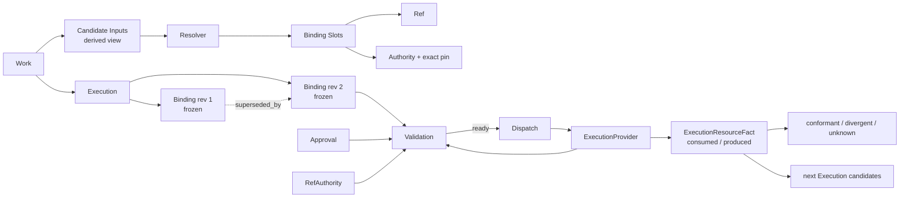

# Agent-Box Execution Binding / Governed Handoff 候选模型
>
> Historical record — describes an earlier architecture or validation state and is not current implementation guidance.
>
> Historical record — describes an earlier architecture or decision input and is not current implementation guidance.

> 文档导航：[总目录](../README.md)

> 研究日期：2026-08-22
> 范围：Production Work Core v0.1 的增量模型推导、对抗验证与最小 Spike 计划

## 最终裁决

**C. MODEL IS PROMISING**

这个模型有独立使用价值，值得做最小真实 Spike，但目前没有足够证据进入 production freeze。

核心结论：

> Execution Binding 是一个属于单次 Execution、冻结后不可变、由外部 Authority 解析和验证、并与 Provider 实际消费事实分离的输入契约。

它不是 Ref 列表，也不是 prompt context。它解决的是：

```text
长期 identity（Ref）
    ↓ 选择、赋 role、固定版本
Execution-specific contract（Binding）
    ↓ Authority + Approval + Provider capability validation
可 dispatch
    ↓
Provider actual consumption
    ↓
match / divergence / unknown
```

现有语义不需要推翻。Work、Execution、Ref、显式 Work closure、provider-native runtime ownership 都保持不变，符合当前冻结契约的设计法则：[CORE_CONTRACT_V0_1.md](../contracts/work-core/v0_1/CORE_CONTRACT_V0_1.md)。

---

## Model



关键不变量：

1. `Ref` 表示长期外部 identity。
2. `BoundRef = Ref + Authority + exact pin`，只是值对象。
3. `Binding` 表示一次 Execution 对输入的使用决定。
4. 冻结后的 Binding 内容永不修改。
5. Binding 的“当前有效性”不是自身状态，而是带时间戳的 Validation 结论。
6. requested/frozen 与 actual consumed 永远分开。
7. Provider outcome 与 Binding conformance 永远分开：`Execution succeeded` 不代表 `Binding conformant`，也不代表 `Work completed`。

---

## 最小对象集合

建议保留四个一级持久概念、一个子实体、一个值对象。

| 对象 | 层级 | 必要性 |
|---|---|---|
| `ExecutionBinding` | 一级 aggregate | 唯一能表示“本次 Execution 的冻结输入契约” |
| `BindingSlot` | Binding 子实体 | requirement、role、选择规则和绑定结果天然属于 Binding |
| `BoundRef` | 值对象 | `Ref + authority + exact pin`，没有独立 lifecycle |
| `BindingValidation` | 一级 evidence | 校验可重复、会过期、可能 unreachable，不能写进冻结 Binding |
| `ApprovalDecision` | 一级 evidence | 异步、可过期/撤销，且有独立 issuer/proof/actor |
| `ExecutionResourceFact` | 一级 evidence | 必须独立记录实际 consumed/produced，不能覆盖 desired Binding |

不保留：

- `BindingRequirement`：并入 `BindingSlot`。
- `BindingCandidate`：只作为 resolver 的临时 DTO；选中理由写入 slot。
- `BindingSnapshot`：冻结后的 Binding 本身就是 snapshot。
- `Invalidation`：表示为新的 invalid/unknown Validation 与 material Event。
- `ConsumptionRecord`：由 `ExecutionResourceFact(direction=input)` 表达。
- `OutputDeclaration`：Binding 不管理预期输出；实际输出沿用 Execution output Ref，并用 `ExecutionResourceFact(direction=output)` 固定版本。
- 独立 `BindingResolver` domain object：resolver 是可替换服务，不是领域实体。

---

## Core entities

### 1. ExecutionBinding

```text
ExecutionBinding {
  id
  execution_id
  revision
  state: draft | frozen | abandoned

  purpose                    # e.g. codex-handoff / ci-test / production-deploy
  required_assurance         # enforced | recorded
  resolver_id
  resolver_version
  selection_provenance_ref?

  supersedes_binding_id?
  content_digest?
  created_by
  created_at
  frozen_at?
}
```

说明：

- Binding 只属于 `Execution`，不直接属于 Work。
- Work 通过 Execution 间接拥有它。
- `purpose` 会交给 Authority，用于判断“存在但不适合本次用途”，例如 artifact v2 仍存在但已不允许用于 production。
- `required_assurance=enforced` 表示 Provider 必须按 exact pin 或原子 precondition 消费。
- `recorded` 只保证事后记录，不能宣传为安全执行保证。

### 2. BindingSlot

```text
BindingSlot {
  binding_id
  slot_key                   # workspace.primary
  role                       # source.workspace / test.dataset / runtime.environment
  required

  expected_ref_type
  selector_kind              # exact / git.current-head / artifact.approved-current
  selector_value?            # branch/ref/policy identifier，非 DSL
  constraint_ref?            # 外部 policy/selection rule 引用

  selected_ref?
  authority_id?

  pin_scheme?                # git.commit / sha256 / vault.kv2.version /
                             # environment.uid+generation
  pin_value?                 # Authority 生成的 canonical opaque token

  resolved_at?
  resolution_evidence_ref?

  approval_required
  approval_policy_ref?
  slot_digest?
}
```

每个 slot 只绑定一个 Ref。多值角色使用多个不同 `slot_key`，不在 v1 引入 cardinality engine。

必须同时保留：

- `selector`：当初要求什么。
- `selected_ref`：选择了哪个长期 identity。
- `pin`：解析后固定到了哪个具体版本。

这避免把“使用 commit A”和“使用 main 当前 commit”混为一谈。

### 3. BoundRef

逻辑值：

```text
BoundRef {
  ref
  authority_id
  pin_scheme
  pin_value
}
```

Core 只比较 canonical identity 和 pin 是否相等，不解释其内部顺序或版本语义。

例如：

```text
WorkspaceRef(repo-x)
  + git.commit
  + abc123

EnvironmentRef(staging)
  + environment.uid+generation
  + "uid=7a21...;generation=12"

SecretRef(signing-key)
  + vault.kv2.version
  + "7"
```

### 4. BindingValidation

```text
BindingValidation {
  id
  binding_id
  binding_digest
  trigger                  # preflight / manual / authority-notification
  state                    # running | completed | abandoned
  verdict                  # valid | invalid | unknown
  started_at
  completed_at?
  valid_until?
  idempotency_key
}

BindingValidationItem {
  validation_id
  slot_key?
  check_kind               # structure / resource / approval / consumer
  checker_id               # Core / authority / approval verifier / provider
  verdict                  # valid | invalid | unknown
  reason_code
  expected_pin?
  observed_pin?
  enforcement_mode?        # immutable-address | conditional-use | observe-only
  observed_at
  valid_until?
  evidence_ref?
}
```

为什么 Validation 必须独立：

- Git commit 可能仍存在，但不再是 branch head。
- Vault 可能暂时 unreachable。
- approval 可能过期。
- 环境 generation 可能变化。
- 同一冻结 Binding 可以被多次重新验证，但内容不变。

### 5. ApprovalDecision

```text
ApprovalDecision {
  id
  subject_kind             # binding | slot
  subject_digest
  issuer_id                # human-gate / github / policy-engine / deployment-gate
  actor_ref?
  decision                 # approved | rejected | revoked
  proof_ref
  decided_at
  expires_at?
  supersedes_decision_id?
  received_at
}
```

Core 保存：

- 批准了哪个精确 digest。
- issuer、actor reference。
- decision/proof reference。
- 决定和过期时间。
- 哪个新决定撤销/替代旧决定。

Core 不保存：

- 用户目录。
- role hierarchy。
- GitHub organization 权限。
- ACL/RBAC。
- 完整 policy。
- 签名私钥或 credential。

Approval 是外部事实，不是 Core 自己对权限的判断。

### 6. ExecutionResourceFact

```text
ExecutionResourceFact {
  id
  execution_id
  binding_id?
  slot_key?

  direction                # input | output
  disposition              # consumed | not_consumed | unknown | produced

  actual_ref?
  actual_authority_id?
  actual_pin_scheme?
  actual_pin_value?

  comparison               # match | mismatch | undeclared | unverifiable
  reporter_id
  assurance                # self-reported | authority-attested | runtime-attested
  evidence_ref?
  observed_at
  idempotency_key
}
```

对每个 required input slot，Provider 最终必须报告：

- `consumed + match`
- `consumed + mismatch`
- `not_consumed`
- `unknown`

Provider 额外使用的受治理资源记录为：

```text
slot_key = null
comparison = undeclared
```

Binding conformance 是派生结果：

```text
conformant:
  所有 required slot 都 consumed+match
  且没有不允许的 undeclared input

divergent:
  任一 mismatch / not_consumed / forbidden undeclared

unknown:
  证据不完整或 provider 不支持 consumption proof
```

Provider 声称 succeeded 时仍可能是 `binding_conformance=divergent`。

---

## Mutable / Immutable

| 内容 | 是否可变 |
|---|---|
| Draft Binding 与 draft slots | 可变 |
| Frozen Binding、slots、digest | 永久不可变 |
| 新 Binding revision | 新对象，不修改旧 revision |
| Validation running header | 完成前可推进 |
| Completed Validation/items | 不可变 |
| ApprovalDecision | 不可变；撤销写新 decision |
| ExecutionResourceFact | 不可变；更正写 superseding fact |
| Execution.accepted_binding_id | 仅允许 `null → binding_id` 一次 |
| Ref | 保持现有长期 identity 语义，不因资源变化改写 |

Secret rotate 不修改旧 Binding：

- 如果旧 secret version 仍允许 exact read：重新 validate 后可能仍 valid。
- 如果旧 version 被 revoked/destroyed 或规则要求 current：Validation invalid。
- 需要新版本时创建新 Binding revision。
- 已经 DispatchRequested 后不得在同一 Execution 上 rebind。

---

## State machines

### Binding lifecycle

```text
draft ───────→ frozen
  │              │
  └→ abandoned   └→ final, immutable
```

“superseded”不是对旧 Binding 的状态修改。新 Binding 使用：

```text
B2.supersedes_binding_id = B1.id
```

Execution 通过 `accepted_binding_id` 指明真正 dispatch 的 revision。

### Validation lifecycle

```text
running
  ├──→ completed(valid)
  ├──→ completed(invalid)
  ├──→ completed(unknown)
  └──→ abandoned
```

三个不同维度不能压成一个 enum：

| 维度 | 状态 |
|---|---|
| Authority truth | `valid / invalid / unknown` |
| Evidence freshness | `fresh / stale`，由 `valid_until` 派生 |
| Launch admission | `ready / blocked` |

规则：

```text
ready =
  binding is frozen
  AND completed validation verdict == valid
  AND validation not stale
  AND required approvals valid
  AND provider can enforce required assurance
  AND no newer invalidation observation
```

其他情况全部 `blocked`。

具体失败语义：

| 情况 | Validation | Admission |
|---|---|---|
| Git commit missing | invalid | blocked |
| expected A，current B 且规则要求 current | invalid | blocked |
| Vault unreachable | unknown | blocked |
| authority response expired | stale → treated as unknown | blocked |
| required approval absent | resource 可 valid；approval item invalid | blocked |
| environment generation changed | invalid | blocked |
| provider 只能 observe，但要求 enforced | invalid consumer check | blocked |

默认永不 fail-open。

---

## Ownership

| 字段/事实 | 权威来源 |
|---|---|
| Binding ID、revision、freeze、digest | Core |
| Slot roles、required、purpose、selector | Host/execution template |
| Candidate ranking/selection | Host/resolver/user |
| Ref identity | 现有 Ref issuer/provider |
| pin scheme/value | RefAuthority |
| existence/currentness/supersession/revocation | RefAuthority 或外部 policy authority |
| approval requirement | Host/template |
| approval decision、actor、proof | 外部 approval source |
| validation aggregate/admission | Core，根据外部 item 计算 |
| pin enforcement 能力 | RefAuthority + ExecutionProvider |
| 实际 consumed/produced | ExecutionProvider、runtime 或 Authority attestation |
| Execution outcome/projection | ExecutionProvider |
| Work completion | host/user/显式 closure policy，保持不变 |

Core 不自行理解 Git、Vault、Docker、Kubernetes 或 artifact currentness。

---

## Resolve flow

```text
1. Create Execution in undispatched state
2. Create Binding draft
3. Derive candidate view from Work graph
4. Host/template creates required slots
5. Resolver recommends candidate Ref for each slot
6. Host/user selects candidate
7. RefAuthority.resolve() returns exact BoundRef
8. Core structurally validates all required slots
9. Core canonicalizes content and freezes Binding
10. Approval sources approve binding_digest or slot_digest
```

Candidate inputs 可以来自：

- 同一 Work 的历史 Execution outputs。
- 已附加的 Work/Execution refs。
- host 显式提供的 Ref。
- provider/extension 发现的 refs。
- 上一次 `ExecutionResourceFact(direction=output)`。

不持久化全部 candidate 集合。只在 slot 中保留：

- selector；
- selected Ref；
- resolver/version；
- selection provenance reference。

这样避免把 Binding 变成 recommendation/RAG 系统。

---

## Validation flow

Dispatch 前必须执行完整 preflight：

1. Core 检查 Binding frozen、digest 正确、required slot 完整。
2. 每个 RefAuthority 校验：
   - pin 是否存在；
   - 是否仍可访问；
   - 是否符合 selector/constraint；
   - 是否适合当前 `purpose`；
   - pin 如何被安全消费。
3. Approval source/verifier 检查 subject digest、issuer、expiry、revocation。
4. ExecutionProvider 检查自己能否消费这些 Ref type/pin scheme。
5. Core 聚合为 valid/invalid/unknown。
6. Core 在同一数据库事务中：
   - 设置 `Execution.accepted_binding_id`；
   - 关联 `validation_id`；
   - 写 `DispatchRequested`；
   - 固定 dispatch idempotency key。

重要限制：

> “刚刚 validate 为 valid”不足以消除 validate 与真正消费之间的 TOCTOU。

因此每个 slot 还要声明/返回 enforcement mode：

- `immutable-address`：Git commit、OCI digest、artifact digest、Vault exact version。
- `conditional-use`：在真正操作时携带 UID/resourceVersion/generation precondition。
- `observe-only`：只能事后观察，不能用于要求 `enforced` 的 production Binding。

Kubernetes 的 UID/resourceVersion precondition 正是这种比较后执行语义；仅名称相同并不足够。[Kubernetes Preconditions](https://kubernetes.io/docs/reference/kubernetes-api/definitions/preconditions-v1-meta/)

---

## Execution flow

ExecutionProvider 应与 RefAuthority 分离。

同一个插件可以同时实现二者，但接口和 authority identity 不能混合。

```text
ExecutionProvider.start({
  execution_id,
  dispatch_id,
  frozen_binding_id,
  binding_digest,
  slots: [
    role,
    ref,
    authority_id,
    pin_scheme,
    pin_value,
    required_assurance
  ]
})
```

Provider 必须：

1. 拒绝不支持的 Ref/pin。
2. 使用 exact locator 或 conditional precondition。
3. 不把 Binding 当 prompt 文本。
4. 以 `dispatch_id` 做幂等启动。
5. 返回 native refs。
6. 记录每个 slot 的 consumed/not-consumed/unknown。
7. 报告额外受治理输入。
8. 报告 versioned output facts。

如果 Provider 实际使用 commit B，而 Binding 固定 commit A：

```text
Execution outcome: succeeded
Binding conformance: divergent

expected: WorkspaceRef(repo) @ git.commit:A
actual:   WorkspaceRef(repo) @ git.commit:B
comparison: mismatch
```

Core 不修改 Binding，也不伪造失败 outcome。

---

## Consumption proof

Consumption proof 有不同可信强度：

| 级别 | 示例 |
|---|---|
| self-reported | Codex/CI adapter 返回实际 checkout commit |
| authority-attested | Git/Vault/environment authority 证明实际读取版本 |
| runtime-attested | sandbox/build runtime/SLSA provenance 证明输入集合 |

SLSA 将外部参数、resolved dependencies、具体 invocation 和 builder trust 分开；这与 requested/resolved/actual 的区分高度相似。[SLSA Build Provenance](https://slsa.dev/spec/v1.2/build-provenance)

但 Agent-Box 不应声称 LLM Execution 可确定性重现。Binding 保证的是：

- 输入依据可重建；
- 版本和治理决策可审计；
- Provider divergence 可发现或明确标记 unknown。

它不保证同样输入得到同样模型输出。

---

## Invalidation

不创建独立 `Invalidation` aggregate。

失效来源生成新的 Validation evidence：

```text
BindingValidation {
  trigger = authority-notification
  verdict = invalid
  reason = artifact_superseded
}
```

典型原因：

| 原因 | Authority 结论 |
|---|---|
| secret version destroyed/revoked | invalid |
| server UID/generation changed | invalid |
| workspace HEAD changed，selector 要求 current | invalid |
| artifact 仍存在但不再 approved-current | invalid |
| authority unreachable | unknown |
| validation TTL 到期 | stale/unknown |
| approval revoked/expired | invalid approval check |

Artifact v2 仍存在但 v3 已是 production current：

```text
existence check: valid
purpose eligibility: invalid
reason: superseded_for_production
observed replacement: ArtifactRef(v3)@digest
```

这不是删除 v2，也不是 Core 管 artifact lifecycle。

Terraform saved plan 在所依据 state 变化后会被判 stale/discard，说明“冻结决定”和“apply-time freshness”必须分离。[HashiCorp saved plan semantics](https://developer.hashicorp.com/terraform/enterprise/workspaces/run/cli)

---

## Rebind

Rebind 规则：

1. 旧 Binding 永不修改。
2. 复制为新 draft revision。
3. 只替换 invalid slot 的 Ref/pin/selector。
4. 重新计算 slot digest 与 binding digest。
5. 再次 approval/validation。
6. 新 Binding 通过 `supersedes_binding_id` 指向旧版本。

Approval 重用取决于 scope：

- binding-level approval：Binding digest 改变后一定不能复用。
- slot-level approval：slot digest 未变化时可以复用，但仍需 issuer policy 允许。

边界：

- `DispatchRequested` 前：同一 Execution 可有多个 revision。
- `DispatchRequested` 后：accepted Binding 永久固定。
- dispatch 后发现需 rebind：创建新 Execution，因为旧 Provider 可能已经产生外部影响。

---

## Audit

一次历史 Execution 的完整输入依据由以下 current/evidence tables 直接查询：

```text
Execution
  → accepted Binding + content digest
  → frozen Slots + Ref + exact pins + selectors
  → ApprovalDecision IDs actually used
  → final preflight Validation + authority evidence
  → Dispatch event and native refs
  → ExecutionResourceFacts(actual inputs)
  → output Ref + exact produced pins
  → conformance result
```

事故后可以回答：

- 系统请求了什么？
- resolver 选择了什么？
- freeze 时固定了什么？
- 谁批准了哪个 digest？
- dispatch 前谁验证过、何时过期？
- Provider 实际使用了什么？
- 是否有 divergence？
- 哪些输出进入了下一次 Binding？

这能重建 manifest 和依据，不保证外部资源 bytes 仍被保留。资源 retention 仍属于 Git/Vault/artifact/environment authority。

EventLedger 只记录 material boundary：

- `BindingFrozen`
- `ApprovalDecisionRecorded`
- `BindingValidationCompleted`
- `BindingInvalidated`
- `BindingAcceptedForDispatch`
- `ExecutionInputsAttested`
- `BindingDivergenceDetected`

不记录：

- candidate 枚举；
- 每次 authority poll；
- 每个 validation item；
- provider 原生日志；
- secret/access payload。

这保持当前 EventLedger “material cross-system facts、非 event sourcing”的冻结约束：[EVENT_LEDGER_CONTRACT_V0_1.md](../contracts/work-core/v0_1/EVENT_LEDGER_CONTRACT_V0_1.md)。

---

## Crash / restart 与去重

| 风险 | 处理 |
|---|---|
| resolve 后、freeze 前 crash | draft 从 DB 恢复；Authority resolve 可安全重试 |
| validation 中 crash | running validation 不可用于 dispatch；用同一 request/idempotency key 恢复或 abandon |
| validation 完成后 crash | completed evidence 已提交，可直接复用直到过期 |
| dispatch transaction crash | accepted binding、validation relation、dispatch row、event 同事务 |
| Provider start 返回前 crash | Provider 必须以 dispatch ID 幂等；重启先 observe correlation |
| Provider 不支持幂等 start | 结果只能标记 unknown，不能冒险重复启动 |
| duplicate validation | `UNIQUE(binding_id, idempotency_key)` |
| duplicate authority result | `checker_id + request_id` 唯一 |
| duplicate consumption fact | reporter native event ID 或 fact idempotency key 唯一 |
| duplicate Event | material fact key 唯一；同结果重复 poll 不写 event |

系统恢复依赖实体表，不 replay ledger，因此没有变成 event sourcing。

---

## Extension contracts

### RefAuthority

```text
RefAuthority {
  descriptor()
  capabilities()

  resolve(
    ref,
    selector,
    purpose,
    request_id
  ) -> {
    verdict: resolved | missing | unknown
    bound_ref?
    observed_at
    evidence_ref?
  }

  validate(
    bound_ref,
    selector,
    purpose,
    request_id
  ) -> {
    verdict: valid | invalid | unknown
    reason_code
    current_pin?
    observed_at
    valid_until?
    enforcement_mode:
      immutable-address | conditional-use | observe-only
    evidence_ref?
  }
}
```

可选：

```text
subscribe_invalidations(refs) -> material observations
```

`Ref.provider` 不应被重新解释为 Authority。BindingSlot 显式保存 `authority_id`，Registry 可以提供 `(RefType, provider) → default authority` 路由。

### ExecutionProvider 扩展

保留现有 `start/observe`，增加 capability-qualified governed binding 支持：

```text
capabilities() {
  governed_binding: supported | unsupported
  consumption_proof: self_reported | attested | unsupported
  supported_pin_schemes: [...]
  conditional_use: [...]
}
```

```text
start(request_with_frozen_binding)
observe_consumption(native_ref) -> ExecutionResourceFact[]
```

不是所有 ExecutionProvider 都必须实现资源 validation。现有 provider 可保持 legacy。

当前 provider 契约已明确 unreachable 必须投影为 unknown；新 Authority 契约延续这一原则：[EXECUTION_PROVIDER_CONTRACT_V0_1.md](../contracts/work-core/v0_1/EXECUTION_PROVIDER_CONTRACT_V0_1.md)。

### Approval source

可选极窄接口：

```text
ApprovalVerifier.verify(
  subject_digest,
  proof_ref,
  issuer_id
) -> approved | rejected | revoked | unknown
```

它不负责用户管理或 RBAC。

---

## Secret 安全性

模型可以安全表达 Secret：

```text
SecretRef {
  provider = vault-prod
  native_id = signing-key-handle
}

BoundRef {
  authority_id = vault-kv2
  pin_scheme = vault.kv2.version
  pin_value = 7
}
```

Core 永不存储：

- secret value；
- decrypted content；
- provider credential；
- secret material digest。

尤其不应对低熵 secret value 做 hash 后持久化，否则可能产生离线猜测风险。

Provider 通过自身 runtime credential 使用 `handle + exact version`。Vault KV v2 本身就公开 version、deletion time、destroyed 等 metadata，而无需泄漏 value。[Vault KV version metadata](https://developer.hashicorp.com/vault/docs/commands/kv/metadata)

---

## 三个场景验证

### Scenario 1：Codex → Codex

第一次 Execution A：

```text
workspace.primary     WorkspaceRef(repo)    git.commit=A
architecture          ArtifactRef(arch)     sha256=V3
benchmark             ArtifactRef(bench)    sha256=V2
```

第二次 Codex 创建 Execution B，Binding B1。

关键点：repo 变化是否 invalid，取决于 slot selector。

#### 如果要求继续使用 exact A

```text
selector = exact
pin = A
```

只要 commit A 仍存在且可 checkout，HEAD 变为 C 不使它失效。

#### 如果要求接手时使用最新 workspace

```text
selector = git.current-head(main)
resolved pin = A
```

执行前 main 已变为 C：

| Slot | 结果 |
|---|---|
| workspace | invalid，observed=C，needs rebind |
| architecture v3 | unchanged + still approved-current，复用 |
| benchmark v2 | digest unchanged，复用 |

创建 B2：

```text
workspace = C
architecture = V3
benchmark = V2
```

B2 freeze、重新验证、dispatch。Codex actual facts 必须报告 commit C。

这个区分很重要：不能把“Ref 变动”机械解释为失效；是否要求 current 是 slot contract 的一部分。

### Scenario 2：Codex → CI

CI Binding：

```text
source.workspace      git.commit=C
test.config           sha256=T
test.dataset          sha256=D
runtime.environment   uid=ENV-8;generation=12
```

前三者是 immutable-address。staging 需要 conditional-use。

staging 被重建：

```text
same Ref/native name: staging
old pin: uid=ENV-8;generation=12
new pin: uid=ENV-9;generation=1
```

Authority 返回：

```text
invalid
reason=instance_replaced
current_pin=uid=ENV-9;generation=1
```

旧 Binding 不能 dispatch。

B2 必须重新绑定环境；CI provider 必须在真正启动测试时带环境 UID/generation precondition。仅“preflight 时看到 generation 正确”仍不足够。

### Scenario 3：Human → Deployment

冻结 Binding：

```text
image       digest=X
target      uid=STAGING-3;generation=12
```

Human approval 的 subject 可以是：

- 整个 `binding_digest`；或
- image slot digest 与 target slot digest 分开。

部署前 target 变为 generation 13：

```text
image validation: valid
target validation: invalid
binding admission: blocked
```

创建 B2：

```text
image=X
target=generation13
```

审批后果：

- binding-level approval：必须全部重新批准。
- slot-level approval：image X 的 approval 可复用；target 需要新 approval。

不能把 generation 12 的批准自动解释为 generation 13 的批准。

---

## 成熟系统类比

| 系统 | 可提取语义 | 不照搬部分 |
|---|---|---|
| Bazel / Remote Execution | Action 将 command 和 input root 固定为 digest；缺输入是 precondition failure。[Remote Execution API](https://github.com/bazelbuild/remote-apis/blob/main/build/bazel/remote/execution/v2/remote_execution.proto) | 不引入 build DAG、cache graph |
| OCI | tag/name 与 content digest 分离，消费时验证 digest。[OCI Descriptor](https://github.com/opencontainers/image-spec/blob/main/descriptor.md) | 不复制 registry/image store |
| Terraform saved plan | 冻结 plan 可被批准，但依赖 state 变化后会 stale | 不引入 infrastructure state engine |
| Kubernetes | 名称不是实例；UID/resourceVersion 可作为操作 precondition | 不引入 controller/reconciliation loop |
| Vault KV v2 | handle 与 secret version 分离；version 可 deleted/destroyed | 不保存 secret value |
| SLSA | build definition、resolved dependencies、run details、builder trust 分离 | 不宣称完整供应链安全或确定性重现 |

最重要的组合不是单一类比，而是：

```text
Bazel/OCI 的 exact pin
+ Terraform 的 apply-time freshness
+ Kubernetes 的 conditional use
+ SLSA 的 actual provenance
```

---

## 对抗验证

| 攻击 | 结论 |
|---|---|
| 只是 dependency injection？ | 否。DI 不提供持久 pin、时效校验、approval、dispatch gate、actual proof |
| 只是 RAG？ | 否。资源可以是 repo、secret、server、dataset；且不处理 retrieval ranking |
| 只是 manifest？ | Frozen Binding 可序列化成 manifest，但 manifest 本身没有 Authority、freshness、approval 或 actual divergence |
| 只是 lockfile？ | Binding 有 lockfile 成分，但还包含用途、时效、批准、Provider enforcement 与实际消费 |
| 只是 provenance？ | Provenance 是事后；Binding 是事前 admission contract，二者通过 actual facts 对照 |
| GitHub Issue + YAML 可替代？ | 低风险人工流程可以。无法自然提供原子 dispatch gate、authority precondition、幂等消费证明 |
| 维护成本是否过高？ | 若要求用户手工创建每个 Ref/slot，答案是是，产品应 FAIL |
| 是否需要大量手工 Ref？ | 不允许。Ref discovery、carry-forward、resolve、revalidate 必须自动化 |
| 是否必须高度自动化？ | 是；这是模型成立的产品前提 |
| provider version 语义会击穿统一模型？ | 不会，Core 不统一解释版本，只统一 `identity + canonical pin + authority verdict + enforcement + actual comparison` |

模型不是万能可复现系统。它只治理被声明为 Binding scope 的外部输入。Provider 内部模型权重、系统二进制、工具链若会影响结果，应进入 Execution provenance 或显式 slot；未声明时必须降低 completeness/assurance，而不能声称 fully reproducible。

---

## Minimal schema

暂不实现 migration，建议表形如下：

```text
core_execution_bindings
  id PK
  execution_id FK
  revision
  state
  purpose
  required_assurance
  resolver_id
  resolver_version
  selection_provenance_ref
  supersedes_binding_id
  content_digest
  created_by
  created_at
  frozen_at
  UNIQUE(execution_id, revision)

core_binding_slots
  binding_id FK
  slot_key
  role
  required
  expected_ref_type
  selector_kind
  selector_value
  constraint_ref
  ref_type/provider/native_id/uri
  authority_id
  pin_scheme
  pin_value
  resolved_at
  resolution_evidence_ref
  approval_required
  approval_policy_ref
  slot_digest
  PRIMARY KEY(binding_id, slot_key)

core_binding_validations
  id PK
  binding_id FK
  binding_digest
  trigger
  state
  verdict
  started_at
  completed_at
  valid_until
  idempotency_key UNIQUE

core_binding_validation_items
  validation_id FK
  slot_key
  check_kind
  checker_id
  verdict
  reason_code
  expected_pin_scheme/value
  observed_pin_scheme/value
  enforcement_mode
  observed_at
  valid_until
  evidence_ref
  UNIQUE(validation_id, slot_key, check_kind, checker_id)

core_approval_decisions
  id PK
  subject_kind
  subject_digest
  issuer_id
  actor_ref
  decision
  proof_ref
  decided_at
  expires_at
  supersedes_decision_id
  received_at

core_execution_resource_facts
  id PK
  execution_id FK
  binding_id
  slot_key
  direction
  disposition
  actual_ref columns
  actual_authority_id
  actual_pin_scheme/value
  comparison
  reporter_id
  assurance
  evidence_ref
  observed_at
  idempotency_key UNIQUE
```

`core_executions` 增加：

```text
binding_mode: legacy | governed
accepted_binding_id nullable
accepted_validation_id nullable
```

设置 accepted binding 与创建 dispatch 必须同事务。

---

## Compatibility with Work Core v0.1

兼容方式应是 additive：

1. Work、Execution identity 与 closure 语义不改。
2. 历史 Execution 标记为 `binding_mode=legacy`，允许无 Binding。
3. 新 governed Execution 可以先无 Binding，但不能 dispatch。
4. 一个 Execution 可在 dispatch 前拥有多个 revision。
5. 现有 `core_execution_refs(input)` 继续作为粗粒度关系，但不再被视为治理证明。它目前只持久化 Ref tuple，没有 role、pin 或 validation：[repository.py](../../src/agent_box/work_core/repository.py)。
6. Ref 的现有字段保持不变；authority/pin 放进 BindingSlot，不塞入 Ref metadata。
7. Spike 只需给 `RefType` 增加 `EnvironmentRef`。当前实现只有 Workspace/Artifact 等五类：[models.py](../../src/agent_box/work_core/models.py)。
8. ExtensionRegistry 增加独立 `RefAuthority` 注册表。
9. Existing ExecutionProvider 无需立即实现 governed binding；不支持时只能运行 legacy execution。
10. Work succeeded/completed 语义不受 Binding conformance 影响。

---

## 最小 Spike

选择：

- `WorkspaceRef`
- `ArtifactRef`
- `EnvironmentRef`
- 一个 `FakeAuthority`：Artifact + Environment
- 一个真实 `GitAuthority`
- 两个 Execution：A、B
- B 内有 Binding B1、B2 两个 revision

流程：

```text
1. 创建 Git repo，commit A
2. 创建 environment staging generation 12
3. Execution A 基于 A 运行
4. A 产生：
   - Workspace/commit output Ref C
   - ArtifactRef(result) @ sha256:R

5. 创建 Execution B
6. 自动从 A outputs 生成 candidate view
7. Binding B1：
   workspace.current = C
   artifact.input = R
   environment = generation12
8. freeze B1 + approval proof
9. 外部变化：
   repo head C → D
   environment 12 → 13
10. validate(B1)
    workspace invalid
    artifact valid
    environment invalid
    admission blocked

11. 创建 B2 supersedes B1
12. 复用 artifact slot；rebind workspace D、environment 13
13. freeze/approve/validate B2
14. Execution B 使用 accepted B2
15. Provider 报告 actual consumed facts
16. 查询 Execution B 的 frozen、approved、validated、actual input 集合
```

必须有以下断言：

- B1 digest 与 slots 在变化后完全未修改。
- B1 不能产生 DispatchRequested。
- B2 只改变需要 rebind 的 slot。
- 旧 binding-level approval 不自动迁移。
- Execution B 的 actual commit/generation 可查询。
- 注入 actual commit E 时，Execution 可 succeeded，但 conformance 必须 divergent。
- Authority unreachable 时结果是 unknown + blocked。
- restart 后重复 validate/start/report 不产生重复记录或 event。

Spike 明确不实现：

- scheduler；
- DAG/workflow；
- retry engine；
- artifact store；
- secret store；
- RBAC；
- 通用 policy DSL；
- UI binding editor。

---

## Kill Criteria 复核

当前候选模型没有触发结构性 `FAIL`：

- 不是 Ref list 或 prompt context。
- 能处理 version、generation、supersession、unreachable。
- 明确区分 requested、resolved、frozen、approved、actual。
- 可用于 Codex、CI、Deployment/Human approval。
- 不依赖 workflow/scheduler。
- 不复制外部资源状态。
- provider 差异被限制在 Authority pin/verdict/enforcement 内。
- 能由自动 candidate/resolution/rebind 降低维护成本。

但 Spike 应增加三个立即终止条件：

1. 无法让真实 Git Authority 自动生成、验证 canonical pin。
2. Provider 无法证明或强制实际使用 frozen pin，只能把它写进 prompt。
3. 正常 handoff 仍需用户手工创建大部分 Ref/slot/approval linkage。

任一出现，应把最终裁决降为：

**A. MODEL FAILS**，而不是继续堆对象补救。

目前最合理的裁决仍是：

> **C. MODEL IS PROMISING — 值得验证 governed handoff，但尚未被真实 provider enforcement 与 consumption proof 强验证。**
