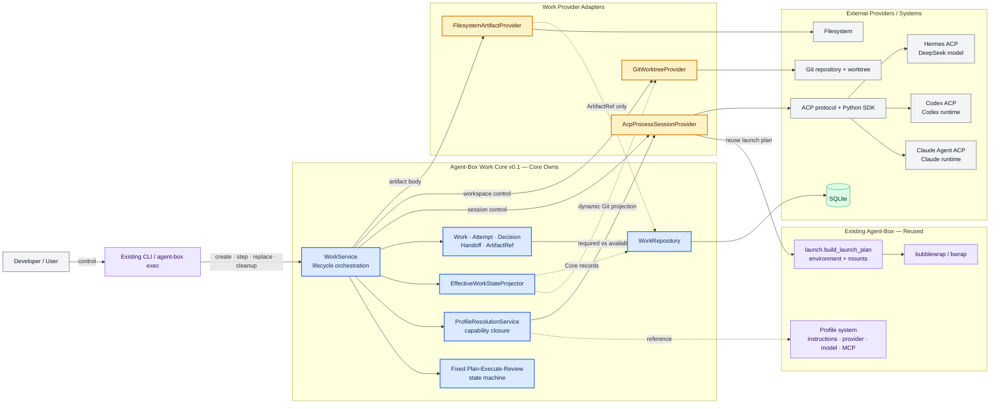
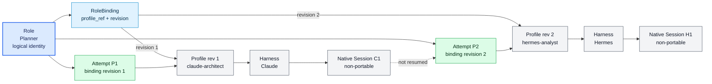
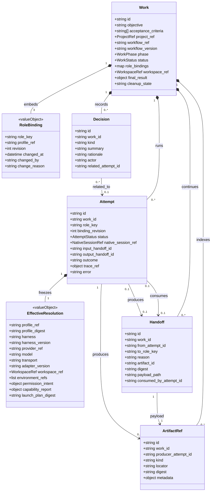
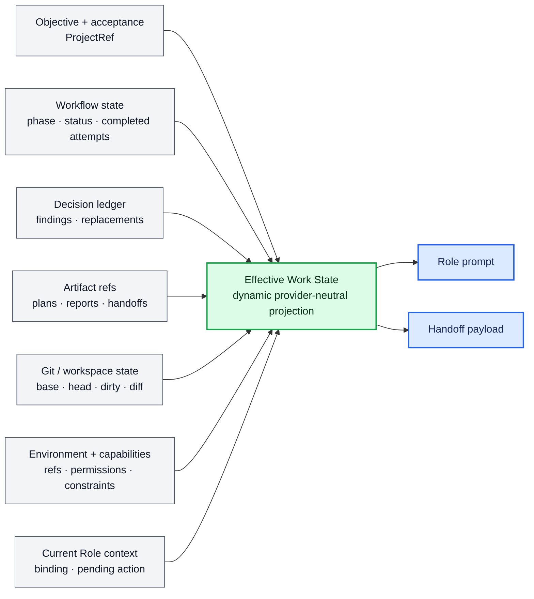
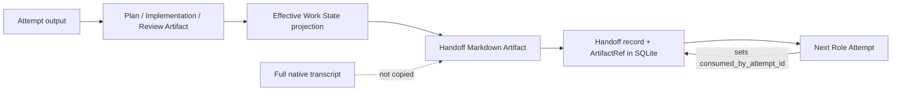
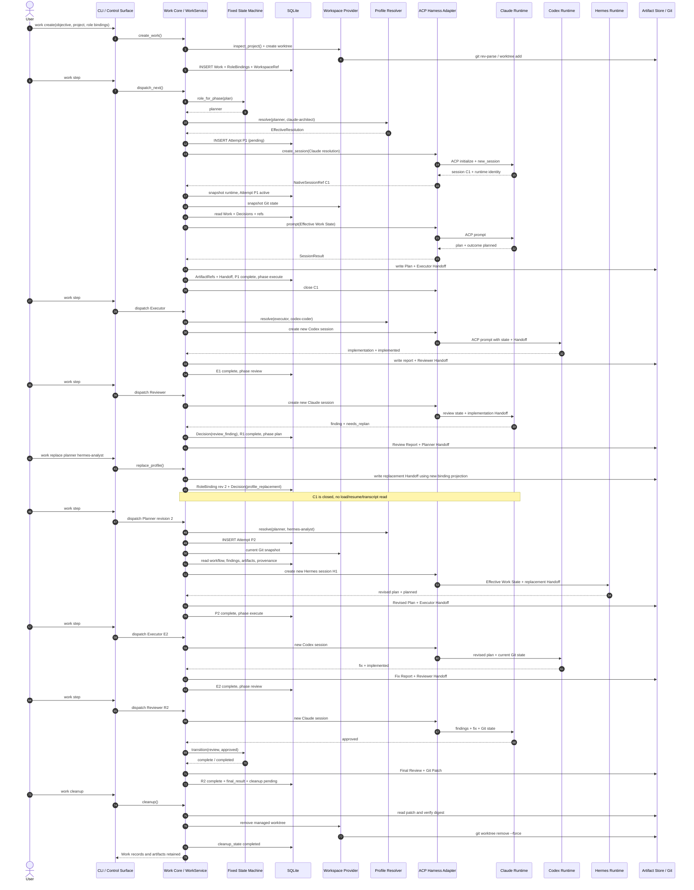

# Agent-Box Work Core v0.1：架构与执行流
>
> Historical record — describes an earlier architecture or validation state and is not current implementation guidance.

> 文档导航：[总目录](../README.md)

> 面向开发者。描述 `experiment/work-core-v0.1` 当前已经实现并完成真实 E2E 验证的原型。

## 1. 一张图看懂当前原型



图例：

- 蓝色：Work Core 自己拥有的语义和代码。
- 黄色：Work Core 到 provider 的窄适配层。
- 紫色：Agent-Box 已有能力，原型直接复用。
- 灰色：外部协议、runtime 或系统。
- 实线：控制流；虚线：引用或动态数据投影。

## 2. Work Core 实现了什么

### 已实现

- 独立 Work ID、objective、acceptance criteria、ProjectRef。
- 固定 `Plan → Execute → Review` 状态机及 `needs_replan` / `needs_fix` 回路。
- `Planner`、`Executor`、`Reviewer` 三个逻辑 Role。
- Role → Profile binding 与 binding revision。
- 每次 Role 执行对应一个独立 Attempt。
- Role/Profile → harness/model/workspace/capability 的 Effective Resolution。
- ACP-first 的 session create、prompt、stream、permission、cancel、close。
- Git worktree 创建、状态投影、patch 导出和安全 cleanup。
- provider-neutral Effective Work State。
- Handoff Artifact、Decision ledger、Artifact index 与 provenance。
- Planner Profile replacement；新 Planner 使用新 native session 接续。
- SQLite persistence 和 CLI 控制面。

### 刻意未实现

- 通用 workflow engine、任意 DAG、动态节点 DSL。
- 通用 Task/Issue 系统。
- native transcript 迁移或跨 harness conversation resume。
- mid-tool-call hot swap。
- object store、分布式 scheduler、OTel Collector。
- 新 sandbox runtime。
- 自动 commit、merge 或 PR。
- GUI 驱动的 E2E。

### Table 1 — Core vs External Boundary

| Component | Owned by Core? | Type (Own/Ref/Delegate/Adapter/External) | Responsibility |
|---|---:|---|---|
| Work lifecycle | Yes | Own | 创建、推进、停止、完成、cleanup |
| Fixed workflow state machine | Yes | Own | 校验 outcome，决定下一 phase/Role |
| Work / Attempt / Decision / Handoff / ArtifactRef | Yes | Own | provider-neutral identity、continuity、correlation |
| RoleBinding / EffectiveResolution | Yes | Own | 嵌入 Work/Attempt 的不可变语义快照 |
| Profile content | No | Reference | Core 只保存 `profile_ref` 和 digest；Profile 系统仍是权威来源 |
| Project / Workspace | Partly | Reference + Delegate | 保存 ProjectRef/WorkspaceRef；Git provider 管理实际 worktree |
| Native session | No | Reference | 保存 NativeSessionRef；不复制 native state/transcript |
| Workflow execution | Yes | Own | v0.1 仅有固定小状态机，不委托外部 workflow runtime |
| Capability resolution | Yes | Own + Adapter | Core 定义 required/closure；adapter/provider 报告 available |
| Harness process control | No | Adapter | ACP adapter 统一 create/prompt/cancel/close |
| Model inference | No | External | Claude、Codex、Hermes/DeepSeek 执行实际 agent 工作 |
| Environment projection | No | Reference + Delegate | 复用 Profile、Project、既有 launch plan |
| Sandbox enforcement | No | Delegate | 复用既有 bwrap launch surface |
| Artifact body | No | Delegate | 文件系统保存正文；Core 只拥有索引与 digest |
| Persistence schema | Yes | Own | 复用 Agent-Box SQLite/migration，新增五张 Work 表 |
| CLI | Partly | Adapter | 新增 WorkCommands，复用既有 CLI/REPL surface |

## 3. 当前外部依赖

### Table 2 — External Providers

| Provider | Current Choice | Responsibility | Why Not Built in Core |
|---|---|---|---|
| Session transport | ACP + `agent-client-protocol==0.9.0` | initialize、new session、prompt、stream、permission、cancel | 避免为每个 harness 重写 transport |
| Claude harness | `claude-agent-acp 0.70.0` | Planner/Reviewer native runtime | Claude 的工具、模型和 session 由 Claude runtime 拥有 |
| Codex harness | `codex-acp 1.6.2` | Executor native runtime | Codex 的工具执行和模型选择由 Codex runtime 拥有 |
| Hermes harness | `hermes-agent 0.19.0` ACP | replacement Planner；实际模型 `custom:deepseek-v4-pro` | Hermes/DeepSeek 推理不属于 Work continuity domain |
| Workspace | Git worktree | 隔离 Work 代码状态、base/branch/diff、cleanup | Git 已提供成熟 revision/worktree 语义 |
| Sandbox | Existing bubblewrap/bwrap | 运行时挂载、cwd、权限隔离 | 原型复用既有安全边界，不新增 sandbox runtime |
| Environment | Existing launch plan | Profile + Project + process env + mounts | 避免复制既有 launch/config 逻辑 |
| Artifact body | Filesystem | Plan、report、handoff、patch 文件 | v0.1 不需要 object store |
| Artifact/source result | Git + patch | tracked/new source result 与可恢复 diff | Git 是代码状态的权威系统 |
| Persistence | Existing SQLite | Work correlation、bindings、Attempt、Decision、refs | 单机原型不需要外部数据库 |
| Control surface | Existing CLI / `agent-box exec` | create、step、show、replace、cleanup | GUI 不应阻塞 E2E |

## 4. Role、Profile、Harness、Session、Attempt



| Concept | Meaning |
|---|---|
| Role | Workflow 中稳定的逻辑职责，例如 Planner。替换 Provider 后 Role 仍是 Planner。 |
| Profile | Agent-Box 配置资源：harness、provider/model、instructions、skills、MCP、permissions、runtime preferences。 |
| Harness | 实际 agent 产品/runtime 类型，例如 Claude、Codex、Hermes。 |
| Native Session | 某个 harness 创建的临时会话。属于 provider，`portable=false`。 |
| Attempt | 一个 Role 在一个 binding revision 下的一次执行记录；连接 Core continuity 与一次 native session。 |

因此：

```text
Role ≠ Profile ≠ Harness ≠ Native Session
Attempt = Role execution boundary + immutable resolution + native session reference
```

### Attempt 为什么必要

- Work 可能多轮进入同一个 Role；直接挂 session 无法区分每一轮。
- 同一 Role 可以更换 Profile、Harness 和模型。
- 每次运行需要冻结当时的 binding revision、Profile digest、capabilities 和 runtime identity。
- Attempt 承担输入 Handoff、输出 Handoff、outcome、error 和 provenance correlation。
- replacement 后必须创建新 Attempt；旧 Attempt 保留为历史证据，不被改写成 Hermes Attempt。

## 5. Core 数据结构



`ProjectRef`、`WorkspaceRef`、`EnvironmentRef`、`NativeSessionRef` 当前是 JSON reference/value，不是独立 Core entity。原型没有单独的 `ExternalRef` 表。

下表中的七个对象/值均由 Core 定义；前五个独立持久化，后两个嵌入父对象。它们内部的 Profile、Workspace、Environment 和 NativeSession 内容仍只是 external reference。

### Table 3 — Core Domain Objects

| Object | Purpose | Key Fields | Why It Exists |
|---|---|---|---|
| Work | 整个闭环的稳定 identity 和 workflow cursor | `id`, `objective`, `phase`, `status`, `role_bindings`, `workspace_ref`, `final_result` | Provider replacement 后仍需有独立于 session 的工作主体 |
| Attempt | 某 Role 的一次实际运行 | `role_key`, `binding_revision`, `effective_resolution`, `native_session_ref`, `handoff ids`, `outcome` | 支持多轮执行、replacement、错误与 provenance |
| Decision | 跨 Provider 保留的关键判断 | `kind`, `summary`, `rationale`, `actor`, `related_attempt_id` | Reviewer finding 和 replacement 不能只留在 transcript |
| Handoff | 从一个 Attempt 到目标 Role 的 continuation record | `from_attempt_id`, `to_role_key`, `artifact_id`, `consumed_by_attempt_id` | 把 durable state 交给下一 Role，并记录消费关系 |
| ArtifactRef | Artifact body 的小型索引 | `kind`, `locator`, `digest`, `producer_attempt_id`, `metadata` | 不建 object store，也能保留结果和校验 provenance |
| RoleBinding | Work 内嵌的 Role→Profile 版本化映射 | `role_key`, `profile_ref`, `revision`, `change_reason` | replacement 改映射而不改变 Role identity |
| EffectiveResolution | Attempt 内嵌的实际运行配置快照 | `profile_digest`, `harness`, `model`, `capability_report`, `workspace_ref` | Profile 可变化；已运行 Attempt 的上下文不可变化 |

## 6. Effective Work State



Effective Work State：

- 不是单一数据库字段；
- 不是 session transcript；
- 是 Core records 与 provider-owned 当前状态的动态投影；
- 每次 Attempt 启动前重新生成；
- replacement 时提供不依赖旧 harness 的 continuation context。

### Table 5 — Source of Truth

| Information | Source of Truth | Stored in Core? | How Used |
|---|---|---:|---|
| Work identity/objective/acceptance | `works` | Yes | 所有 Role 的稳定目标 |
| Workflow phase/status | `works` + fixed state machine | Yes | 决定下一 Role 和合法 outcome |
| Role→Profile binding | `works.role_bindings_json` | Yes | resolution 与 replacement revision |
| Profile instructions/provider/model intent | Existing Profile system | Ref + digest | 启动 harness，不复制完整配置 |
| Attempt history/outcome | `work_attempts` | Yes | completed/provenance/continuation |
| Review findings/replacement | `work_decisions` | Yes | 后续 Planner/Reviewer 的 durable context |
| Handoff correlation | `work_handoffs` | Yes | 选择最新未消费 Handoff并记录 consumer |
| Artifact index/digest | `work_artifacts` | Yes | 定位并校验 Plan/Report/Patch |
| Artifact body | Filesystem | Reference only | 拼接 Handoff、读取最终结果 |
| Git base/head/diff/dirty | Git workspace | Reference + dynamic projection | 让新 Role看到真实代码状态 |
| Effective runtime/model/version | ACP response + Attempt snapshot | Yes, per Attempt | provenance；不依赖 Profile 当前值 |
| Native conversation | Claude/Codex/Hermes runtime | No | 不用于跨 Provider continuation |
| Environment refs/permission intent | Profile + Project + launch plan | Ref + per-Attempt snapshot | resolution 与 prompt constraints |
| Capability availability | ACP/session adapter + workspace/launch | Per-Attempt snapshot | fail-closed resolution |

## 7. Handoff



当前 Handoff 最少承载：

- objective 与 acceptance criteria；
- workflow phase/status；
- completed attempts；
- decisions/findings；
- pending Role/action；
- current Role bindings；
- workspace/Git snapshot；
- Artifact refs；
- Attempt provenance；
- environment/capability constraints；
- latest durable report。

区别：

| Concept | Scope |
|---|---|
| Effective Work State | 随时可重建的完整当前投影 |
| Handoff | 某次 transition/replacement 生成、面向目标 Role 的 durable delivery package |
| Native transcript | Provider-owned conversation history；v0.1 不复制、不依赖 |

**Current implementation：** Handoff body 是 Markdown，其中包含完整 Effective Work State JSON 和 latest durable report。

**Intended abstraction：** Handoff 是 provider-neutral、可校验、可消费的 continuation package；不要求它永远使用当前 Markdown/完整投影格式。

## 8. Capability Resolution

Resolution 流程：

```text
Role required capabilities
+ ACP harness probe
+ workspace/launch capabilities
= capability report
→ unsupported 非空：fail closed
→ unsupported 为空：产生 EffectiveResolution
```

术语：

| Set | Meaning |
|---|---|
| RequiredCapabilities | 当前 Role 要求的最小能力 |
| AvailableCapabilities | adapter、workspace、sandbox/launch 报告的原始能力 |
| EffectiveCapabilities | 可实际使用；包括 `True` 与显式 degraded 能力 |
| UnsupportedCapabilities | required 但不可用；非空则阻止 Attempt 启动 |
| DegradedCapabilities | 可继续使用但约束弱于理想状态，保留原因字符串 |

### Table 4 — Capability Model

| Capability | Required By | Provided By | Current Handling |
|---|---|---|---|
| `headless` | Planner, Executor, Reviewer | ACP adapter executable + SDK probe | 必需；缺失则 resolution 失败 |
| `workspace_read` | Planner, Executor, Reviewer | Git workspace/launch | 必需 |
| `workspace_write` | Executor | Git workspace/launch | Executor 必需 |
| `terminal` | Executor, Reviewer | ACP harness | 必需；Planner 不要求 |
| `session_resume` | 无 | ACP adapter | 当前为 `false`；replacement 明确不 resume |
| `mcp` | 无 | ACP harness/Profile config | 记录 available；不进入 v0.1 Role closure |
| `background` | 无 | ACP harness | 记录 available；未参与状态机 |
| `user_approval` | 无硬性 requirement | ACP permission callback + CLI | 真实运行使用 Allow Once；未作为 Role fail-closed 条件 |
| `network_control` | 无 | Existing sandbox/launch | 当前为 `false`；记录限制 |
| `sandbox_enforcement` | 无硬性 requirement | Existing bwrap/launch | 当前报告 `degraded: broad rw root/share-net` |

## 9. 完整 Work 流程

贯穿示例：

```text
Work: 为 Agent-Box 增加 capability resolver 改造
Workflow: Plan → Execute → Review

Planner  → claude-architect
Executor → codex-coder
Reviewer → claude-reviewer

Replacement:
Planner  → hermes-analyst (Hermes + DeepSeek)
```

真实 E2E 使用等价 Profile：

| 文档示例名 | 实际验证 Profile |
|---|---|
| `claude-architect` | `learn` |
| `codex-coder` | `codex-main` |
| `claude-reviewer` | `work-e2e-reviewer` |
| `hermes-analyst` | `hermes-main` |

真实验收最终形成 6 个 Attempt、2 个 Decision、6 个 Handoff 和 13 个 Artifact；cleanup 后 Work/Core records 与 Artifact 保留，受管 worktree 已删除。

### 完整流程图

```mermaid
flowchart TD
    classDef core fill:#dbeafe,stroke:#2563eb,color:#172554,stroke-width:2px
    classDef attempt fill:#dcfce7,stroke:#16a34a,color:#052e16,stroke-width:2px
    classDef external fill:#f3f4f6,stroke:#4b5563,color:#111827
    classDef event fill:#fef3c7,stroke:#d97706,color:#451a03
    classDef stop fill:#fee2e2,stroke:#dc2626,color:#450a0a

    Create["work create<br/>objective + Project + bindings"]:::core
    WT["Git worktree<br/>base SHA + branch"]:::external
    Persist["Persist Work<br/>phase=plan status=ready"]:::core

    P1["Attempt P1 · Planner<br/>claude-architect / Claude"]:::attempt
    PA["Plan Artifact<br/>Handoff → Executor"]:::event
    E1["Attempt E1 · Executor<br/>codex-coder / Codex"]:::attempt
    EA["Implementation Artifact<br/>Handoff → Reviewer"]:::event
    R1["Attempt R1 · Reviewer<br/>claude-reviewer / Claude"]:::attempt
    Finding["Decision: review_finding<br/>outcome=needs_replan"]:::event
    RH["Review Artifact<br/>Handoff → Planner"]:::event

    Replace["work replace planner hermes-analyst<br/>binding revision 1 → 2"]:::core
    ReplaceDecision["Decision: profile_replacement<br/>replacement Handoff"]:::event
    OldSession["Old Claude native session<br/>closed · portable=false"]:::stop
    NoResume["No transcript copy<br/>No session resume"]:::stop

    State["Build Effective Work State<br/>Workflow + Decisions + Artifacts<br/>Git + Environment + Role"]:::core
    P2["Attempt P2 · Planner<br/>hermes-analyst / Hermes + DeepSeek<br/>new native session"]:::attempt
    HP["Revised Plan Artifact<br/>Handoff → Executor"]:::event
    E2["Attempt E2 · Executor<br/>codex-coder / Codex"]:::attempt
    Fix["Fix Artifact<br/>Handoff → Reviewer"]:::event
    R2["Attempt R2 · Reviewer<br/>claude-reviewer / Claude"]:::attempt
    Complete["Work phase=complete<br/>status=completed"]:::core
    Patch["Git Patch Artifact<br/>digest verified"]:::event
    Cleanup["work cleanup<br/>remove managed worktree<br/>retain Core + artifacts"]:::core

    Create --> WT --> Persist --> P1 --> PA --> E1 --> EA --> R1
    R1 -->|needs_replan| Finding --> RH --> Replace
    Replace --> ReplaceDecision --> State --> P2
    P1 --> OldSession --> NoResume
    NoResume -.->|explicitly not used| P2
    State -->|provider-neutral context| P2
    P2 --> HP --> E2 --> Fix --> R2
    R2 -->|approved| Complete --> Patch --> Cleanup
```



### 每阶段的 Core 变化

| Stage | Attempt | Core mutation | Provider call | Artifact / Decision |
|---|---|---|---|---|
| Create | — | 新 Work、三个 RoleBinding、WorkspaceRef | Git worktree create | 无 |
| Plan 1 | P1 | Attempt + phase `plan→execute` | Claude ACP session | Plan + Executor Handoff |
| Execute 1 | E1 | Attempt + phase `execute→review` | Codex ACP session | Implementation Report + Reviewer Handoff |
| Review 1 | R1 | Attempt + phase `review→plan` | Claude ACP session | Review Report + `review_finding` + Planner Handoff |
| Replace | — | Planner binding revision `1→2` | 无 native resume | `profile_replacement` + replacement Handoff |
| Plan 2 | P2 | 新 Attempt，binding revision 2；phase `plan→execute` | 全新 Hermes ACP session | Revised Plan + Executor Handoff |
| Execute 2 | E2 | 新 Attempt；phase `execute→review` | 新 Codex ACP session | Fix Report + Reviewer Handoff |
| Review 2 | R2 | 新 Attempt；phase `review→complete`，status completed | 新 Claude ACP session | Approved Review Report |
| Complete | — | `final_result`、cleanup pending | Git snapshot/export | Git Patch Artifact |
| Cleanup | — | `cleanup_state=completed` | Git worktree remove | Core/Artifact provenance 保留 |

## 10. 从创建到替换再到完成：时序图



## 11. Current implementation vs intended abstraction

| Area | Current implementation | Intended abstraction represented by it |
|---|---|---|
| Workflow | `FixedPlanExecuteReviewWorkflow` Python transition table | Work Core owns workflow cursor and Role transitions |
| Session transport | ACP-first；每 Attempt 新进程/新 session | Harness-specific session provider，可有 native escape hatch |
| Handoff | Markdown + 完整 Effective Work State JSON + latest report | Provider-neutral durable continuation package |
| Work State | 调用时动态投影为 dict/JSON | 多 source-of-truth 的统一读取模型 |
| External refs | JSON value/ref，没有独立 `ExternalRef` 实体 | Core 不复制 provider-owned state |
| Environment | `environment_refs` + permission intent；复用 launch plan | Resolution 时组合 System/Project/Profile/Attempt context |
| Artifact store | Filesystem body + SQLite ArtifactRef | ArtifactProvider，可替换但 v0.1 不需要 object store |
| Workspace result | dirty worktree + durable Git Patch Artifact | 代码结果可恢复，cleanup 不丢 provenance |
| Observability | Attempt/error/native log ref；`trace_ref=null` | 预留 correlation，不接 OTel platform |

## 12. 代码入口

| Concern | File |
|---|---|
| Domain model | `src/agent_box/work/models.py` |
| Lifecycle service | `src/agent_box/work/service.py` |
| Fixed workflow | `src/agent_box/work/workflow.py` |
| Resolution/capabilities | `src/agent_box/work/resolution.py` |
| Effective Work State | `src/agent_box/work/state.py` |
| ACP adapter | `src/agent_box/work/acp.py` |
| Git worktree provider | `src/agent_box/work/workspace.py` |
| Artifact provider | `src/agent_box/work/artifacts.py` |
| SQLite repository | `src/agent_box/work/repository.py` |
| Provider contracts | `src/agent_box/work/providers.py` |
| Migration | `src/agent_box/migrations/003_work_core.sql` |
| CLI | `src/agent_box/cli/commands/work.py` |
| Real E2E probe | `scripts/work-acp-probe.py` |

## 13. What v0.1 proves

### 已证明

- Work identity 可以独立于任何 native session 生存。
- Role binding 可以从 Claude Profile revision 1 切换到 Hermes Profile revision 2，而 Role 仍是 Planner。
- replacement 后创建的是新 Attempt、新 EffectiveResolution 和新 native session。
- `session_resume=false` 时，Hermes 仍能通过 Effective Work State、Handoff、Decision、Git 和 Artifact refs 理解现状并继续规划。
- Claude Planner → Codex Executor → Claude Reviewer → Hermes Planner → Codex Executor → Claude Reviewer 的六 Attempt 链路可真实运行。
- Reviewer 的 `needs_replan` 可以持久化为 Decision，并驱动 workflow 回到 Planner。
- Profile/harness/model/version/capabilities 可以按 Attempt 快照并用于 provenance。
- Git worktree 可以承载多 Role 共享的代码状态。
- 结果可以保存为带 digest 的 Git Patch Artifact，再安全 cleanup dirty worktree。
- SQLite + filesystem + Git 足以支撑本地 v0.1，无需 workflow engine、object store 或分布式系统。

### 尚未证明

- 跨机器、分布式或长时间 daemon 调度。
- CLI 进程退出后恢复一个仍 active 的 ACP connection。
- native transcript 的可移植性；v0.1 明确不依赖它。
- 任意 workflow/DAG、并行 Role 或动态 Role 集合。
- mid-tool-call replacement。
- 自动 commit、merge、冲突解决或 PR lifecycle。
- object store、大 Artifact、远程 Workspace。
- 完整 network policy 和强 sandbox enforcement；当前该能力被报告为 degraded。
- OTel trace、GUI Work control surface 和生产级 operator UX。
