# Work Runtime Dependency Landscape
>
> Historical record — describes an earlier architecture or decision input and is not current implementation guidance.

> 文档导航：[总目录](../README.md)

> **研究问题**：如果 Agent-Box 的 Work Core 只负责组合、解析、关联，Work 全生命周期中的哪些能力应直接消费成熟系统，而不是自行实现？
> **研究日期**：2026-08-20（Asia/Shanghai）
> **证据口径**：优先采用官方协议、产品文档、源码与当前仓库研究；“有该功能”不等于“适合作为该状态的权威来源”。
> **核心问题**：**What must remain when every replaceable subsystem is removed?**

---

## Executive Summary

### 结论

如果 Agent-Box 只做 Work-level composition，现有生态可以承担绝大部分**执行机制**：agent session 与流式事件由 ACP/native adapter 承担；durable workflow、checkpoint、retry、queue 和 recovery 由 Temporal、LangGraph、Prefect 等承担；workspace 由 Git worktree、Dev Container、Codespaces、Docker Sandbox、E2B 或 Modal 承担；artifact blob、日志、trace、issue、secret、credential、UI 和通知也都有成熟所有者。

按本报告拆出的能力项计算，超过四分之三可完全 Delegate/Reference；按工程复杂度估计，**80% 以上的 runtime infrastructure 不应由 Agent-Box 重建**。剩余部分很小，但不是零：没有任何外部 provider 天然知道“Agent-Box 的逻辑角色绑定到了哪个 Profile、为什么选择了这个 harness、多个 native session 是否属于同一 Work、替换 provider 后哪些事实仍有效、能力缺口是否允许降级、下一位角色应收到什么”。

因此最薄的 Work Core 应是一个 **composition and correlation kernel**，而不是 workflow platform：

1. **Work identity mapping**：优先复用外部 Task/Workflow/Host identity；只有确有 multi-session、multi-attempt 或跨资源域关联时才创建独立 Work ID。
2. **Role → Profile binding 与 effective resolution**：保存逻辑绑定和一次运行实际解析到的 provider/harness/profile/version 快照。
3. **Cross-provider correlation**：关联 workflow run、native session、workspace、sandbox、interaction、trace 和 artifact refs。
4. **Capability closure**：拥有 Required/Effective/Unsupported/Degraded 的语义判断；Adapter 报告 Available，backend 负责 enforcement。
5. **Continuation decision 与 durable handoff semantics**：决定复用 native session、启动新 attempt、回到哪个 logical role；handoff 不默认复制完整 conversation。
6. **Minimal decision ledger**：只记录 Core 自己作出的绑定、降级、生命周期和 continuation 决策，以及外部事实的引用；不复制 provider event history。
7. **Effective Work State projection**：从 workflow、task、artifact、Git、approval、native session 和 Core ledger 组合出可消费视图；该视图通常是派生物，不是第二套权威状态数据库。

### 最关键的判断

- **不要自建通用 workflow runtime。** 固定 `Plan → Execute → Review` 且只要求进程内执行时，一个显式小状态机已足够；一旦要求跨进程等待、durable retry、child workflow、recovery 或长期 HITL，就应接 LangGraph/Temporal/Prefect，而不是继续扩张小状态机。
- **Workspace 是 Project 的临时物化实例/外部资源，不是 Work Core 内的文件系统。** Core 保存 `WorkspaceRef`、base/head revision、provider 与 cleanup disposition；provider 承担 create/isolate/snapshot/diff/merge/cleanup/resume。
- **Work Core 不应有通用 Artifact Store，但应有 artifact/provenance index。** blob 留在 Git、CI、对象存储、workflow artifact system；Core 保留类型、producer、hash、URI 和因果关系。
- **State 不是一个东西。** Workflow State、Native Session State、Workspace/Git State、Artifact State、Task State 和 Work Composition State 必须分开。新的 Planner 应接收由它们解析出的 `Effective Work State`，而不是被迫恢复另一个 harness 的 conversation。
- **Work Core 需要 correlation ownership，不需要 universal event ownership。** OpenTelemetry 负责 trace correlation，provider 保留原生事件；Core 只拥有自己的 domain decision events 和引用。
- **Capability Contract 是少数必须留在 Core 的语义。** ACP/MCP capability negotiation 只描述协议端点支持什么；Work Core 还必须判断 Profile 所需的 headless、resume、workspace-write、background、MCP、interaction、sandbox 等能力能否由多个 backend 联合满足。

### Ownership 标记

本报告统一使用以下标记：

| 标记 | 含义 |
|---|---|
| **A. Core Owns** | Work Core 是该语义的权威来源 |
| **B. Core References** | Core 只保存稳定引用、摘要、digest 或解析快照 |
| **C. Core Delegates** | Core 发出 intent/lifecycle 请求，机制由 provider 实现 |
| **D. Adapter** | 负责探测、翻译、验证、错误映射与事件桥接 |
| **E. External System** | 成熟系统拥有真实状态、存储或 enforcement |
| **F. Out of Product** | 不应成为 Agent-Box 产品能力；最多提供文档集成点 |

---

## Current Known Components

Agent-Box 已有方向构成了合理前提：

```text
Role
  → Profile
      → Harness Runtime
          → Native Session
```

- **Profile** 已承载 harness、model/provider、instructions、skills、MCP、permissions/config 与 runtime preferences。
- **Harness Adapter** 面向 Claude Code、Codex、OpenCode、Hermes；目标是 `Role → Profile → Harness Runtime`，而不是把 Role 绑定到品牌名。
- **ACP Adapter** 优先复用 ACP、codex-acp、claude-agent-acp、OpenCode native ACP、Hermes ACP，不重写 agent wire protocol。ACP v1 已覆盖 initialization/capabilities、session new/load、prompt/update、cancel、permission request、filesystem、terminal 与 elicitation；这些是 session transport semantics，不是 Work semantics。[ACP protocol overview](https://agentclientprotocol.com/protocol/v1/overview)、[ACP initialization and capabilities](https://agentclientprotocol.com/protocol/v1/initialization)
- **Environment** 已明确采用 System/Project/Profile/Session 多层选择、绑定和投影，不自建 secret manager、knowledge base、SSH 或 dev environment。
- **Project** 是稳定 domain object：repo/project identity、root、project environment/resources/instructions/configuration。
- 仓库既有研究已把第二阶段收窄到 Profile ACP Runtime，并否定 generic workflow、generic resource/IAM、universal memory 与 session control plane。

本报告不重新设计这些组件，而是审计 Work 在它们之上的最小依赖和所有权。

---

## Work Lifecycle Decomposition

一个完整 Work 的生命周期可以拆成 14 个阶段。每个阶段都不要求由同一系统拥有：

| 阶段 | 必要能力 | 合理权威来源 | Work Core 的最小责任 |
|---|---|---|---|
| 1. Intake | objective、source task、acceptance criteria、attachments | GitHub/Linear/Jira/Kandev/user input | 绑定或快照 objective；避免复制 issue tracker |
| 2. Instantiate | Work/Run identity、definition version、idempotency | external task/workflow host；必要时 Core | 决定 identity reuse/mapping，生成 correlation key |
| 3. Resolve | Project、roles、Profiles、workflow、environment、policy | Agent-Box Project/Profile + providers | 生成 effective resolution snapshot |
| 4. Validate | capability、version、permission/sandbox coverage | adapters + providers | 计算 capability closure；fail/allow/degrade |
| 5. Allocate | queue、worker、workspace、sandbox、credentials | workflow/scheduler/workspace/sandbox/secret providers | 保存 refs，发出 intent |
| 6. Start | harness process、native session、trace、interaction | ACP/native harness + observability/UI | 关联 native IDs，不接管 native state |
| 7. Run | prompt、stream、tool/file/terminal、heartbeats | harness/ACP/workflow runtime | 记录关键 correlation，不复制 raw stream |
| 8. Interrupt | user input、permission request、approval、pause | ACP/AG-UI/UI + workflow HITL | 关联 request/decision，区分 approval 与 enforcement |
| 9. Recover | checkpoint、retry、replay、worker failure | workflow runtime/sandbox/session provider | continuation policy；决定 resume 或 new attempt |
| 10. Handoff | role transition、context package、pending actions | workflow/task ledger + Core handoff semantics | 生成/验证 provider-neutral handoff ref |
| 11. Review | diff、tests、review findings、accept/reject | Git/CI/Kandev/IDE/reviewer harness | 关联 evidence 和 disposition |
| 12. Finish | complete/fail/cancel/abandon、external task update | workflow/task provider | 形成 Work outcome summary 和映射状态 |
| 13. Publish | commit/PR/build/report/notification | Git forge/CI/artifact/interaction providers | 保存 output refs，不承担发布平台 |
| 14. Cleanup/retain | terminate、worktree cleanup、snapshot retention、GC | resource providers | 决定 disposition、追踪 finalizer 结果 |

这里最容易混淆的是：`pause` 可能是 workflow pause、native session waiting、sandbox stop 或 interaction disconnect；`resume` 也可能恢复完全不同的对象。Core 必须知道它正在请求谁恢复什么，但不应自己实现每一种恢复机制。

---

## Workflow Runtime

### 能力版图

| 系统 | Definition/Run | State/Checkpoint | Pause/HITL | Retry/Recovery | Child/Parallel | Event History | 与外部 coding harness 的关系 |
|---|---|---|---|---|---|---|---|
| **Temporal** | Workflow Definition、Workflow ID、Run ID | durable replay/event history | Signal/Update；Workflow Pause 仍为 pre-release | 最强；activity retry、timeout、recovery | child workflow、task queues | 权威 event history | 通过 activity/child workflow 调 ACP；最可靠也最重 |
| **LangGraph** | graph + `thread_id` | 每 step checkpoint、state history、fork/time travel | `interrupt()` 持久等待 | 从成功 checkpoint 恢复；节点需幂等 | subgraph、parallel superstep | state snapshots | 适合 agent-centric、本地/服务化 workflow adapter |
| **Prefect 3** | flow/task run | rich run states、result/cache | Paused/Suspended/Resuming | retry、crash state、workers | task DAG、subflows | state/event backend | 强 infrastructure/work-pool/queue；可包 CLI/ACP task |
| **Dagster** | asset/job run | run storage、asset materialization | 非 agent HITL 优先 | retries/re-execution | asset/job graph | event log、lineage | 更适合 build/data asset，不是首选 conversational runtime |
| **OpenAI Agents SDK** | Runner run/trace/session | `RunState` 可序列化；sessions | tool approval interrupt | durability 依赖 Temporal/DBOS/Restate/Dapr | handoff、agent-as-tool | trace/run items | 主要编排 SDK 内 agent；外部 harness 仍需 adapter |
| **AutoGen** | team/run | agent/team save/load state | pause/resume hooks | 应用负责更强 durability | teams/GraphFlow | messages/team state | framework 内 agent 强，跨 harness 需 wrapper |
| **CrewAI** | Crew/Flow | persisted flow state | HITL/Flow resume | flow persistence/retry | sequential/hierarchical/routers | framework run data | 适合其 own agent model，不是 coding session host |
| **Mastra** | workflow/run | complete snapshots | suspend/resume | snapshot + remaining retries | branch/parallel | step output/snapshot | TS 应用友好；外部 harness 仍是 step adapter |
| **Agno** | workflow session/run | persisted workflow state | workflow-level HITL | session resume | steps/router/loop | stored runs/results | 注意 tool-level HITL 不自动传播到 workflow |
| **PydanticAI** | agent/graph run | 由 durable backend 提供 | supported through integration | 官方接 Temporal、DBOS、Prefect、Restate | code-defined composition | backend-owned | 很好的反例：durability 是可插拔 capability，不应重写 |

Temporal 的 Workflow Execution 由 Namespace、Workflow ID、Run ID 唯一识别，event history 驱动 replay/recovery；它已经拥有 durable execution、retry、cancellation、child workflow、task queue 等核心机制。[Temporal Workflow Execution](https://docs.temporal.io/workflow-execution)、[Temporal Task Queues](https://docs.temporal.io/task-queue)

LangGraph 的 checkpointer 会在每个 superstep 保存 checkpoint，支持 HITL、state history、fault tolerance、replay/fork；恢复时节点可能重新执行，因此 side effect 必须幂等。[LangGraph persistence](https://docs.langchain.com/oss/python/langgraph/persistence)、[LangGraph interrupts](https://docs.langchain.com/oss/python/langgraph/interrupts)

Prefect 已有 Scheduled、AwaitingRetry、Paused、Suspended、Resuming、Cancelled、Crashed 等 run state，work pools/queues 提供 infrastructure provisioning、priority 和 concurrency。[Prefect states](https://docs.prefect.io/v3/concepts/states)、[Prefect work pools](https://docs.prefect.io/v3/concepts/work-pools)

PydanticAI 官方同时接入 Temporal、DBOS、Prefect、Restate，说明 agent framework 与 durability engine 可以清晰分离；OpenAI Agents SDK 也把长时 durable execution交给 Temporal、Restate、DBOS、Dapr。[PydanticAI durable execution](https://pydantic.dev/docs/ai/capabilities/durable_execution/overview/)、[OpenAI Agents SDK durable integrations](https://openai.github.io/openai-agents-python/running_agents/)

### 是否应该自建 workflow runtime？

**不应该。** Agent-Box 最多需要一个 `WorkflowProvider` 边界和一个极小 reference controller，不需要自己的 durable scheduler、event-sourced replay、worker queue 或 checkpoint database。

### 固定 Plan → Execute → Review 是否需要现有 runtime？

用以下门槛判断，而不是按节点数量判断：

| 条件 | 推荐 |
|---|---|
| 单进程、短时、失败后允许整段重跑、无跨天等待 | 20–100 行显式状态机足够；状态可作为 Work Core 的 optional local provider |
| 需要 crash 后从 role boundary 恢复，但没有复杂分支 | LangGraph checkpointer 或轻量 durable engine；不要扩张自研状态机 |
| 跨天 HITL、可靠 retry、child workflow、worker failover、严格 event history | Temporal |
| 重点是 worker infrastructure、schedule、priority、queue、部署形态 | Prefect |
| 输出主要是可物化 build/data assets 与 lineage | Dagster |
| 已经选定特定 agent framework | 使用该框架 workflow，但仍把外部 harness state 当引用 |

小状态机的正确定位是 **a provider implementation for a narrow workflow**，不是未来通用 Workflow Core 的种子。它一旦出现 durable timer、retry backoff、lease、worker heartbeat、replay、child state 或 schema migration，应立即停止扩张并切换成熟 runtime。

### Recommendation

- **B/C/D/E**：Core 保存 `WorkflowDefinitionRef`、`WorkflowRunRef` 和状态摘要；Adapter 映射 start/signal/query/cancel；runtime 拥有执行状态。
- 不强制所有 Work 都有 workflow provider。一次 interactive native session 可以没有独立 workflow run。
- Workflow state 不能被复制为 Work state；Core 只做 projection。

---

## Workspace / Worktree Runtime

### Workspace 是什么

**Workspace 是 Project 在某次 Work/attempt 中的临时可执行物化实例。** 它不是 Project 本身，也不等于 sandbox：

```text
ProjectRef (stable)
   └── WorkspaceRef (temporary materialization)
          ├── source/base revision
          ├── working tree / mounted volume
          ├── one or more repository roots
          └── optional SandboxRef / EnvironmentRef
```

一个 Work 可以有多个 workspace（多 repo、并行 role、不同 trust boundary）；多个 attempts 也可以在明确串行和兼容的情况下复用同一 workspace。Workflow activity 可以申请 workspace，但 workspace 的 create/snapshot/cleanup 仍由 workspace provider 拥有。

### 成熟实现

| Provider/mechanism | Create/isolate | Snapshot/resume | Diff/merge | Cleanup | 适用判断 |
|---|---|---|---|---|---|
| **Git worktree + branch** | 同一 repo 的独立 working tree | Git refs/commit；dirty state需另存 | 原生 diff/cherry-pick/merge/rebase | `worktree remove/prune` | 本地代码 Work 默认首选 |
| **Dev Container** | 声明开发容器与 workspace mount/lifecycle | image/volume 依赖实现 | 仍由 Git | container lifecycle | environment definition，不是强安全或 task ledger |
| **Codespaces** | remote VM + devcontainer | stop/start 保留 `/workspaces`；rebuild 保留 workspace | Git/PR | retention/delete | GitHub 托管远程开发 |
| **Docker container** | image/container/volume | image/volume/checkpoint依实现 | Git/volume export | container/volume cleanup | 普遍机制；需另做安全边界和凭证策略 |
| **Docker Sandboxes** | 每 agent microVM；direct mount 或 private clone | sandbox 持久直到删除 | host Git diff 或 clone fetch | remove sandbox | coding agent 专用本地隔离 provider |
| **E2B** | remote sandbox | pause 保存 filesystem + memory，resume；kill 不可恢复 | API/export/Git | kill/TTL/pause retention | 远程临时 execution，provider-owned lifecycle |
| **Modal Sandbox** | remote container + resources/volumes | filesystem/directory/memory snapshots，有 TTL/限制 | Git/export | terminate/TTL | 弹性远程执行、大规模分支实验 |
| **Firecracker/gVisor** | 低层 isolation primitive | snapshot 能力依平台 | 无 Work-level Git 语义 | 运维方负责 | 不是 Work Core 应直接消费的高层 contract |
| **Kandev** | Task/Session 绑定 local/worktree/Docker/SSH/Sprites | task/session/worktree state | review/changes/PR | executor lifecycle | 已是完整 workspace/task provider，优先集成而非复制 |
| **Codeg** | task/worktree/branch workspace | session/task persistence | diff/review/merge | product-owned | 可作为完整上层替代方案，不只是低层 provider |
| **VS Code workspace / remote host** | 单/多 folder 的 editor context，Agent Host 位于 workspace 旁 | session/remote reconnect 由 host | changeset/Git 仍是外部语义 | host/remote extension | 是 interaction/session context，不是通用 create/snapshot/merge provider |

Git 官方已经提供 worktree add/list/lock/remove/prune 等 lifecycle；它解决 repo working tree isolation，但不负责 process/network/security 和 dirty-state durable snapshot。[git-worktree](https://git-scm.com/docs/git-worktree)

Dev Container 是“为 container 增加开发内容与元数据”的开放规范；它定义 workspace mount 和 lifecycle，但不能自动等价为 hostile-code sandbox。[Development Containers Specification](https://containers.dev/)、[devcontainer reference](https://github.com/devcontainers/spec/blob/main/docs/specs/devcontainer-reference.md)

Codespaces stop/start 会保留保存的数据，rebuild 保留 `/workspaces`、清除其外大部分修改，删除则清除 workspace；因此 commit/push 仍是长期成果的可靠边界。[Codespaces lifecycle](https://docs.github.com/en/codespaces/about-codespaces/understanding-the-codespace-lifecycle)

E2B pause/resume 保存 filesystem 与 memory；Modal 提供 filesystem/directory/memory snapshot，且各有 TTL 和运行限制。这些都说明 snapshot 是 provider-specific capability，不能被一个布尔字段假装统一。[E2B persistence](https://e2b.dev/docs/sandbox/persistence)、[Modal snapshots](https://modal.com/docs/guide/sandbox-snapshots)

### Core 应保存什么

只保存 `WorkspaceRef` 及跨 provider 必需事实：provider、project/repository refs、base revision、current/head revision、branch/worktree identifier、mount/root mapping、snapshot ref、dirty/conflict summary、retention/cleanup disposition、creator attempt。不要把 checkout、copy、mount、snapshot、merge 实现进 Core。

### Recommendation

- **B/C/D/E**：Workspace 是 external provider resource；Core 引用和关联。
- 本地 MVP 默认 adapter 到 Git worktree；不是自行发明 workspace database。
- `snapshot`、`commit`、`artifact` 三者必须分开：snapshot 是执行环境恢复点，commit 是 Git content/history，artifact 是可寻址输出。

---

## Artifact / Provenance

### 三类不同对象

| 对象 | 目的 | 典型内容 | 权威来源 |
|---|---|---|---|
| **Artifact** | 可消费的结果 | plan、patch、commit、test report、screenshot、build、generated file | Git/CI/object store/Prefect/Kandev docs |
| **Event/Trace** | 解释执行过程和因果 | tool call、span、retry、provider event | native runtime/OTel/workflow history |
| **Conversation** | 某个 agent session 的交互上下文 | messages、tool results、native compaction | harness/session provider |

把三者合并会产生两个问题：用无限 transcript 充当 audit ledger，以及把大文件塞入 workflow history。Temporal event history 是恢复 workflow 的权威日志，不是通用 blob store；OpenTelemetry 是 telemetry correlation，不是 artifact store。

### 已有系统的覆盖

- **Git/forge**：patch、commit、branch、PR 和 diff provenance 的天然权威来源。
- **GitHub Actions artifacts**：保存 run 后的 logs、test results、screenshots、binaries，并支持 artifact attestations 关联 workflow、repository、commit SHA 和触发事件。[GitHub workflow artifacts](https://docs.github.com/en/actions/concepts/workflows-and-actions/workflow-artifacts)
- **Prefect artifacts**：面向人的 Markdown、table、image、link、progress；适合作为 run annotation，不是任意大文件仓库。[Prefect artifacts](https://docs.prefect.io/v3/concepts/artifacts)
- **MLflow-style store**：明确分离 backend metadata 与 artifact blob store，支持 file/S3/Azure/GCS/NFS 等 URI；该模式值得消费，不值得复制。[MLflow artifact stores](https://mlflow.org/docs/latest/self-hosting/architecture/artifact-store/)
- **Kandev**：task documents/revision history、plans、reviews、worktrees、changes 与 walkthrough，已经接近 coding Work artifact ledger。[Kandev feature guide](https://github.com/kdlbs/kandev/blob/main/docs/features.md)
- **Dagster assets**：强调持久 asset 的 materialization、lineage 和 event log，适合 build/data output；但 plan、conversation、patch 等仍需自定义 artifact 类型/存储，不应为此把 Work 映射成 data asset。
- **Codeg WorkTask/task events**：如果采用 Codeg 作为上层 workspace，它自己的 task/event/diff ledger 应保持权威；Agent-Box 只关联根 Task/Session，不复制事件树。
- **Temporal/LangGraph**：保存恢复所需的 event/checkpoint state；只应在状态中保存 artifact ref/digest。

### 是否需要自己的 Artifact Store？

**不需要通用 blob store；需要一个很小的 Artifact/Provenance Index。** 最小记录可以只是：

```text
ArtifactRef
  type
  uri/path/provider_id
  digest/size/media_type
  work_id_or_alias
  producer_role + attempt/session/workflow-node refs
  created_at
  source/base revision refs
  mutable/version/retention hints
```

这不是完整 schema，而是所有 provider 都无法替 Core 自动补齐的跨系统关系。若外部 task/workflow system 已原生提供足够 ledger，Core 可以只保存其根引用。

### Work history 与 conversation history

```text
Conversation history (native)
  └── messages / tool calls / provider compaction

Work history (cross-provider)
  ├── objective + definition/source refs
  ├── binding/continuation/approval decisions
  ├── workflow/session/workspace/sandbox refs
  ├── artifact/evidence refs
  └── outcome + cleanup disposition
```

Work history 不应复制 conversation；它可以保存 native transcript ref、handoff summary artifact 和少数 causal milestones。全文转录只有在明确审计/合规需求下才进入专门存储，并受 retention/redaction policy 管理。

### Recommendation

- **A**：Core 拥有 artifact 与 Work/role/attempt 的关系。
- **B/E**：内容、版本和下载由 Git/CI/object store/provider 拥有。
- **D**：Adapter 从 native outputs 提取 ref/hash/producer metadata。

---

## Task / Issue Systems

### 四种 identity 的关系

| Identity | 回答的问题 | 生命周期 | 是否总要存在 |
|---|---|---|---|
| **Task/Issue** | “用户/团队要完成什么？” | 可跨多次实施、重开、拆分、换负责人 | 否；ad-hoc prompt 可没有 |
| **Work Definition** | “这类工作应如何绑定角色和依赖？” | 可版本化、复用 | 否；ad-hoc Work 可没有 |
| **Work Instance** | “这次跨角色、跨 attempt 的协调范围是什么？” | 从 instantiate 到 terminal/abandoned | 只有确实存在上层关联时才需要 |
| **Workflow Run** | “某个 runtime 的一次 durable execution 是什么？” | runtime-specific run/chain | 只有使用 workflow provider 时需要 |
| **Native Session** | “某个 harness 的 conversation/thread 是什么？” | harness-specific | 每个 agent attempt 通常有 |

GitHub Issues 已拥有 objective、discussion、sub-issues、dependencies 和 project planning；Linear/Jira 已拥有 issue identifier、workflow status、parent/subtask 与 transitions。Agent-Box 不应复制 issue tracker。[GitHub Issues](https://docs.github.com/en/issues/tracking-your-work-with-issues/learning-about-issues/about-issues)、[Linear issue status](https://linear.app/docs/configuring-workflows)

GitLab Issues 与 GitHub Issues 属于同一所有权类别：如果 source objective 已在 forge 中，Work 只保存 namespaced TaskRef、instantiate snapshot 和同步策略；不因 provider 不同而再抽象一个完整 Issue domain。

Temporal 的 Workflow ID 是可自定义的 application-level identifier，并且一个 execution chain 中多个 Run 共享 Workflow ID；它可以承载 business ID，但这不等于任何 Work 都必须有 Temporal。[Temporal glossary](https://github.com/temporalio/documentation/blob/main/docs/glossary.md)

### Identity reuse 规则

1. **外部 Task 的生命周期和 Work 完全一致**，且能关联多个 sessions/artifacts/attempts：直接把 Task ID 作为 canonical Work key，Agent-Box 只保存 namespaced ref。
2. **Workflow runtime 是真正的 lifecycle authority**，一个 workflow execution chain 对应一个 Work：可将 business Work key 用作 Workflow ID，避免再加 UUID；Run ID 仍是 execution attempt。
3. **IDE/host 已拥有跨 harness session**，且目标不需要更高 task/artifact 生命周期：复用 host session ID。
4. **一个 issue 会触发多个独立实现尝试/并行方案/重新执行**：IssueRef 是 source objective，Work Instance 仍需独立 key。
5. **Work 需要关联多个 workflow runs 或没有任何外部 owner**：才创建 Agent-Box Work ID。

独立 Work ID 的进入门槛应是：至少关联两个 execution attempts、两个 provider domains，或驱动 resume/cleanup/audit 中至少一种真实行为。否则它只是第五层重复 identity。

### Kandev / Codeg

Kandev 的 Task + TaskSession/Run/worktree/doc/review 已经可以充当完整 Work owner；其当前产品还直接支持 GitHub、GitLab、Jira、Linear 等集成和 task-scoped MCP。若采用 Kandev，Agent-Box 不应再造平行 Work DB，而应把 Kandev Task 当 external canonical owner。[Kandev docs](https://kandev.ai/docs/)

Codeg 以 multi-agent workspace/Task 聚合多种 CLI session 并支持跨类型 delegation；它更适合被视为上层替代产品或 host，而不是低层 library。[Codeg repository](https://github.com/xintaofei/codeg)

### Recommendation

- **B/D/E** 为默认：`Work → TaskRef`。
- **A** 仅在上层业务关联确实不存在或不能表达 multi-attempt 时启用。
- 状态同步必须声明 source of truth；不要双向同步两个完整 workflow state machine。

---

## Sandbox / Execution

### Core intent 与 backend mechanism

Work Core 可以声明 requirement，但不能写 backend 命令：

```text
Intent / requirement                  Backend mechanism
──────────────────────────────────    ─────────────────────────────
filesystem: workspace_write       →   bwrap bind / VM clone / mount
network: restricted(domains...)   →   proxy / netns / provider policy
process: no_host_process_access   →   namespace / container / microVM
resources: cpu/memory/time        →   cgroup / scheduler / cloud quota
persistence: resumable            →   volume / sandbox pause / snapshot
location: local|remote / region    →   provider placement
credentials: brokered/ref-only     →   proxy injection / Vault lease
```

Core 不应该出现 `bwrap --bind`、iptables、Firecracker socket、Docker CLI flags。Adapter 才把 intent 编译为 mechanism，并返回 coverage/evidence。

### Backend landscape

| Backend | 层次 | 强项 | 重要限制 | 结论 |
|---|---|---|---|---|
| **bubblewrap** | Linux OS primitive | 本地低开销 filesystem/process namespace | 非跨平台；network/credential需组合 | 保留现有 adapter，不上升为 Core |
| **Anthropic sandbox-runtime** | local policy runtime | Linux bwrap/macOS Seatbelt + proxy network filter | research preview；policy semantics仍 backend-specific | 可直接消费/参考，避免自行扩张 bwrap policy engine |
| **Docker container** | OCI runtime | 普及、image/dev tooling | 与 host 共 kernel；mount/daemon/credential配置决定安全 | provider adapter |
| **Docker Sandboxes** | coding-agent microVM product | 每 agent microVM、workspace/credential/network isolation、clone mode | 新产品、平台支持和资源开销需验证 | 强候选 local provider |
| **E2B** | remote sandbox service | pause/resume filesystem+memory、API lifecycle | cloud/price/retention/trust | remote provider |
| **Modal Sandbox** | remote compute/sandbox | elastic resource、volume、network controls、snapshots | continuous lifetime/snapshot constraints | remote provider |
| **Firecracker** | VMM primitive | microVM、jailer、snapshot | 需要构建网络/rootfs/control plane | 不应由 Agent-Box 直接产品化 |
| **gVisor** | userspace-kernel isolation | container isolation strengthening | 仍需 orchestrator/runtime | backend implementation detail |
| **devcontainer/Codespaces** | dev environment | reproducible toolchain、remote workspace lifecycle | 不自动等于 untrusted-agent sandbox | Environment/Workspace provider，不是 Permission enforcement |
| **remote executor/SSH** | transport/execution | 使用现有 machine | credential、trust、cleanup 属于远端系统 | Agent-Box 只引用；不自建 SSH |

Anthropic Sandbox Runtime 明确以 bubblewrap/Seatbelt 和 proxy 实现 filesystem/network restriction；Docker Sandboxes 则以独立 microVM、workspace mount/clone 与 credential proxy 建立更强边界。[Anthropic sandbox-runtime](https://github.com/anthropic-experimental/sandbox-runtime)、[Docker Sandboxes isolation](https://docs.docker.com/ai/sandboxes/security/isolation/)

Firecracker 的 jailer/snapshot 是低层构件，不包含 workspace、Git、credential、artifact、task 或 agent lifecycle；直接采用它意味着 Agent-Box 在重建 sandbox platform。[Firecracker jailer](https://github.com/firecracker-microvm/firecracker/blob/main/docs/jailer.md)、[Firecracker snapshot support](https://github.com/firecracker-microvm/firecracker/blob/main/docs/snapshotting/snapshot-support.md)

### Sandbox Provider contract 应覆盖的语义

只需定义 provider-neutral 问题，不需完整 schema：

- placement：local/remote、OS/arch/region；
- isolation：filesystem roots、host/process visibility、privilege；
- network：none/restricted/unrestricted、inbound/outbound；
- workspace mount/clone mode 与 persistence；
- env/secret injection mode；
- CPU/memory/disk/time/process limits；
- create/start/exec/stop/snapshot/resume/destroy；
- logs/exit/health refs；
- cleanup guarantee、TTL、orphan detection；
- capability/evidence/version report。

### Recommendation

- **A**：Core 只拥有 runtime requirements 和是否接受 coverage 的判断。
- **C/D/E**：provider/adapter 拥有 materialization、process lifecycle、enforcement 和 cleanup。
- Sandbox capability 不等于 permission：sandbox 是可验证的 enforcement surface，permission 是允许/禁止/需批准的意图与决策。

---

## Observability / Events

### 不设计 universal event schema

ACP、Claude/Codex/OpenCode、LangGraph、Temporal、Kandev、Codeg 都有不同事件，语义粒度也不同。把所有消息、token、tool call、workflow event、Git change 和 approval 压成一个“统一 event”会制造最低共同分母，并迫使 Agent-Box 维护高速变化的 schema。

更合理的三层模型：

```text
Provider-native events/history     authoritative for provider semantics
        │ export/link
        ▼
OpenTelemetry traces/logs/metrics  correlation + transport + backend choice
        │ refs/links
        ▼
Core decision ledger               only Work-owned decisions and mappings
```

OpenTelemetry 已定义 trace/span context、links、logs、metrics、resources、baggage 和 propagation；LogRecord 可带 TraceId/SpanId 实现 logs/traces correlation。[OpenTelemetry overview](https://opentelemetry.io/docs/specs/otel/overview/)、[OpenTelemetry logs](https://opentelemetry.io/docs/specs/otel/logs/)

### Work Core 需要拥有的内容

- `WorkKey`/external aliases；
- role/profile/effective provider；
- `NativeSessionID`、`WorkflowRunRef`、`WorkspaceRef`、`SandboxRef`、`InteractionSessionRef`；
- `TraceID`/span links/native event cursor or URI；
- Core 自己作出的 lifecycle、binding、degradation、approval-correlation、continuation decisions；
- artifact producer causal link。

Core **不拥有** provider token stream、完整 terminal output、Temporal event history、LangGraph checkpoint history 或 native transcript。需要 timeline 时，对这些 sources 建查询/投影，不把它们全部复制进 Core DB。

Kandev task events、Codeg task event log、Codex app-server events、Claude/OpenCode streams 与 ACP `session/update` 都应留在各自 adapter/native source。Core 可以为同一 attempt 分配 TraceID/links，但不能因为 UI 想展示一条时间线，就把不同 provider 的事件强制改写为看似等价的 tool/message 状态。

### Audit 与 provenance

Trace 说明“调用链发生了什么”，不自动证明权限确实被 enforcement；event history 说明 runtime 状态如何演进，也不自动证明 artifact 内容。审计至少要链接：intent/decision → effective capability plan → execution attempt → native evidence → artifact digest。Core 负责链接，不负责成为日志平台。

### Recommendation

- **A**：correlation ownership、Core decision events。
- **B/D/E**：provider event refs、OTel export、log/trace backend。
- 只在 UI 需要稳定 lifecycle timeline 时定义少量 Work-domain milestones；不要把它称为 universal event schema。

---

## Interaction / Approval

### Interaction Surface 不拥有 Work

用户可以只与 Planner 交互：

```text
User ↔ Planner
          ├── Executor
          └── Reviewer
```

这是一种 routing policy，不意味着 Planner native session 或 UI thread 拥有 Work。Planner 可被替换，Slack thread 可断开，VS Code 可重启；Work identity 和 durable artifacts 仍应有效。

### Provider landscape

| Surface/protocol | 覆盖 | 不覆盖 | 角色 |
|---|---|---|---|
| **ACP client** | prompt stream、tool updates、permission request、cancel、elicitation、session load | Work/task/workflow authority | Harness interaction adapter |
| **AG-UI** | agent↔frontend streaming、state snapshot/delta、attachments、interrupt、steering、custom events | coding workspace ownership | Web/app interaction protocol |
| **VS Code Agent Host/AHP** | host-owned session、多 client、remote、ordered actions、cross-harness handoff | 通用 Work Definition/issue/artifact authority | 若采用，它可以成为 session host/provider |
| **TUI/Web/IDE** | render/input/approval/attachment/resume controls | durable execution本身 | InteractionProvider |
| **Slack/Discord/bot** | thread、message、buttons、notification、attachments | agent/workflow state | connector；保存 channel/thread refs |

AG-UI 明确定位为 agent 与 user-facing application 间的双向 event protocol；其 shared state 是 UI/runtime 同步模型，不应被误认为全部 Work state。[AG-UI overview](https://docs.ag-ui.com/)

VS Code Agent Host 是值得特别注意的例外：Host 明确是 session source of truth，client 通过 AHP 订阅 snapshot + ordered actions，且能在 harness 之间 handoff。若 Agent-Box 运行在这个 host 下，就应消费其 session authority，而不是再建一套。[VS Code Agent Host](https://code.visualstudio.com/docs/agents/concepts/agent-host)、[VS Code sessions and handoff](https://code.visualstudio.com/docs/agents/concepts/sessions)

### Approval 分层

```text
Approval request transport  ACP/AG-UI/native event
Approval presentation       TUI/IDE/Web/Slack
Decision authority          user/policy engine/organization rule
Workflow waiting            LangGraph/Temporal/Prefect/etc.
Enforcement                 harness/sandbox/tool gateway/backend
Correlation/audit           Work Core refs
```

用户点击“Allow”不等于 sandbox 已正确 enforcement；ACP permission response 也不等于跨 harness permission policy。Core 可保存 decision ref 和 scope，但 backend 才执行。

### Recommendation

- Work 只维护 `InteractionSessionRef[]`、当前 routing target、pending approval refs 和 resume locator。
- UI 断连不得改变 Work ownership；stream reconnect 由 interaction/runtime provider 处理。
- Planner-only UI 是可配置 interaction policy，不进入 universal Work schema。
- JetBrains、Coze、Discord 与未来 IDE/bot surfaces 都遵守同一边界：只要它们负责 input/stream/approval/notification，就属于 InteractionProvider；除非像 VS Code Agent Host 一样明确成为 session source of truth，否则不能因拥有 thread/chat ID 而拥有 Work。

---

## Additional Missing Dependencies

以下能力常被隐藏在“Work runtime”中，但应单独定责：

| 能力 | 分类 | 成熟系统/协议 | 判断 |
|---|---|---|---|
| Scheduler / timer | **C/E** | Temporal Schedules、Prefect deployments、cron、Kubernetes Jobs | 不进 Core；Core 只保存 TriggerRef |
| Queue / worker routing | **C/E** | Temporal Task Queue、Prefect work pools/queues、Kubernetes/Nomad | 不自建 broker |
| Lock / concurrency / lease | **C/E** | workflow runtime、DB advisory lock、Redis/etcd、Kubernetes Lease | provider-owned；Core 只表达 no-overlap/limit intent |
| Resource allocation | **C/E** | Kubernetes requests/limits/affinity、Nomad、Modal/E2B | Core 声明 requirements，scheduler placement/enforcement |
| State store | **B/E** | workflow DB/checkpointer、task system、native session store | 只为 Core-owned ledger 建最小存储，不做 database framework |
| Cache | **B/E/F** | Git/object cache、CI cache、provider cache、content-addressed store | 非 Work semantic；只引用命中/输出证据 |
| Secret management | **B/E/F** | Vault、1Password、OS keychain、cloud secret manager | 永不保存 secret value |
| Credential broker | **B/C/E** | Vault dynamic secrets、OIDC/workload identity、credential proxy | 保存 binding/lease ref，不做代理平台 |
| Identity / authentication | **B/E** | OS user、OIDC/OAuth、GitHub/Slack identities | Core 保存 PrincipalRef；不自建 IdP |
| Policy engine | **B/C/E** | OPA、native org policies、sandbox policy | Core 拥有 Work requirement，不发明通用 policy language |
| Event bus / message transport | **C/E/F** | Temporal messages、ACP/A2A/MCP/AG-UI、NATS/Kafka | 固定流程用 direct calls；不要为 agents 自建 bus |
| Service discovery | **D/E** | ACP registry、MCP discover/capabilities、Kubernetes services | Adapter probe；不做全机资源发现平台 |
| Version/schema migration | **A/D** | Core manifest version + adapter compatibility ranges | 这是少数不可外包的跨 provider语义 |
| Config precedence/provenance | **A/D** | Agent-Box resolver + native configs | Core 保存 effective snapshot/source chain，Adapter materialize |
| Dependency graph | **B/E** | workflow DAG、issue blockers、Kandev task dependencies | Core 引用；不维护第二张 DAG |
| Retry/idempotency | **A/C/E** | Temporal/LangGraph/Prefect、provider idempotency keys | runtime 执行；Core 为跨 provider side effect 生成稳定 operation key |
| Checkpoint | **B/C/E** | workflow checkpointer、sandbox snapshot、native session resume | 三类 checkpoint 分开，不设万能 checkpoint blob |
| Notification | **C/E** | Slack/Discord/email/desktop/Prefect automations | Interaction provider |
| Evaluation/testing | **B/C/E** | CI、test runner、eval platforms、review harness | Core 关联 TestReport/EvalRef，不建测试平台 |
| Usage/cost/budget | **B/E** | model provider、harness telemetry、cloud billing | Core 可汇总引用/上限 intent，不做 billing ledger |
| Retention/GC/finalizers | **A/C/E** | provider TTL、object lifecycle、workflow cleanup | Core 决定 desired disposition，provider 执行并报告 |
| Encryption/signing/attestation | **B/E/F** | KMS、Sigstore、GitHub attestations | Core 保存 digest/attestation ref，不实现 PKI |
| Remote execution transport | **C/D/E** | sandbox providers、Kubernetes/Nomad、SSH executor | 不自建 SSH/remote protocol |

Kubernetes 的 requests/limits 与 node affinity 展示了正确分层：workload 声明资源需求，scheduler 选择节点，kubelet/container runtime enforcement；Work Core 应借鉴这个 ownership pattern，而不是嵌入 backend flags。[Kubernetes resource management](https://kubernetes.io/docs/concepts/configuration/manage-resources-containers/)、[assigning Pods to Nodes](https://kubernetes.io/docs/concepts/scheduling-eviction/assign-pod-node/)

OPA 的价值是把 policy evaluation 从应用中解耦；Vault 已拥有 secret lease、renew/revoke 与 dynamic credentials。Agent-Box 只应消费 decision/credential refs。[OPA integration](https://www.openpolicyagent.org/docs/integration)、[Vault leases](https://developer.hashicorp.com/vault/docs/concepts/lease)

---

## State Ownership

### State 必须拆层

| State 类型 | 例子 | 权威 owner | Core 是否复制 |
|---|---|---|---|
| **Objective/Task State** | issue open/closed、acceptance criteria、priority | GitHub/Linear/Jira/Kandev 或 Work source | 保存 ref + instantiate-time snapshot；不双向复制全量 |
| **Workflow State** | current node、retry count、pending child、checkpoint | Temporal/LangGraph/Prefect | 不复制；query/ref/summary |
| **Native Session State** | messages、tool state、provider compaction、resume token | Claude/Codex/OpenCode/Hermes/ACP agent | 只保存 native session ref/capabilities |
| **Workspace/Git State** | base/head SHA、dirty diff、branch、conflict | Git/workspace provider | 保存 revision refs和摘要 |
| **Sandbox/Process State** | running/stopped/snapshot/exit/health | sandbox/execution provider | 保存 provider ref和summary |
| **Artifact State** | plan version、test report、review、patch digest | artifact/Git/CI provider | Core 拥有 causal index，不复制 blob |
| **Interaction/Approval State** | pending question、approval decision、thread locator | UI/protocol/workflow wait | Core 关联 refs和scope |
| **Composition State** | role binding、effective provider、attempt graph、continuation decision | **Work Core** | **权威拥有** |
| **Effective Work State** | “已执行第 3 步，review pending，新 Planner 应做什么” | **多源派生视图** | 可缓存/版本化，但标记 provenance 和 freshness |

### Planner 替换场景

当 Planner 从 Claude Code 换为 Hermes + DeepSeek Analyst，新的 Planner 不需要读取或伪造 Claude native session。它需要一个 resolved state pack：

```text
Effective Work State
├── objective + acceptance criteria + source TaskRef
├── logical phase / workflow cursor ref
├── role/attempt summary（Planner A → Executor → Reviewer → Planner B）
├── completed facts + evidence refs
├── decisions / constraints / open questions
├── pending actions / owner / blocking reason
├── ProjectRef + EnvironmentRef + capability/effective-plan refs
├── WorkspaceRef + base/head/diff/conflict summary
├── ArtifactRefs（plan/patch/tests/review/...）
├── approval/policy outstanding refs
└── native session refs（仅供追溯，不作为必需输入）
```

其来源解析顺序应遵循权威性，而不是“最新消息优先”：

1. external task/objective 与 Work instantiate snapshot；
2. workflow runtime 的 current execution state；
3. Core composition/decision ledger；
4. artifact evidence 与 handoff；
5. Git/workspace actual state；
6. approval/policy state；
7. native session summary/transcript ref，作为补充而非主事实。

### Core 是否需要拥有 State？

答案是：**拥有一小部分不可外包的 Composition State；解析而非拥有完整 Effective Work State。**

- 如果使用 Temporal/LangGraph/Kandev，`current step` 属于 provider；Core 不另存一份可独立修改的 current step。
- 如果使用极小本地 Plan→Execute 状态机，Core/local workflow provider 可以暂时拥有 phase；这仍是 provider state，不应扩张为 universal Work State。
- `State Summary` 是 materialized view/cache。每一项应带 source/ref、observed_at、freshness 或 digest；冲突时显示冲突，不静默选 winner。
- 只有 Core 自己做出的事实——role/profile binding、resolution、degradation、attempt correlation、continuation、cleanup disposition——应写入 dedicated Core ledger。

这一区分避免“为了换 Planner 而复制整个世界”，同时保证 provider replacement 后仍有 provider-neutral continuity。

---

## Handoff / Continuation

### 现有系统给出的教训

- **OpenAI Agents SDK**：handoff 默认让新 agent 接管并看到 conversation history，但提供 `input_filter`、structured `input_type` 和 history mapper；官方也明确 application state 应放 context，而不是混在 handoff tool payload。[OpenAI Agents SDK handoffs](https://openai.github.io/openai-agents-python/handoffs/)
- **VS Code Agent Host**：当前 handoff 可携带完整 conversation/context 到另一 harness；这是强 IDE convenience，但并不证明 full transcript 是长期 durable Work contract。
- **LangGraph**：跨 node/subgraph continuation 依赖 checkpointed graph state；conversation 只是 state 的一种字段。
- **Temporal**：用 durable event history、Signal/Update/Query 和 child workflows推进，不要求 agent 间共享 transcript。[Temporal workflow message passing](https://docs.temporal.io/encyclopedia/workflow-message-passing)
- **Kandev**：Task/worktree/doc/review/session 提供 durable task现场；新的 provider session 可以从 task、document、messages、Git state 重建上下文。当前 Kandev 还提供 task-scoped MCP、targeted messages、subtasks 与 documents。[Kandev Automation and MCP](https://kandev.ai/docs/automation-and-mcp)
- **AutoGen/CrewAI/Claude Teams/Cline Teams**：message/team/task state适合同框架协作，但其 agent object/message schema 不应直接成为跨 harness Work contract。

### 最小 durable handoff contract

handoff 应是一个版本化、可寻址的 artifact/record，最小包含：

1. **Identity**：Work key/aliases、from role/attempt、to role、handoff reason、timestamp/version。
2. **Objective**：目标、acceptance criteria 与 source TaskRef；避免重新解释任务。
3. **State summary**：已完成、当前 phase、明确未完成；把事实与推测分开。
4. **Decision/constraint log**：已经决定什么、为什么、不可违反的限制、尚未解决的问题。
5. **Evidence/artifact refs**：plan、patch/commit、tests、review findings、screenshots、logs；不内嵌大内容。
6. **Execution context refs**：Project/Environment/Workspace、base/head SHA、dirty/conflict summary、effective capability plan；不含 secret values。
7. **Pending actions**：下一步、owner、blocker、需要的 approval/input、completion condition。
8. **Provenance/integrity**：producer、source refs/digests、schema version；可选 native session/transcript ref。

最小 contract **不包含**：完整 conversation、raw chain of thought、复制的 tool logs、secret、provider-private session blob、可执行 sandbox command。Adapter 可以把 contract 投影为新 harness 的 prompt/resources/MCP context。

### Continuation Decision

Handoff 是数据；continuation 是决策。Core 需要高于 provider 做如下选择：

```text
same provider + resumable + compatible effective plan
    → resume native session

provider/profile changed OR resume unsupported/unsafe
    → create new native session from durable handoff + effective state

workflow checkpoint invalid/incompatible
    → workflow provider recovery/fork/new run

workspace unavailable/stale
    → restore/re-materialize workspace before starting agent
```

这个 decision 必须记录理由和实际 refs，否则“resume”会把旧权限、旧 environment 或错误 worktree 静默带入新 attempt。

### Recommendation

- **A**：Core 拥有 provider-neutral handoff semantics 和 cross-provider continuation decision。
- **B/E**：handoff 内容可存入 Kandev document、Git、artifact store 或 workflow state；Core 保存 ref/digest。
- **D**：Harness adapter 负责 native transcript summary/import/export 的 best-effort 转换，但不能宣称 lossless portability。

---

## Capability Contract

### 为什么这是 Core 语义

Profile 可能要求：headless、session resume、workspace write、MCP GitHub、background、image input、approval、remote execution。ACP 的 initialization capability 能告诉 client/agent 是否支持 `loadSession`、filesystem/terminal、prompt content、MCP transports 等；MCP 也有 capability/discovery。它们只覆盖各自协议的可用 feature，不回答组合后是否满足 Work requirement。

例如：

- harness 的 `workspace_write` 支持可能依赖 ACP client 提供 filesystem，也可能直接写 mounted workspace；
- network restriction 可能由 harness、sandbox proxy 或 remote provider共同实现；
- `permission request` 表示能请求用户，不表示 filesystem deny 已 enforcement；
- headless 可运行不表示能在 interaction disconnect 后 background continue；
- native session load 存在不表示换了 Profile/permissions/workspace 后仍安全可恢复。

因此 Core 必须像 scheduler 处理 workload requirements 一样，拥有**要求和闭包判断**；Adapter/Provider拥有能力声明和机制。

### 候选概念

不设计完整 schema，只保留五个语义集合：

| 集合 | 来源/含义 | Owner |
|---|---|---|
| **RequiredCapabilities** | Work/role/Profile/environment 明确要求；带 required/advisory 与安全影响 | **Core** |
| **AvailableCapabilities** | harness、ACP client、sandbox、workspace、interaction、host 在特定版本/环境实测可用 | **Adapter/provider report** |
| **EffectiveCapabilities** | 多 provider 组合后实际满足的闭包及 enforcement scope | **Core computes** |
| **UnsupportedCapabilities** | 没有任何 provider 覆盖或组合仍有 gap | **Core computes** |
| **DegradedCapabilities** | 只能 partial/advisory/best-effort；需要显式接受 | **Core decides/records** |

每个 Available/Effective 结论至少要能解释：provider/version、exact/partial/unsupported、scope、bypass surfaces、evidence/tested range。未知版本不能默认继承安全能力。

### Capability、Permission、Resource 的边界

| 概念 | 问题 | 示例 |
|---|---|---|
| Capability | “系统能不能做/表达/执行？” | session resume、background、image input |
| Permission intent | “这次允许、禁止或需批准什么？” | workspace-write allowed、network requires approval |
| Enforcement | “哪个边界真正阻止了违规动作？” | bwrap mount、microVM、proxy、MCP gateway |
| Resource requirement | “执行需要多少/哪类资源？” | Linux、8 GiB RAM、GPU、region |

### Negotiation 顺序

```text
resolve Work/Role/Profile requirements
        ↓
probe harness + ACP client + sandbox + workspace + interaction providers
        ↓
compose Available coverage
        ↓
compute Effective / Unsupported / Degraded
        ↓
required security gap? ── yes → fail closed
        │
        no
        ↓
persist resolution/evidence → launch
```

ACP v1 的 omitted capability 必须视为 unsupported，这与 fail-closed 思路一致。[ACP initialization](https://agentclientprotocol.com/protocol/v1/initialization) MCP 当前规范也持续演进；截至 2026-08，2026-07-28 版本已把旧 handshake/session 模型改为 stateless-first discovery，进一步说明 Core 不能把某一版 wire handshake 固化为 Work capability model。[MCP 2026-07-28 GA note](https://github.com/modelcontextprotocol/modelcontextprotocol/blob/main/blog/content/posts/2026-07-28-spec-ga/index.md)

IDE/plugin capability systems通常回答“扩展点或命令是否存在”，Kubernetes/Nomad driver constraints回答“某个 worker/node 是否可承载 workload”；它们都支持同一结论：Available 由执行端声明，Required 由 workload声明，最终 placement/launch 只能基于二者闭包。它们不能替代 Permission/Policy enforcement。

### Recommendation

**这是 Work Core 真正需要拥有的核心语义。** 但 vocabulary 应小、可扩展、按 provider namespaced escape hatch；不要企图一次性统一所有 harness feature。相同语义在至少两个 backend 上稳定、可验证后再提升为 portable capability。

---

## Dependency Map

图中节点同时标注 ownership：

```mermaid
flowchart TB
    WC["Work Core\nA: composition decisions\nA: capability closure\nA: correlation + continuation\nB: external refs"]

    HP["Harness Provider\nC/D"] --> ACP["ACP / native harness\nE"]
    WP["Workflow Provider\nC/D"] --> WF["Temporal / LangGraph / Prefect\nE"]
    EP["Environment Provider\nB/C/D"] --> ENV["Project/Profile/external env refs\nE"]
    PP["Permission Provider\nD"] --> PEN["Harness / sandbox / gateway enforcement\nE"]
    SP["Sandbox Provider\nC/D"] --> SB["bwrap / srt / Docker / E2B / Modal\nE"]
    WSP["Workspace Provider\nB/C/D"] --> WS["git worktree / devcontainer / Codespaces\nE"]
    AP["Artifact Provider\nB/D"] --> AS["Git / CI / object store / Kandev docs\nE"]
    TP["Task Provider\nB/D"] --> TS["GitHub / Linear / Jira / Kandev\nE"]
    OP["Observability Provider\nB/D"] --> OT["OTel + native/runtime histories\nE"]
    IP["Interaction Provider\nB/C/D"] --> UI["TUI / IDE / Web / Slack / AG-UI\nE"]
    STP["State Resolver\nA: projection\nB: source refs"] --> ST["workflow + task + Git + artifact + session\nE"]
    SEP["Secret/Credential Binding\nB/D"] --> SEC["Vault / keychain / broker\nE/F"]
    KP["Knowledge Binding\nB/D"] --> KNOW["MCP resources / external KB\nE/F"]
    SCP["Scheduler/Queue Provider\nC/D"] --> SCH["Temporal / Prefect / K8s / Nomad\nE"]
    CP["Capability Reports\nD"] --> CAPS["ACP/MCP/backend probes\nE"]

    WC --> HP
    WC --> WP
    WC --> EP
    WC --> PP
    WC --> SP
    WC --> WSP
    WC --> AP
    WC --> TP
    WC --> OP
    WC --> IP
    WC --> STP
    WC --> SEP
    WC --> KP
    WC --> SCP
    WC --> CP
```



核心关系不是“Core 管理所有 provider”，而是：Core 在 launch/continue 前解析引用并验证组合，在运行中维护关联，在结束时记录 disposition。每个 provider 仍是其 native state 的 source of truth。

---

## Ownership Matrix

| Capability | Work Core | Adapter | External Provider | Existing Systems | Recommendation |
|---|---|---|---|---|---|
| Project | **B** ProjectRef + revision snapshot | resolve roots/config | repo/project owner | Git/GitHub/GitLab/Kandev | 不复制 Project；复用现有稳定 object |
| Work identity | **A/B** conditional canonical key/aliases | external ID mapping | task/workflow/host may own | Kandev Task、Temporal Workflow ID、VS Code session | 优先 alias；满足门槛才建新 ID |
| Work Definition | **A/B** only if Agent-Box-specific binding template | parse/version adapter | workflow/task template may own | workflow YAML、issue template | 可选；不要强制所有 Work 有 definition |
| Workflow | **B/C** definition/run refs | provider API bridge | **E** owns execution | Temporal/LangGraph/Prefect | 不自建 engine |
| Profile | **A** existing Agent-Box domain | harness projection | harness consumes | Agent-Box profiles/Kandev profiles | 保留；Profile 不等于 Role/Session |
| Role | **A/B** logical key + Profile binding | project to workflow node/prompt | workflow may define topology | Kandev steps/agent frameworks | 只保留 provider-neutral role semantics |
| Harness | **B/C** selected provider | **D** ACP/native anti-corruption | **E** agent loop | Claude/Codex/OpenCode/Hermes | 消费现有 adapter |
| Model/provider | **B** effective selection in Profile snapshot | native config translation | **E** model API/harness | native providers | 不在 Work Core 重做 model router |
| Session | **B** native ref + attempt relation | create/load/cancel/events | **E** harness/Agent Host | ACP、AHP、native sessions | 不复制 native state |
| State | **A** composition ledger only; derived view | query/normalize summaries | **E** per-state owner | workflow/task/Git/session/artifact | resolve Effective Work State，不建万能 store |
| Workflow state | **B** ref/summary | query/signal | **E** runtime | Temporal/LangGraph/Prefect | provider source of truth |
| Native session state | **B** ref only | load/export/summary best effort | **E** harness | ACP/native | 不承诺 lossless portability |
| Environment | **B/C** refs + effective snapshot | projection/materialization plan | **E** external env | devcontainer/Codespaces/K8s | 选择、绑定、投影 |
| Knowledge | **B** resource refs | MCP/context projection | **E** KB/docs/search | MCP resources/external KB | 不自建知识库 |
| Memory | **B/F** session/work memory refs | provider-specific import | **E** harness/vector/memory system | native session/LangGraph store | 不建 Universal Memory |
| Permission intent | **A** resolved allow/deny/approve requirements | compile/coverage report | policy source may contribute | Profile/project/org policy | Core 语义；与 capability 分开 |
| Permission enforcement | **B** evidence refs only | map/verify | **E** harness/sandbox/gateway | bwrap/srt/Docker/MCP gateway | Core 不声称执行 |
| Policy engine | **B/C** input/decision refs | OPA/native bridge | **E** policy system | OPA/org policies | 不发明 policy language |
| Sandbox | **B/C** requirements + ref | **D** provider contract | **E** lifecycle/enforcement | bwrap/srt/Docker/E2B/Modal | provider 化 |
| Workspace/worktree | **B/C** WorkspaceRef + revisions/disposition | **D** create/diff/snapshot/cleanup | **E** workspace system | Git worktree/Kandev/Codespaces | Project 临时实例，不进 Core FS |
| Filesystem | **A** access intent only | ACP/sandbox mapping | **E** workspace/sandbox | ACP fs、bwrap mounts | 不实现 VFS |
| Network | **A** network intent only | proxy/policy mapping | **E** sandbox/network backend | srt/Docker/Modal/K8s | 不实现 network stack |
| Remote execution | **B/C** placement requirement/ref | executor bridge | **E** remote provider | E2B/Modal/K8s/SSH/Codespaces | 不自建 SSH/control plane |
| Artifact | **A** causal index; **B** content ref | discover/hash/register | **E** blob/content owner | Git/CI/Prefect/MLflow/Kandev | 不建 generic artifact store |
| Provenance | **A** cross-provider links | extract producer/evidence | external attestations | OTel/GitHub attestations | Core 保留因果关系和 digest |
| Task/Issue | **B** source/canonical ref | API sync/mapping | **E** issue tracker | GitHub/Linear/Jira/Kandev | 不建 issue tracker |
| Event/log | **A** Core decisions only; **B** native refs | exporter/event bridge | **E** provider/log backend | ACP/Temporal/Kandev/OTel | 不统一所有 raw events |
| Trace | **B** TraceID/span links | OTel instrumentation | **E** collector/backend | OpenTelemetry | correlation，不自建 tracing stack |
| Approval | **A** correlate scope/decision ref | protocol/UI bridge | user/policy + enforcer | ACP/AG-UI/LangGraph/Temporal | transport、decision、wait、enforce 分层 |
| Interaction UI | **B/C** InteractionSessionRef/routing | **D** surface connector | **E** UI/channel | TUI/VS Code/Web/Slack | UI 不拥有 Work |
| Secret | **B/F** secret reference only | resolve at launch | **E** secret manager | Vault/1Password/keychain | 永不存值 |
| Credential | **B/C** credential binding/lease ref | broker/injection | **E** IdP/Vault/proxy | OIDC/Vault/credential proxy | 不自建 broker，除非薄 adapter |
| Identity/auth | **B** PrincipalRef | auth context bridge | **E** IdP/OS/platform | OIDC/OAuth/OS/GitHub | 不建 IdP |
| Scheduler | **B/C** TriggerRef | schedule API | **E** scheduler | Temporal/Prefect/cron/K8s | 不建 scheduler |
| Queue | **B/C** routing requirement/ref | queue bridge | **E** runtime | Temporal Task Queue/Prefect | 不建 message broker |
| Lock/concurrency | **A** desired constraint; **B** lease ref | map provider primitive | **E** runtime/store | Temporal/Prefect/K8s/DB | 不实现 distributed lock service |
| Resource allocation | **A** requirements | scheduler adapter | **E** compute platform | K8s/Nomad/Modal/E2B | 声明 intent，不 placement |
| Retry | **A** semantic policy only if cross-provider | error classification | **E** workflow/runtime | Temporal/LangGraph/Prefect | mechanism外包；side effect幂等 |
| Recovery | **A** continuation decision | resume/restore adapters | **E** workflow/session/sandbox | Temporal/LangGraph/E2B | Core 决定恢复对象，provider执行 |
| Checkpoint | **B** typed refs | query/create/restore | **E** workflow/sandbox/harness | LangGraph/Temporal/E2B/Modal | 严分三类 checkpoint |
| Communication | **B/C** routing/recipient refs | ACP/A2A/MCP/direct bridge | **E** protocol/runtime | ACP/A2A/MCP/Temporal messages | 不建 agent message bus |
| Handoff | **A** minimal durable semantics | project to native context | **E** artifact/task storage | Kandev docs/LangGraph/OpenAI SDK | 核心 contract，内容外存 |
| Capability negotiation | **A** required/effective closure | **D** probe/report | **E** endpoint/backend capabilities | ACP/MCP/K8s analogy | 必须保留在 Core |
| Config precedence | **A** effective resolution/provenance | native projection | native config sources | Agent-Box Project/Profile | 保存 immutable effective snapshot |
| Versioning | **A** Work contract/decision versions | tested ranges/migrations | provider versions | ACP/MCP/runtime releases | 不可外包的兼容性语义 |
| Cache | **B** hit/result refs at most | provider bridge | **E/F** cache owner | Git/CI/content cache | 不属于 Work Core |
| Evaluation/testing | **B/C** evidence requirement/ref | invoke/parse result | **E** CI/test/eval | GitHub Actions/test harness | 只关联 report |
| Notification | **C** notification intent | interaction connector | **E** Slack/email/desktop | Slack/Discord/Prefect | InteractionProvider |
| Cleanup/retention | **A** desired disposition/finalizer ledger | provider cleanup bridge | **E** resource provider | Git/Docker/E2B/object TTL | Core追踪，不执行所有机制 |

---

## Do Not Build

以下结论不是预设，而是由已存在的成熟 ownership 直接推出：

1. **Generic workflow engine**：Temporal/LangGraph/Prefect 已覆盖 definition/run、checkpoint、HITL、retry、recovery、queue；自建只会重复最难的 failure semantics。
2. **Durable scheduler/worker queue/message broker**：Task Queues、work pools、Kubernetes/Nomad、现有 brokers 已成熟。
3. **Universal agent event schema / full observability stack**：ACP/native/runtime events不等价；OTel 已解决 propagation、trace/log/metric correlation。
4. **Generic artifact blob store**：Git、CI artifacts、S3-compatible store、MLflow-style systems已解决 storage/retention/download；Core只需 index。
5. **Issue tracker/Kanban**：GitHub、Linear、Jira、Kandev 已拥有 task hierarchy、status、discussion、integration。
6. **Secret manager / credential rotation / OAuth or IdP**：Vault、1Password、keychain、OIDC/workload identity 已拥有 lifecycle 和 audit。
7. **Generic sandbox/container/microVM runtime**：bwrap/srt/Docker Sandboxes/E2B/Modal/Firecracker/gVisor 已覆盖不同层次；Agent-Box 只做 provider adapter。
8. **SSH/remote development platform**：Codespaces、devcontainer、Kubernetes、remote sandbox/SSH executor 已存在。
9. **Universal Memory / knowledge base / vector database**：Native session、LangGraph store、MCP resources、外部 KB 各自拥有不同语义；统一会混淆 conversation、knowledge 与 Work state。
10. **Chat/interaction protocol**：ACP、AG-UI、Slack/Discord APIs、AHP 已覆盖；只做 adapter。
11. **Agent-to-agent message bus**：固定角色 flow 用 workflow edges/direct calls；distributed 场景用 Temporal/A2A/MCP/existing bus。
12. **Database framework / event-sourcing platform**：Core 可以有小型 repository 存自己的 decision ledger，但不以此扩张成通用 state infrastructure。
13. **Model router/provider gateway**：Profile/harness/provider 已有；Work 只保存 effective selection。
14. **Git implementation、merge engine 或 virtual filesystem**：消费 Git/worktree/forge。
15. **Policy language**：Core 可有少量 typed intent，复杂组织策略交 OPA/native policy system。
16. **CI/test/evaluation platform**：Work 关联 test/eval artifacts，不承担 runner ecosystem。
17. **Billing/usage accounting platform**：保存 provider usage refs/summary即可。

一个很实用的停止规则：如果某模块的核心名词变成 worker lease、queue partition、blob multipart upload、OAuth refresh token、network namespace、VM snapshot format 或 trace storage，它已经越过 Work composition 边界。

---

## Remaining Core After Outsourcing

假设 Harness、Workflow、Environment、Permission enforcement、Sandbox、Workspace、Artifact storage、Observability、Interaction、Task、Secrets、Knowledge、Scheduler 全部消费现有系统，逐项挑战候选 Core：

| 候选 | 是否必须保留 | 挑战后的结论 |
|---|---|---|
| Work Identity / Mapping | **有条件保留** | 必须有稳定 business key，但不一定新建 Agent-Box UUID；优先 alias external owner |
| Role Definition | **收窄保留** | Core 只需要 stable logical role key 和职责/输入输出引用；复杂组织图可由 workflow/task provider 拥有 |
| Profile Binding | **保留** | 这是 Agent-Box 已有资产，也是 Role 与具体 harness 解耦的关键 |
| Provider Resolution | **保留 decision** | routing algorithm 可简单/外部，但“这次实际选了什么、为什么”必须权威记录 |
| Effective Work Plan | **改名后保留** | 不是 workflow plan；应是 immutable effective resolution snapshot（bindings/capabilities/refs/version） |
| State Summary | **不作为权威状态保留** | 是多源 Effective Work State projection/cache；必须带 provenance/freshness |
| Cross-provider Correlation | **必须保留** | 这是任何单一 provider 都不能自动拥有的核心价值 |
| Continuation Decision | **必须保留** | 跨 harness resume/new attempt/fork 选择必须高于 native session存在 |
| Capability Validation | **必须保留** | Required→Effective closure 是安全和 portability 的前置条件 |
| Artifact/Session References | **保留关系，不保留内容** | 形成 causal graph；若 external host 已完整拥有，可降为根 ref |
| Objective | **ref + instantiate snapshot** | 外部 Task 通常权威；snapshot 防止运行中目标静默漂移 |
| Lifecycle State | **只保留 Core summary/decision** | workflow/native/resource state各自外置；Core terminal disposition与映射需要权威 |
| Handoff Contract | **必须保留语义** | 内容可外存；contract 是跨 provider continuity 的最小公共面 |
| Cleanup/Retention Decision | **保留 intent/finalizer ledger** | provider 执行；没有上层 owner 会产生 orphan workspace/sandbox |
| Core Decision Ledger | **必须保留但要极小** | 只记录 bind/resolve/degrade/continue/finalize；不是通用 event log |

### 最薄边界

最终可以压缩为：

```text
Work Composition Kernel
├── CanonicalKey / ExternalAliases
├── ObjectiveRef + instantiate snapshot digest
├── Role → Profile bindings
├── EffectiveResolutionSnapshot
│   ├── selected providers + versions
│   ├── resource/session/workflow/workspace refs
│   └── capability closure + degradation decisions
├── Attempt / Artifact / Interaction correlation graph
├── Minimal Core Decision Ledger
├── HandoffRef + ContinuationDecision
├── EffectiveWorkState resolver (derived view)
└── Terminal/Cleanup disposition
```

甚至这个 Kernel 也不是永远需要独立部署：

- 如果 Kandev Task/Run 已完整承担以上关系，Agent-Box 只需 Profile/Harness adapters 和 Kandev integration。
- 如果 VS Code Agent Host session 足够覆盖目标，复用 host authority。
- 如果一个 Temporal Workflow ID 正好等于 Work 的业务生命周期，可把 Kernel metadata 放在 workflow search attributes/memo + external index，而不另建 run engine。
- 如果只是单 session interactive coding，根本不需要 Work Core。

剩余 Core 的存在条件不是“我们需要一个表”，而是它能否可靠回答：

> 在不依赖任何单一 harness 的情况下，这个目标当前由谁、以什么有效配置、在哪个 workspace 做到哪里；已有证据是什么；下一步应 resume、handoff、retry 还是结束？

如果实现无法比 external Task + workflow run + native session refs 多回答这个问题，就应继续删减或直接采用现有 host。

---

## Risks

1. **Thin Core 退化为 metadata database**：只有外键，没有 capability/continuation 行为时，独立产品价值不足。
2. **Identity explosion**：Issue/Work/WorkflowRun/Session/TaskAttempt 重复；必须有 canonical/alias policy。
3. **State split-brain**：Core summary 与 workflow/Git/task 不一致；derived view必须有 provenance、freshness和冲突状态。
4. **虚假 portability**：同名 capability 在不同 harness 上语义不同；需要 exact/partial/unsupported 与 version evidence。
5. **虚假安全**：permission UI 被误认为 enforcement；安全 gap 必须 fail closed。
6. **Resume 污染**：复用 native session 时悄悄继承旧 workspace、secret、permissions 或 model；continuation 前必须重新验证 effective plan。
7. **Handoff 信息损失**：summary 可能漏掉隐含决策；重要断言必须链接 artifact/evidence，不仅是一段生成文本。
8. **Artifact URI rot/retention mismatch**：Core ref 长于 provider artifact TTL；需要 retention hint、digest 和 terminal export policy。
9. **Provider event schema drift**：Adapter 只标准化最小 lifecycle/correlation，保留 raw provider ref。
10. **Workflow provider lock-in**：把 provider checkpoint schema泄漏进 Work contract会阻止替换；handoff/state view必须 provider-neutral。
11. **Durable replay side effects**：LangGraph/Temporal retry 可能重放 node/activity；跨 provider launch/publish 要有稳定 idempotency key和查询能力。
12. **Cleanup orphan**：Core crash 后 workspace/sandbox/credential lease残留；需要 provider TTL + finalizer reconciliation，而不是仅靠 happy-path cleanup。
13. **Privacy/retention**：conversation、logs、screenshots可能含 secret/PII；默认只保存 refs和必要 summary。
14. **AHP/MCP/ACP 快速演进**：capability model要与 wire protocol版本解耦，Adapter声明 tested range。
15. **本地用户被基础设施压垮**：Temporal/Kubernetes 对简单 Work 过重；provider选择要按 durability门槛，不做“一套栈统治所有场景”。

---

## Final Recommendation

### 能外包多少

现有生态足以外包几乎全部 replaceable subsystem：agent wire/session、workflow durability、workspace materialization、sandbox enforcement、artifact storage、issue tracking、trace/log backend、UI/channel、secret/credential、scheduler/queue、remote execution、knowledge与memory。Agent-Box 不需要成为这些系统的较小复制品。

### 必须保留什么

只保留高于所有 provider 的语义：

1. **canonical Work mapping，而非必然的新 Work ID**；
2. **Role/Profile binding 与不可变 effective resolution snapshot**；
3. **Required→Effective capability closure 和显式 degradation/failure**；
4. **跨 workflow/session/workspace/artifact/interaction 的 correlation graph**；
5. **provider-neutral handoff contract 与 continuation decision**；
6. **只记录 Core 决策的 minimal ledger**；
7. **从权威 sources 解析 Effective Work State 的能力**；
8. **terminal/cleanup disposition**。

### 实施方向判断，而非平台设计

- 默认采用 `Work → optional WorkflowProvider`，而不是内置 workflow engine。
- 本地固定 Plan→Execute→Review 可以有极小 reference provider；明确标注 non-durable boundary。
- 需要 task/worktree/review/product UI 时，优先集成或贡献 Kandev，而不是重做其 Task/Session/Document/Executor stack。
- 需要 agent-centric checkpoint/HITL 时优先 LangGraph；需要服务级强 durability 时用 Temporal；需要 worker infrastructure/schedule/queue 时用 Prefect。
- 任何新模块先问：它是否拥有一种必须跨所有 providers 存在的语义？如果答案只是“方便统一调用”，应放 Adapter；如果只是“保存数据”，应先找 external owner。

最终，Agent-Box 的 Work Core 不应是工作发生的地方，而应是**工作在多个既有系统之间仍保持同一含义的最小控制点**。

> Remove every provider, runtime, store, UI and transport that can be replaced. What remains is not execution infrastructure. It is the authoritative explanation of identity, binding, capability, causality and continuation.
