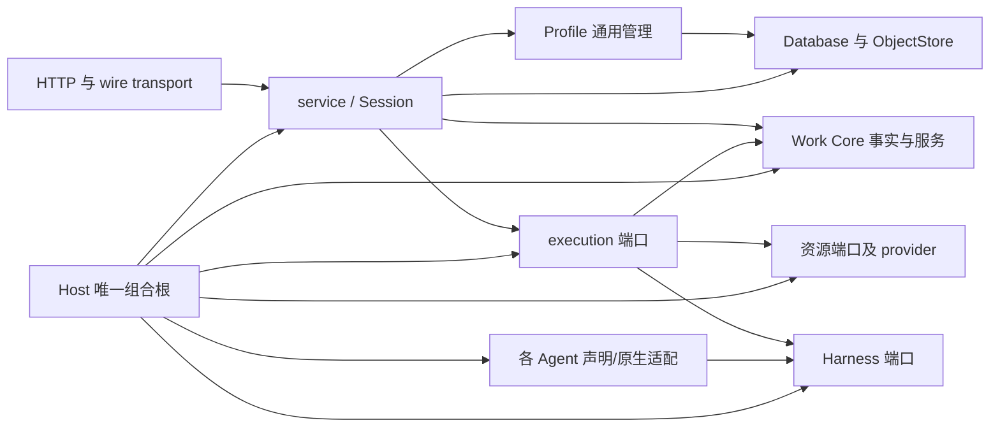

# 后端模块图与依赖方向（MB-1 联署；恢复轮 C 按已集成事实更新）

基准：backend integration **`321c883cac8aa0fbb5e83a9ff76802533c20a0a4`**（恢复轮链：
`d12aa979`→E2a `a67c67c9`→S2a `fe59016b`→kilo `0c042f54`→S2c1 `321c883c`，各配对
根门 0 新增红 ID）；S 图/E 图/H 检查点/P 消息 45/49 为底层输入。本图按**已在候选的
物理事实**与**在途/待拆的目标归属**分别记：已集成＝CP 在案；在途＝批文已发；不把
批文算成交付。

## 包目录图

| 目标包 | 当前物理代码 | 当前形态与待做 |
| --- | --- | --- |
| service（协议入口/会话/业务编排） | `src/agent_box/service/{__init__,facade}.py`＋`src/agent_box/service/sessions/`（**已集成 S2a＋S2c1**：`ProductService`/`SessionService`/`SessionRecords`/`QueueRecords` 唯一实现）；`src/agent_box/server/{services.py,sessions/}(薄别名/shim)`；`wire/`、`transport/http/` 仍在 server 域 | facade＋sessions 物理包已立（M1-P-A① 同对象 shim，过渡边七项入钉）；**在途 S2-c2**（wire 物理包，13 路径已批）；S2-c3（transport/组合根收口）候 S2-c2 后再判（可能登记为 host 暂留装配根）；`server.*` 过渡边如实暂列。 |
| execution（中立组合/生命周期协调） | `src/agent_box/execution/{__init__,contracts}.py`（**已集成 E2a**：九 DTO/enum＋`TurnExecutionPort` 唯一实现）；`src/agent_box/server/execution/`（sidecar backend、placement、first_run_lock、delegation 等薄别名/载体）；`src/agent_box/extensions/runtime_composition/` | 纯契约物理包已立、旧入口同对象重导出。**在途 E2b**（lifecycle 中立协调账＋first_run_lock，5 路径已批）；`delegation.py` 含 Session/Profile 业务规则（S 域 b2 未提交件另案）；`sidecar.py/local_channel.py/ssh_connector.py` 逐文件会签后另批。 |
| Work Core | `src/agent_box/work_core/` | **物理包已成**：事实/事件/终态、repository/services/迁移、唯一 `ExtensionRegistry`。`runtime.py` 的历史 DB 路径暂留兼容；不改 schema/数据权威。 |
| Profile 通用管理 | `src/agent_box/server/profiles/`，邻接 `server/model_configs/` | **物理子包已成但职责混放**：`repository/service/permissions/subagents` 属通用管理；`posture_translation.py/posture_config.py` 的家族原生形需另批交 H。`server_profiles` 和现有 DB/对象 digest 的唯一权威不迁、不双写；`sessions/repository.py` 仍写运行态三列，须窄接口等价收拢。 |
| 通用 Harness 核心 | `plugins/agent-box-harness/` | **独立物理插件包**（PA① 已合）：registry/generic adapter、Profile 插件侧通用半、资源 codec；零品牌分支、零 entry point。与旧包之间三条登记过渡缝暂留，见 `packages/harness.md`。 |
| Agent 接入层/旧兼容面 | `plugins/agent-box-harnesses/`，`plugins/agent-box-harness-{dsh,qwen,kilo}/` | **dsh、qwen、kilo 三家独立物理包已合入**（kilo＝恢复轮集成 `0c042f54`），旧 Python 入口为同对象薄别名、零新增发现点、零 EP。旧 deploy 三资产（dsh settings.yaml＋两枚 loopback-guard）均＝**兼容保留**（前者涉 S 域契约；后者经 H-043 复查证实被 `scripts/server-round1` 两离线门消费，处置随 scripts 遗留线延期）。余家 **pi→hermes→claude→codex** 逐家先报候批（codex 排末位，候 bwrap 接缝窗口）。 |
| 资源插件 | `plugins/agent-box-{runtime-local,sandbox-bwrap,terminal-session,git,artifacts,skills}/` | **六个独立物理包已成**，各有 pyproject/src/tests/entry point；P 的六份说明已收编。bwrap 的固定 Codex 模板＝实际品牌策略偷渡（**边界反例在案**）：档位已裁＝检查点内 A'（新增中立 kernel＋旧公开函数签名/字节/拒绝文本全不变的薄垫片，公开面零变化）；档 B（`__all__` 删项等公开语义变化）延期基线后呈 I 豁免；C×H 纯参数接缝确认已闭合（H-040）。P 复开后先交 A' 增补件。 |
| 中立存储与端口 | `src/agent_box/{storage,resource_contracts,extensions}/` | 共享设施/契约与装配点。归属按实际 provider/consumer 定，不另造统一框架或第二注册表。 |

## 目标依赖图

**禁止反向边**：Work Core → Server/Profile/具体插件；execution → wire/Session 业务规则、Profile 写权或具体 Agent 协议；Profile 通用管理 → wire/transport/具体 Agent 插件；资源插件 → Agent 品牌策略；兼容入口 → 第二实现。Host 组合根可注入具体 provider，但不能复制注册/派发权威。

## 现有证据与未闭门

- 已收包说明 13 份：`packages/{service,profile,execution,work_core,harness,harnesses,agent-box-runtime-local,agent-box-sandbox-bwrap,agent-box-terminal-session,agent-box-git,agent-box-artifacts,agent-box-skills,agent-box-harness-dsh,agent-box-harness-qwen}.md`；kilo 包说明候 H 随下一格补。
- **恢复轮新增可跑边界反例（已集成树内）**：`tests/server/test_s_mb_service_boundary.py`（8 钉：facade 单实现/旧入口薄形/禁反向/过渡边/构造签名）、`tests/server/test_s_mb_sessions_boundary.py`（7 钉：模块/名字同对象链/零 def/禁反向/过渡边精确集合）、`tests/server/test_e_modular_execution_boundary.py`（11 钉：同对象/AST 单实现/stdlib-only 反例/旧包面不增）、`plugins/agent-box-harnesses/tests/test_family_dialect_tables.py`（kilo 身份/零 EP/禁双实现 3 钉）。S2-c2/E2b 交付后再各加一组。
- 可跑局部边界反例已收 `checks/`：Work Core 上行禁边/唯一 registry（3P）、S Profile/Service 禁边与 wire 重复键（4P）、P 六资源跨包 import/双注册/品牌词盘点（exit 0）。**尚需全图环、生产装配与余家搬迁后反例**。
- 在途批文（不把批文算交付）：S2-c2（wire，基线 `321c883c`）、E2b（lifecycle，基线 `0c042f54`，与 S2-c1 路径零重叠、集成时 cherry-pick）、H-GUARDS-001（两枚 guard 删除，基线 `0c042f54`，同前）。每批 C 串行同环境配对根门按 FAILED-ID、ERROR、skip、xfail 比对；既有红灯单列（本 C 环境根门红＝20F 族，见 `evidence/`）。
- 公开 wire/Core 状态、数据保留/迁移与计费调用不在等价拆包内；bwrap 档 B 公开面豁免延期基线后呈 I。
